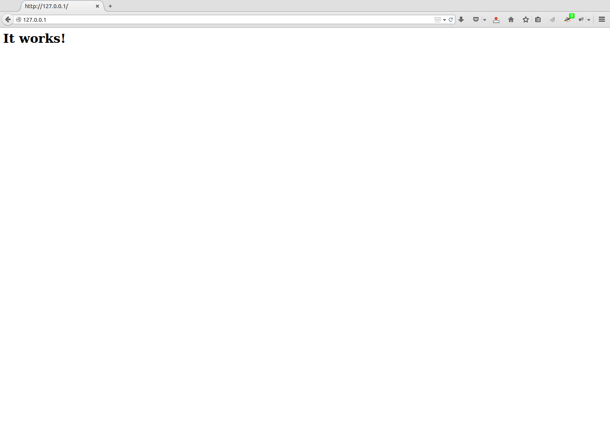

##Kompilieren eines Apache Webservers

###Was machen wir?

Wir kompilieren einen Apache Webserver für ein Testsystem

###Warum tun wir das?

Im professionellen Einsatz des Webservers geschieht es regelmässig, dass besondere Bedürfnisse (Security, zusätzliche Debug-Messages, spezielle Funktionalität dank eines neuen Patches etc.) einen zwingen, sich von den Distributionspaketen zu verabschieden und rasch eigene Binaries herzustellen. In diesem Fall ist es wichtig, dass die Infrastruktur bereit steht und man erste Erfahrungen mit dem Kompilieren und Produktivschalten der eigenen Binaries mitbringt. Zudem lässt sich in einem Laborsetup leichter mit selbst kompiliertem Apache arbeiten, was auch beim Debuggen von Vorteil ist.

###Schritt 1: Bereitmachen des Verzeichnisbaumes für den Sourcecode

Prinzipiell spielt es keine grosse Rolle, wo der Sourcecode liegt. Das Folgende ist ein Vorschlag, der sich am [File Hierarchy Standard](http://www.pathname.com/fhs/) orientiert. Der FHS definiert den Pfadbaum eines Unix-Systems; also die Ablagestruktur für sämtliche Dateien.

```bash
$> sudo mkdir /usr/src/apache
$> sudo chown `whoami` /usr/src/apache
```

###Schritt 2: Erfüllen der Vorbedingungen apr und apr-util

Seit dem Erscheinen von Apache 2.4 wird der Apache Webserver ohne zwei wichtige Bibliotheken ausgeliefert, die vormals Teil der Distribution waren. Wir müssen nun `apr` und `apr-util` selbst installieren, bevor wir Apache kompilieren können. Bei `apr` handelt es sich um die Apache Portable Runtime Bibliothek. Sie erweitert den normalen Satz an C-Bibliotheken mit weiteren Funktionen, die von Server-Software typischerweise benötigt wird. Darunter fallen etwa Funktionen zur Verwaltung von Hash-Tabellen oder Listen. Diese Bibliothek wird nicht nur vom Webserver Apache, sondern auch von anderen Projekten der Apache Software Foundation verwendet, weshalb sie aus dem Source-Code von Apache herausgelöst wurde. Wie `apr` ist `apr-util` Teil der Portable Runtime Libraries, welche durch `apr-util` ergänzt werden.

Wir laden die beiden Pakete nacheinander herunter, überprüfen die Checksum, konfigurieren die Pakete, kompilieren sie und installieren sie schliesslich. Es ist eine gute Angewohnheit, Sourcecode auf seine Integrität hin zu prüfen. Dazu dient die Checksum, welche bei _www.apache.org_ als Link direkt neben dem Sourcecode der Software erscheint.

```bash
$> wget http://mirror.switch.ch/mirror/apache/dist/apr/apr-1.5.2.tar.bz2
$> wget https://www.apache.org/dist/apr/apr-1.5.2.tar.bz2.md5
$> md5sum --check apr-1.5.2.tar.bz2.md5
apr-1.5.2.tar.bz2: OK
$> tar xvjf apr-1.5.2.tar.bz2
$> cd apr-1.5.2
$> ./configure --prefix=/usr/local/apr/
$> make
$> sudo make install
```

Leider bietet _www.apache.org_ nur eine md5-Checksum für `apr` an. Wir testen sie dennoch. Bei der Konfiguration entscheiden wir uns für eine Installation in einem lokalen Library-Pfad. Wenn das für `apr` geklappt hat, dann weiter mit `apr-util`:

```bash
$> wget http://mirror.switch.ch/mirror/apache/dist/apr/apr-util-1.5.4.tar.bz2
$> wget https://www.apache.org/dist/apr/apr-util-1.5.4.tar.bz2.md5
$> md5sum --check apr-util-1.5.4.tar.bz2.md5
apr-util-1.5.4.tar.bz2: OK
$> tar xvjf apr-util-1.5.4.tar.bz2
$> cd apr-util-1.5.4
$> ./configure --prefix=/usr/local/apr/ --with-apr=/usr/local/apr/
$> make
$> sudo make install
```

Wenn das in beiden Fällen geklappt hat, sind wir bereit für den Webserver selbst.

###Schritt 3: Herunterladen des Sourcecodes und Überprüfen der Checksum

Jetzt laden wir den Programmcode vom Netz herunter. Man kann das mit dem Browser direkt von [Apache](https://httpd.apache.org/) tun, oder man schont die Bandbreite des Apache Projektes und zieht ihn mittels wget von einem Mirror.

```bash
$> cd /usr/src/apache
$> wget http://mirror.switch.ch/mirror/apache/dist//httpd/httpd-2.4.16.tar.bz2
```

Der gepackte Sourcecode hat etwa eine Grösse von 5MB.

Nun laden wir die Checksum der Sourcecodedatei direkt von Apache herunter. Dankenswerterweise steht sie immerhin als _sha1-Checksum_ zur Verfügung. Sicherheitshalber verwenden wir dazu wieder eine gesicherte Verbindung. Ohne https macht diese Überprüfung keinen Sinn.

```bash
$> wget https://www.apache.org/dist/httpd/httpd-2.4.16.tar.bz2.sha1
```

Beide Files, der Sourcecode und die kleine Prüfsummendatei sollten nebeneinander in `/usr/src/apache` liegen. Dann lässt sich die Prüfsumme testen:

```bash
$> sha1sum --check httpd-2.4.16.tar.bz2.sha1 
```

Wir erwarten Folgendes als Antwort:

```bash
httpd-2.4.16.tar.bz2: OK
```

###Schritt 4: Entpacken und Compiler konfigurieren

Nach der Überprüfung können wir das Paket entpacken.

```bash
$> tar xvjf httpd-2.4.16.tar.bz2
```

Das ergibt nun etwa 38MB.

Wir gehen nun in das Verzeichnis und konfigurieren den Compiler mit unseren Eingaben und mit Informationen zu unserem System. Neben den Optionen der Kommandozeile sucht sich das Configure-Script selbst sehr viele Informationen zu unserem System zusammen. Dies Infos werden dann für den Compiler bereit gestellt.

```bash
$> cd httpd-2.4.16
$> ./configure --prefix=/opt/apache-2.4.16  --with-apr=/usr/local/apr/bin/apr-1-config --with-apr-util=/usr/local/apr/bin/apu-1-config --enable-mpms-shared=event --enable-mods-shared=all --enable-nonportable-atomics=yes
```

Hier bestimmen wir das Zielverzeichnis für den zukünftigen Apache Webserver; wieder konform mit dem _FHS_. Darauf folgen zwei Optionen, um die beiden als Vorbedingung installierten Bibliotheken anzubinden. Mittels `--enable-mpms-shared` wählen wir ein sogenanntes Prozessmodell des Servers aus. Das ist – vereinfacht gesagt – so etwas wie der Motorentyp der Maschine: Benzin oder Diesel. In unserem Fall stehen `event`, `worker`, `prefork` und ein paar experimentelle Motoren zur Verfügung. Wir nehmen hier das Modell `event`, das unter 2.4 den neuen Standard darstellt und deutlich performanter ist als die übrigen Architekturen. In den Versionslinien 2.0 und 2.2 gab es bei diesem Entscheid deutlich mehr als nur die Performance zu bedenken, aber seit 2.4 hat sich die Problematik deutlich entschärft und wir fahren nun mit `event` am besten. Mehr Infos zu den verschiedenen Prozessmodellen (_MPMs_) liefert das Apache Projekt.

Dann bestimmen wir, dass wir alle (_all_) Module mitkompilieren möchten. Dabei ist zu berücksichtigen, dass _all_ hier nicht wirklich alle bedeutet. Aus historischen Gründen meint _all_ nur sämtliche Kern-Module, was auch schon eine ganze Menge ist. Das Schlüsselwort _shared_ besagt, dass wir die Module separat kompiliert haben möchten, um sie dann einzeln als optionale Module einbinden zu können. Zu guter Letzt folgt mit `enable-nonportable-atomics` ein Compiler-Flag, das den Compiler instruiert, besondere Optionen zu verwenden, welche nur auf modernen x86-Prozessoren zur Verfügung stehen und sich günstig auf die Performance auswirken.

Der Configure-Befehl beschwert sich oft über fehlende Komponenten. Ist klar: Ohne funktionierenden Compiler können wir nicht kompilieren und das Configure hat die Aufgabe nachzusehen, ob alles gut beisammen ist.

Sachen, die typischerweise fehlen, sind Folgende:

- binutils
- gcc
- libpcre3-dev
- libssl-dev
- zlibc
- zlib1g-dev

(je nach Distribution mag dieses Paket anders heissen)

Das lässt sich leicht beheben, indem man sie mit den Hilfsmitteln der eigenen Distribution nachinstalliert. Danach configure neu ausführen, eventuell nochmals zwei, drei Mal etwas nachinstallieren und irgendwann läuft das Skript dann erfolgreich durch.

###Schritt 5: Kompilieren
Nun sind wir bereit für den Compiler. Hier sollte nun nichts mehr schief gehen.

```bash
$> make
```

Das dauert einen Moment und aus den 38MB werden knapp 100MB.

###Schritt 7: Installieren
Wenn das geklappt hat, dann installieren wir den selbst gebauten Apache Webserver. Wir müssen das Installieren durch den Superuser vornehmen lassen. Aber danach schauen wir gleich zu, dass wir wieder in Besitz des Webservers kommen. Für ein Testsystem ist das viel praktischer.

```bash
$> sudo make install
```

Auch die Installation dauert eine Weile.

```bash
$> sudo chown -R `whoami` /opt/apache-2.4.16
```

Und jetzt noch ein Kniff: Wenn man professionell mit Apache arbeitet, dann hat man oft mehrere verschiedene Versionen nebeneinander auf der Testmaschine. Verschiedene Versionen, verschiedene Patches, andere Module etc. führen zu recht mühsamen und langen Pfaden mit Versionsnummern und weiteren Beschreibungen. Ich mache es dann jeweils so, dass ich einen Softlink von `/apache` auf den aktuellen Apache Webserver lege. Dabei ist darauf zu achten, dass auch der Softlink uns und nicht dem root-User gehört (dies wird bei der Konfiguration des Servers wichtig).

```bash
$> sudo ln -s /opt/apache-2.4.16 /apache
$> sudo chown `whoami` --no-dereference /apache
$> cd /apache
```

Unser Webserver hat nun also einen klaren Pfad, der ihn mit der Versionsnummer eindeutig beschreibt. Im Alltag verwenden wir aber einfach /apache für den Zugriff. Das erleichtert die Arbeit.

###Schritt 8: Starten

Dann wollen wir mal sehen, ob die Maschine anspringt. Das müssen wir für den Moment wieder durch den Superuser erledigen lassen:

```bash
$> sudo ./bin/httpd -X
```

Das ist wieder ein Kniff für den Testbetrieb: Apache ist eigentlich ein Daemon der im Hintergrund läuft. Für einfache Tests ist das aber eher nervig, da wir den Daemon andauernd starten, stoppen, neu laden und sonstwie manipulieren müssen. Mit der Option -X teilen wir Apache mit, dass er sich das mit dem Daemon erst mal sparen und dass er schön im Vordergrund als Single-Prozess/-Thread bleiben soll. Auch das hilft bei der Arbeit.

Vermutlich gibt es nun beim Start eine Warnung:

```bash
AH00558: httpd: Could not reliably determine the server's fully qualified domain name, using 127.0.1.1. Set the 'ServerName' directive globally to suppress this message
```

Das ist nicht weiter schlimm und wir können sie für den Moment ignorieren.

###Schritt 9: Ausprobieren

Die Maschine läuft nun also. Aber funktioniert sie auch? Zeit für den Funktionstest: Wir sprechen den Apache mit dem Browser unter folgendem Link an:

[http://127.0.0.1](http://127.0.0.1)

Da erwarten wir dann Folgendes:



Im Browser zeigt der Apache ein erstes Lebenszeichen.

Super! Ziel erreicht: Der selbst kompilierte Apache läuft.

Zurück in die Shell und Abschalten des Servers mit STRG-C oder für uns Schweizer mit CTRL-C.

###Schritt 10 (Bonus): Ansehen des Binaries und der Module

Der Webserver läuft nun also. Aber vielleicht möchten wir ihn noch etwas genauer ansehen und mit den Fingern über die Karosserie streichen. Informationen zu unserem Binary erhalten wir wie folgt:

```bash
$> ./bin/httpd -V
```

```bash
Server version: Apache/2.4.16 (Unix)
Server built:   Sep 17 2015 21:09:49
Server's Module Magic Number: 20120211:47
Server loaded:  APR 1.5.2, APR-UTIL 1.5.4
Compiled using: APR 1.5.2, APR-UTIL 1.5.4
Architecture:   64-bit
Server MPM:     event
  threaded:     yes (fixed thread count)
    forked:     yes (variable process count)
Server compiled with....
 -D APR_HAS_SENDFILE
 -D APR_HAS_MMAP
 -D APR_HAVE_IPV6 (IPv4-mapped addresses enabled)
 -D APR_USE_SYSVSEM_SERIALIZE
 -D APR_USE_PTHREAD_SERIALIZE
 -D SINGLE_LISTEN_UNSERIALIZED_ACCEPT
 -D APR_HAS_OTHER_CHILD
 -D AP_HAVE_RELIABLE_PIPED_LOGS
 -D DYNAMIC_MODULE_LIMIT=256
 -D HTTPD_ROOT="/opt/apache-2.4.16"
 -D SUEXEC_BIN="/opt/apache-2.4.16/bin/suexec"
 -D DEFAULT_PIDLOG="logs/httpd.pid"
 -D DEFAULT_SCOREBOARD="logs/apache_runtime_status"
 -D DEFAULT_ERRORLOG="logs/error_log"
 -D AP_TYPES_CONFIG_FILE="conf/mime.types"
 -D SERVER_CONFIG_FILE="conf/httpd.conf"

```

Da wird die Version angegeben, wann wir kompiliert haben, `apr` kommt wieder zur Sprache und weiter unten der _MPM_ `event`. Ganz unten finden wir übrigens den Hinweis auf das Standard-Konfigurationsfile des Webservers und etwas darüber den Pfad, unter dem wir das Errorlog finden können.

Man kann aber noch etwas mehr aus dem System rausholen und ihn etwa nach den Modulen fragen, welche fix in den Server hineinkompiliert sind:

```bash
$> ./bin/httpd -l
```

```bash
Compiled in modules:
  core.c
  mod_so.c
  http_core.c
```

Diese und die obenstehenden Informationen helfen bei der Fehlersuche und wenn man einen Bugreport einsenden will. Dies sind typischerweise auch die ersten Fragen, welche gestellt werden.

Das Binary selbst (`/apache/bin/httpd`) ist übrigens ungefähr 2.0MB gross und die Liste der Module sieht folgendermassen aus:

```bash
$> ls -lh modules
```

```bash
total 8.8M
-rw-r--r-- 1 myuser dune73  14K Sep 17 21:09 httpd.exp
-rwxr-xr-x 1 myuser root    36K Sep 17 21:16 mod_access_compat.so
-rwxr-xr-x 1 myuser root    34K Sep 17 21:17 mod_actions.so
-rwxr-xr-x 1 myuser root    49K Sep 17 21:17 mod_alias.so
-rwxr-xr-x 1 myuser root    31K Sep 17 21:17 mod_allowmethods.so
-rwxr-xr-x 1 myuser root    30K Sep 17 21:17 mod_asis.so
-rwxr-xr-x 1 myuser root    47K Sep 17 21:16 mod_auth_basic.so
-rwxr-xr-x 1 myuser root   102K Sep 17 21:16 mod_auth_digest.so
-rwxr-xr-x 1 myuser root    79K Sep 17 21:16 mod_auth_form.so
-rwxr-xr-x 1 myuser root    30K Sep 17 21:16 mod_authn_anon.so
-rwxr-xr-x 1 myuser root    39K Sep 17 21:16 mod_authn_core.so
-rwxr-xr-x 1 myuser root    43K Sep 17 21:16 mod_authn_dbd.so
-rwxr-xr-x 1 myuser root    33K Sep 17 21:16 mod_authn_dbm.so
-rwxr-xr-x 1 myuser root    33K Sep 17 21:16 mod_authn_file.so
-rwxr-xr-x 1 myuser root    54K Sep 17 21:16 mod_authn_socache.so
-rwxr-xr-x 1 myuser root    70K Sep 17 21:16 mod_authz_core.so
-rwxr-xr-x 1 myuser root    46K Sep 17 21:16 mod_authz_dbd.so
-rwxr-xr-x 1 myuser root    37K Sep 17 21:16 mod_authz_dbm.so
-rwxr-xr-x 1 myuser root    41K Sep 17 21:16 mod_authz_groupfile.so
-rwxr-xr-x 1 myuser root    37K Sep 17 21:16 mod_authz_host.so
-rwxr-xr-x 1 myuser root    31K Sep 17 21:16 mod_authz_owner.so
-rwxr-xr-x 1 myuser root    31K Sep 17 21:16 mod_authz_user.so
-rwxr-xr-x 1 myuser root   129K Sep 17 21:17 mod_autoindex.so
-rwxr-xr-x 1 myuser root    35K Sep 17 21:17 mod_buffer.so
-rwxr-xr-x 1 myuser root   103K Sep 17 21:17 mod_cache_disk.so
-rwxr-xr-x 1 myuser root   229K Sep 17 21:17 mod_cache.so
-rwxr-xr-x 1 myuser root   108K Sep 17 21:17 mod_cache_socache.so
-rwxr-xr-x 1 myuser root   118K Sep 17 21:17 mod_cgid.so
-rwxr-xr-x 1 myuser root    68K Sep 17 21:17 mod_charset_lite.so
-rwxr-xr-x 1 myuser root    33K Sep 17 21:17 mod_data.so
-rwxr-xr-x 1 myuser root   221K Sep 17 21:17 mod_dav_fs.so
-rwxr-xr-x 1 myuser root    83K Sep 17 21:17 mod_dav_lock.so
-rwxr-xr-x 1 myuser root   395K Sep 17 21:17 mod_dav.so
-rwxr-xr-x 1 myuser root    71K Sep 17 21:17 mod_dbd.so
-rwxr-xr-x 1 myuser root   100K Sep 17 21:17 mod_deflate.so
-rwxr-xr-x 1 myuser root    36K Sep 17 21:17 mod_dialup.so
-rwxr-xr-x 1 myuser root    37K Sep 17 21:17 mod_dir.so
-rwxr-xr-x 1 myuser root    33K Sep 17 21:17 mod_dumpio.so
-rwxr-xr-x 1 myuser root    34K Sep 17 21:17 mod_echo.so
-rwxr-xr-x 1 myuser root    32K Sep 17 21:17 mod_env.so
-rwxr-xr-x 1 myuser root    44K Sep 17 21:17 mod_expires.so
-rwxr-xr-x 1 myuser root    74K Sep 17 21:17 mod_ext_filter.so
-rwxr-xr-x 1 myuser root    42K Sep 17 21:17 mod_file_cache.so
-rwxr-xr-x 1 myuser root    62K Sep 17 21:17 mod_filter.so
-rwxr-xr-x 1 myuser root    73K Sep 17 21:17 mod_headers.so
-rwxr-xr-x 1 myuser root    30K Sep 17 21:17 mod_heartbeat.so
-rwxr-xr-x 1 myuser root    79K Sep 17 21:17 mod_heartmonitor.so
-rwxr-xr-x 1 myuser root   163K Sep 17 21:17 mod_include.so
-rwxr-xr-x 1 myuser root    85K Sep 17 21:17 mod_info.so
-rwxr-xr-x 1 myuser root    35K Sep 17 21:17 mod_lbmethod_bybusyness.so
-rwxr-xr-x 1 myuser root    35K Sep 17 21:17 mod_lbmethod_byrequests.so
-rwxr-xr-x 1 myuser root    35K Sep 17 21:17 mod_lbmethod_bytraffic.so
-rwxr-xr-x 1 myuser root    52K Sep 17 21:17 mod_lbmethod_heartbeat.so
-rwxr-xr-x 1 myuser root   103K Sep 17 21:17 mod_log_config.so
-rwxr-xr-x 1 myuser root    43K Sep 17 21:17 mod_log_debug.so
-rwxr-xr-x 1 myuser root    37K Sep 17 21:17 mod_log_forensic.so
-rwxr-xr-x 1 myuser root    35K Sep 17 21:17 mod_logio.so
-rwxr-xr-x 1 myuser root   467K Sep 17 21:17 mod_lua.so
-rwxr-xr-x 1 myuser root    56K Sep 17 21:17 mod_macro.so
-rwxr-xr-x 1 myuser root    88K Sep 17 21:17 mod_mime_magic.so
-rwxr-xr-x 1 myuser root    60K Sep 17 21:17 mod_mime.so
-rwxr-xr-x 1 myuser root   184K Sep 17 21:16 mod_mpm_event.so
-rwxr-xr-x 1 myuser root   136K Sep 17 21:16 mod_mpm_worker.so
-rwxr-xr-x 1 myuser root   117K Sep 17 21:17 mod_negotiation.so
-rwxr-xr-x 1 myuser root   198K Sep 17 21:17 mod_proxy_ajp.so
-rwxr-xr-x 1 myuser root   139K Sep 17 21:17 mod_proxy_balancer.so
-rwxr-xr-x 1 myuser root    59K Sep 17 21:17 mod_proxy_connect.so
-rwxr-xr-x 1 myuser root    40K Sep 17 21:17 mod_proxy_express.so
-rwxr-xr-x 1 myuser root    77K Sep 17 21:17 mod_proxy_fcgi.so
-rwxr-xr-x 1 myuser root    40K Sep 17 21:17 mod_proxy_fdpass.so
-rwxr-xr-x 1 myuser root   131K Sep 17 21:17 mod_proxy_ftp.so
-rwxr-xr-x 1 myuser root   114K Sep 17 21:17 mod_proxy_html.so
-rwxr-xr-x 1 myuser root   121K Sep 17 21:17 mod_proxy_http.so
-rwxr-xr-x 1 myuser root    66K Sep 17 21:17 mod_proxy_scgi.so
-rwxr-xr-x 1 myuser root   357K Sep 17 21:17 mod_proxy.so
-rwxr-xr-x 1 myuser root    59K Sep 17 21:17 mod_proxy_wstunnel.so
-rwxr-xr-x 1 myuser root    33K Sep 17 21:17 mod_ratelimit.so
-rwxr-xr-x 1 myuser root    34K Sep 17 21:17 mod_reflector.so
-rwxr-xr-x 1 myuser root    41K Sep 17 21:17 mod_remoteip.so
-rwxr-xr-x 1 myuser root    48K Sep 17 21:17 mod_reqtimeout.so
-rwxr-xr-x 1 myuser root    40K Sep 17 21:17 mod_request.so
-rwxr-xr-x 1 myuser root   210K Sep 17 21:17 mod_rewrite.so
-rwxr-xr-x 1 myuser root   144K Sep 17 21:17 mod_sed.so
-rwxr-xr-x 1 myuser root    35K Sep 17 21:17 mod_session_cookie.so
-rwxr-xr-x 1 myuser root    53K Sep 17 21:17 mod_session_dbd.so
-rwxr-xr-x 1 myuser root    61K Sep 17 21:17 mod_session.so
-rwxr-xr-x 1 myuser root    47K Sep 17 21:17 mod_setenvif.so
-rwxr-xr-x 1 myuser root    32K Sep 17 21:17 mod_slotmem_plain.so
-rwxr-xr-x 1 myuser root    59K Sep 17 21:17 mod_slotmem_shm.so
-rwxr-xr-x 1 myuser root    52K Sep 17 21:17 mod_socache_dbm.so
-rwxr-xr-x 1 myuser root    40K Sep 17 21:17 mod_socache_memcache.so
-rwxr-xr-x 1 myuser root    82K Sep 17 21:17 mod_socache_shmcb.so
-rwxr-xr-x 1 myuser root    43K Sep 17 21:17 mod_speling.so
-rwxr-xr-x 1 myuser root   897K Sep 17 21:17 mod_ssl.so
-rwxr-xr-x 1 myuser root    80K Sep 17 21:17 mod_status.so
-rwxr-xr-x 1 myuser root    48K Sep 17 21:17 mod_substitute.so
-rwxr-xr-x 1 myuser root    35K Sep 17 21:17 mod_unique_id.so
-rwxr-xr-x 1 myuser root    37K Sep 17 21:17 mod_unixd.so
-rwxr-xr-x 1 myuser root    34K Sep 17 21:17 mod_userdir.so
-rwxr-xr-x 1 myuser root    44K Sep 17 21:17 mod_usertrack.so
-rwxr-xr-x 1 myuser root    27K Sep 17 21:17 mod_version.so
-rwxr-xr-x 1 myuser root    40K Sep 17 21:17 mod_vhost_alias.so
-rwxr-xr-x 1 myuser root    54K Sep 17 21:17 mod_watchdog.so
-rwxr-xr-x 1 myuser root    69K Sep 17 21:17 mod_xml2enc.so
```

Das sind nun alle Module, welche von Apache zusammen mit dem Server verteilt werden. Weitere Module gibt es von Drittanbietern. Alle brauchen wir kaum, aber einige will man fast immer dabei haben: Sie stehen für eine Einbindung bereit..

#####Verweise
- Apache: [http://httpd.apache.org](http://httpd.apache.org)
- File Hierarchy Standard: [http://www.pathname.com/fhs/](http://www.pathname.com/fhs/)
- Apache ./configure documenation: [http://httpd.apache.org/docs/trunk/programs/configure.html](http://httpd.apache.org/docs/trunk/programs/configure.html)
