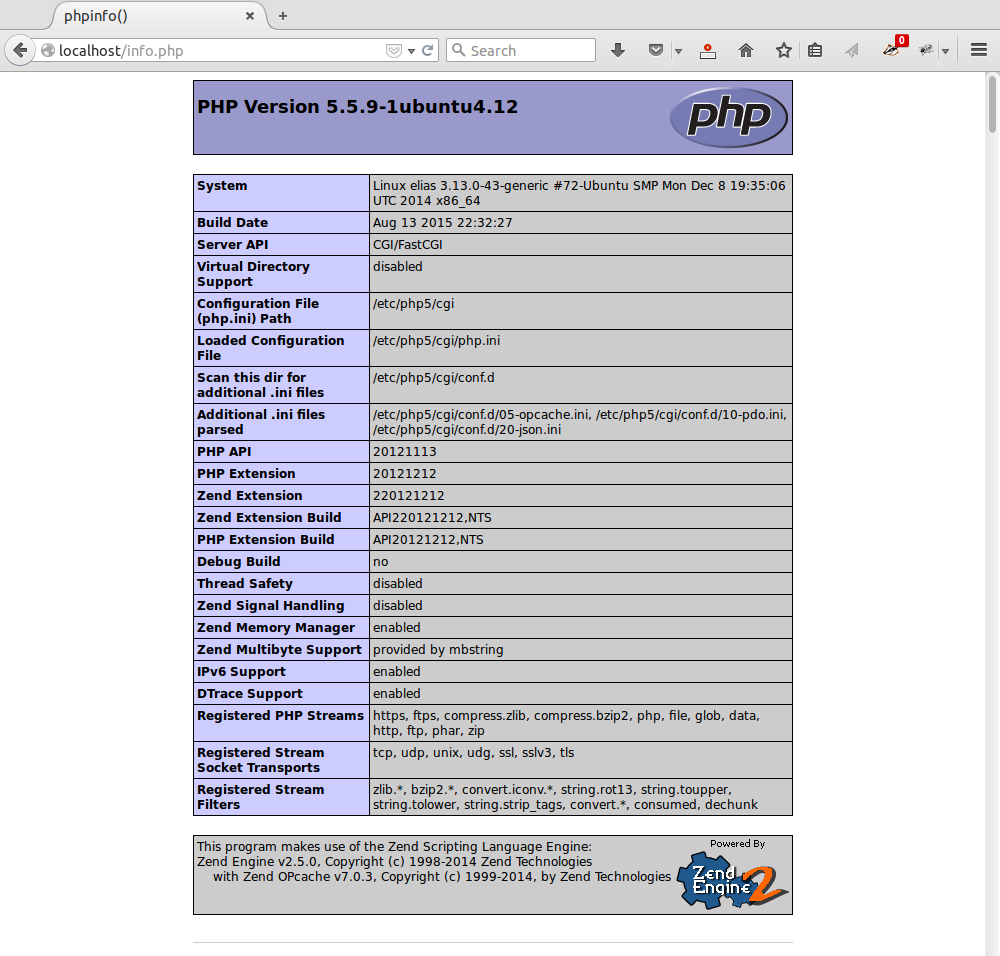

##Aufsetzen eines Apache/PHP Applikationsservers

###Was machen wir?

Wir setzen einen Apache / PHP Applikationsserver mit den minimal nötigen Modulen auf.

###Warum tun wir das?

Ein nackter Apache eignet sich, um statische Files auszuliefern. Komplexere Applikationen bauen auf dynamischem Content auf. Dies bedingt eine Erweiterung des Servers. Ein sehr schneller und sicherer Applikationsserver lässt sich mit _Suexec_, einem externen _FastCGI-Daemon_ und _PHP_ realisieren. Dies ist bei weitem nicht die einzige Variante und im Unternehmensumfeld vermutlich auch nicht die verbreitetste. Aber es ist eine sehr einfache Architektur, die sich hervorragend für ein Testsystem eignet.

###Voraussetzungen

* Ein Apache Webserver, idealerweise mit einem File-Layout wie bei [Anleitung 1 (Kompilieren eines Apache Servers)](http://www.netnea.com/cms/apache_tutorial_1_apache_compilieren/) erstellt.
* Verständnis der minimalen Konfiguration in [Anleitung 2 (Apache minimal konfigurieren)](http://www.netnea.com/cms/apache_tutorial_2_apache_minimal_konfigurieren/).


###Schritt 1: Apache konfigurieren

Wir konfigurieren den Webserver vorneweg; wohlwissend, dass er in dieser Konfiguration noch nicht lauffähig ist. Basierend 
auf dem in Lektion 2 beschriebenen minimalen Webserver konfigurieren wir einen sehr einfachen Applikationsserver in der Datei *conf/httpd.conf_fastcgid*.

```bash
ServerName              localhost
ServerAdmin             root@localhost
ServerRoot              /apache
User                    www-data
Group                   www-data

ServerTokens            Prod
UseCanonicalName        On
TraceEnable             Off

Timeout                 5
MaxRequestWorkers       250

Listen                  127.0.0.1:80

LoadModule              mpm_event_module        modules/mod_mpm_event.so
LoadModule              unixd_module            modules/mod_unixd.so

LoadModule              log_config_module       modules/mod_log_config.so
LoadModule              mime_module             modules/mod_mime.so

LoadModule              authn_core_module       modules/mod_authn_core.so
LoadModule              authz_core_module       modules/mod_authz_core.so

LoadModule              suexec_module           modules/mod_suexec.so
LoadModule              fcgid_module            modules/mod_fcgid.so

ErrorLogFormat          "[%{cu}t] [%-m:%-l] %-a %-L %M"
LogFormat               "%h %l %u [%{%Y-%m-%d %H:%M:%S}t.%{usec_frac}t] \"%r\" %>s %b \"%{Referer}i\" \"%{User-Agent}i\"" combined

LogLevel                debug
ErrorLog                logs/error.log
CustomLog               logs/access.log combined

AddHandler              fcgid-script .php

DocumentRoot            /apache/htdocs

<Directory />

        Require all denied

        Options         SymLinksIfOwnerMatch
        AllowOverride   None

</Directory>

<VirtualHost 127.0.0.1:80>

      <Directory /apache/htdocs>

        Require all granted

        Options          ExecCGI
        AllowOverride    None

        FCGIWrapper      /apache/bin/php-fcgi-starter/php-fcgi-starter .php

      </Directory>

</VirtualHost>
```


Ich gehe nicht mehr auf die gesamte Konfiguration ein, sondern nur noch auf die Abweichungen zur Anleitung 2. Hinzugekommen sind drei Module:
Neben dem _Suexec-_ und dem _FCGI-Modul_ ist es das _Mime-Modul_, welches uns erlaubt, die Dateiendung _.php_ dem _FCGI-Daemon_ zuzuweisen. Diese Zuweisung erfolgt mittels der _AddHandler-Direktive_. 

Das Verzeichnis _/apache/htdocs_ benötigt neu die zusätzliche Option _ExecCGI_. Schliesslich der _FCGIWrapper_. Das ist das Verbindungsstück zwischen dem Webserver und dem noch zu konfigurierenden _FCGI-Daemon_. Sobald die erste Anfrage mit der Endung _.php_ an den Webserver gestellt wird, ruft der Server ein _Wrapper-Script_ auf und startet damit den _FCGI-Daemon_, der sich ab diesem Moment um die _PHP-Anfragen_ kümmert.

_FastCGI_ ist eine Technik um dynamischen Programmcode aus einem Webserver heraus aufzurufen. Es ist eine sehr schnelle Technik, welche den Server weitgehend unberührt lässt und die Applikation auf einem separaten Daemon ausführt. Um die Geschwindigkeit zu steigern stellt _FastCGI_ mehrere Instanzen dieses Daemons bereit, so dass eine Anfrage ohne Wartepause verarbeitet werden kann. In der Praxis ist dies ein ansprechender Performance-Gewinn und vor allem eine Architektur, welche Speicher spart, wie unten genauer erklärt wird.

###Schritt 2: Apache mir Suexec-Unterstützung kompilieren

Wir müssen nun zwei fehlende Module kompilieren und weitere Komponenten für den _FCGI-Daemon_ bereitstellen. Beginnen wir mit dem _Suexec-Modul_.

In Lektion 1 wurde ein Apache Webserver selbst kompiliert. Aber obschon dort die Option _--enable-mods-shared=all_ verwendet wurde, ist _suexec_ noch nicht kompiliert. Das Modul ist demnach so speziell, dass es nicht als Standard-Modul mitkompiliert werden kann, obschon es im Quelltext vorhanden ist.

Der in Lektion 2 konfigurierte Webserver läuft als Benutzer _www-data_ oder je nach Konfiguration als beliebiger anderer dedizierter Benutzer. Unsere dynamische Applikation möchten wir noch weiter eingrenzen und den separaten Daemon unter einem weiteren separaten User drehen lassen. Dies wird uns durch das Modul _suexec_ ermöglicht.  Diese Massnahme ist nicht zwingend. Aber sie bringt ein Mehr an Sicherheit mit wenig zusätzlichem Aufwand.

Begeben wir uns ins Verzeichnis mit dem Apache Quelltext und kompilieren den Server neu. 

```bash
$> cd /usr/src/apache/httpd-2.4.23
$> ./configure --prefix=/opt/apache-2.4.23 --enable-mods-shared=all --with-apr=/usr/local/apr/bin/apr-1-config --with-apr-util=/usr/local/apr/bin/apu-1-config --enable-mpms-shared="event worker" --enable-nonportable-atomics=yes --enable-suexec --with-suexec-caller=www-data --with-suexec-docroot=/opt/apache-2.4.23/bin && make && sudo make install
```

Zum bekannten _configure_ sind nun drei Optionen hinzugekommen, die sich um das _Suexec_ kümmern. _Enable-suexec_ spricht für sich, _with-suexec-caller_ teilen wir dem gewissenhaften Modul mit, dass ausschliesslich der User _www-data_ die Erlaubnis erhalten soll, das Modul mit dem dahinter liegenden Programm aufzurufen. Schliesslich geben wir dem Modul noch bekannt, wo die aufzurufenden Skripte liegen sollen. Der Einfachheit halber nehmen wir das existierende _bin-Verzeichnis_. Allerdings ist _suexec_ pingelig und wir können nicht mit dem Symlink arbeiten. Es muss also der voll qualifizierte Pfad sein.

Nach der erfolgreichen Konfiguration wird obenstehende Befehlszeile den Compiler aufrufen und nach dessen erfolgreichem Abschluss den neu-kompilierten Server installieren.

Übrigens: Wenn man bei der obenstehenden Konfiguration einen Fehler macht und _Suexec_ andere Compilerkonstanten mitgeben möchte, dann muss man vor dem erneuten Kompilieren zuerst die Compiler-Umgebung reinigen. Ansonsten werden die neuen Optionen ignoriert. Dies können wir über den Befehl _make clean_ vor dem _configure_ erreichen, oder durch manuelles Löschen der Dateien _support/suexec_, _support/suexec.lo_ und _support/suexec.o_, was schneller geht, weil danach nicht mehr der gesamte Webserver neu gebaut werden muss.

###Schritt 3: FastCGI Modul herunterladen und kompilieren

Das _FastCGI-Modul_ wird von Apache verwaltet. Es ist aber nicht Teil des normalen Quellcodes des Webservers. Laden wir den Quelltext für das zusätzliche Modul also herunter und prüfen wir die über eine verschlüsselte Verbindung geladene Checksumme.

```bash
$> cd /usr/src/apache
$> wget http://www.apache.org/dist/httpd/mod_fcgid/mod_fcgid-2.3.9.tar.gz
$> wget https://www.apache.org/dist/httpd/mod_fcgid/mod_fcgid-2.3.9.tar.gz.sha1
$> sha1sum --check mod_fcgid-2.3.9.tar.gz.sha1
```

Wir erwarten wieder ein _OK_. Wenn dies korrekt retourniert wurde, ist es Zeit für das Entpacken, Kompilieren und Installieren.

```bash
$> tar xvzf mod_fcgid-2.3.9.tar.gz
$> cd mod_fcgid-2.3.9
$> APXS=/apache/bin/apxs ./configure.apxs
$> make
$> sudo make install
```

Der _Configure-Befehl_ hat hier ein etwas anderes Format, da es sich beim _FCGI-Modul_ um ein von Apache abhängiges Modul handelt. Wir verwenden deshalb _APXS_, das _Apache Expansion Tool_, das Teil des in Lektion 1 kompilierten Servers ist. Leider zerstört das _make install_ teilweise die von uns gesetzten Besitzverhältnisse. Dies muss also nachjustiert werden.

```bash
$> sudo chown `whoami` /apache/conf/httpd.conf
```

Weiter benötigt der Apache-Benutzer Zugriff auf ein Verzeichnis, in das er Sockets anlegt, um mit dem FCGI-Daemon kommunizieren zu können. Dieses erstellen wir und übergeben es ihm direkt.

```bash
$> sudo mkdir /apache/logs/fcgidsock
$> sudo chown www-data:www-data /apache/logs/fcgidsock
```

###Schritt 4: PHP installieren und vorkonfigurieren

Bislang haben wir die ganze Software Stück für Stück selbst kompiliert. Beim ganzen PHP-Stack ist aber eine Grenze erreicht. Es soll niemandem verwehrt werden, PHP selbst zu kompilieren, hier konzentrieren wir uns aber auf den Webserver und übernehmen dieses Stück Software deshalb aus der Linux-Distribution. In Debian/Ubuntu heisst das entsprechende Paket _php5-cgi_ und es zieht _php5-common_ nach sich.

_PHP_ richtig zu konfigurieren ist ein weites Feld und ich empfehle die einschlägigen Seiten zu konsultieren, denn ein falsch konfiguriertes _PHP_ kann ein grosses Sicherheitsproblem darstellen. Hier möchte ich nicht mehr Informationen dazu geben, da es von unserem eigentlichen Thema, dem einfachen Applikationsserver, wegführen würde. Für den Betrieb im Internet, also nicht mehr im heimischen Laborbereich, ist es aber deutlich angezeigt, sich mit den relevanten PHP-Sicherheitseinstellungen vertraut zu machen.

###Schritt 5: CGI User erstellen

Oben wurde bereits beschrieben, dass wir planen, einen separaten Daemon zur Bearbeitung der _PHP-Anfragen_ zu starten. Dieser Daemon soll mittels _suexec_ gestartet werden und als eigenständiger Benutzer laufen.  Wir erstellen diesen Benutzer folgendermassen:

```bash
$> sudo groupadd fcgi-php
$> sudo useradd -s /bin/false -d /apache/htdocs -m -g fcgi-php fcgi-php
```

Es ist zu erwarten, dass eine Warnung betreffend des vorhandenen Verzeichnisses _/apache/htdocs_ erscheint. Diese können wir aber ignorieren.

###Schritt 6: PHP-Wrapper Skript erstellen

Es ist üblich, _PHP_ und _FCGI_ mittels eines _Wrapper-Skripts_ zusammenarbeiten zu lassen. Wir haben das oben auch schon in der Apache Konfiguration so vorgesehen. Der Webserver wird ausschliesslich dieses Skript aufrufen, während sich das Skript um alles weitere kümmert. Wir legen das Skript wie vorgesehen in _/apache/bin/php-fcgi-starter/php-fcgi-starter_ ab. 
Das Unterverzeichnis ist nötig, denn _suexec_ setzt voraus, dass das Verzeichnis dem vorkonfigurierten Benutzer gehört und wir möchten _./bin_ nicht komplett dem neuen Benutzer übergeben. Legen wir das Unterverzeichnis also an:

```bash
$> cd /apache/bin
$> sudo mkdir php-fcgi-starter
$> sudo chown fcgi-php:fcgi-php php-fcgi-starter
```

Wir müssen nun in diesem Verzeichnis ein Starter-Skript platzieren. Da wir das Verzeichnis bereits dem Benutzer _fcgi-php_ übergeben haben, muss das Skript durch den _Root-Benutzer_ erstellt werden. Oder durch ihn an diesen Ort kopiert werden. Das Erstellen eines Skripts in einem Verzeichnis, das uns nicht mehr gehört, ist bisweilen schwierig. Wir lösen das mit einem Trick mittels _cat_ und einer _Sub-Shell_. Hier der Trick und daran anschliessend das Skript. (Die Eingabe in _cat_ wird mittels STRG-D abgeschlossen).

```bash
$> sudo sh -c "cat > php-fcgi-starter/php-fcgi-starter"
#!/bin/sh
export PHPRC=/etc/php5/cgi/
export PHP_FCGI_MAX_REQUESTS=5000
export PHP_FCGI_CHILDREN=5
exec /usr/lib/cgi-bin/php
```

Was legen wir hier fest? Wir geben _PHP_ bekannt, wo sich seine Konfiguration befindet, legen die maximale Zahl der Requests eines _FCGI-Daemons_ auf 5'000 fest (danach wird er durch einen frischen Prozess ersetzt), wir bestimmen die Zahl der Prozess-Kinder auf 5 und rufen zu guter Letzt PHP selbst auf.

Nun nicht vergessen, das Skript auch dem _FCGI-Benutzer_ zu übergeben und ausführbar zu machen:

```bash
$> sudo chown fcgi-php:fcgi-php php-fcgi-starter/php-fcgi-starter
$> sudo chmod +x php-fcgi-starter/php-fcgi-starter
```

###Schritt 7: PHP-Testseite erstellen

Zum Schluss sollten wir noch eine einfache _php-basierte_ Testseite erstellen: _/apache/htdocs/info.php_.

```bash
<?php
phpinfo();
?>
```

###Schritt 8: Ausprobieren

Das war alles. Nun können wir den Webserver starten und ausprobieren.

```bash
$> cd /apache
$> sudo ./bin/httpd -X -f conf/httpd.conf_fastcgid
```

Erreichbar ist unser Testskript unter der URL [http://localhost/info.php](http://localhost/info.php).


Im Browser zeigt phpinfo einen umfassenden Statusbericht.

Ergibt der Start des Servers oder der Aufruf der URL eine Fehlermeldung, dann weiss das _Fehler-Log_ des Servers oder das separate _Suexec-Log_ unter _logs/suexec_log_ Abhilfe. Typische Fehler betreffen Besitz und Zugriffsrechte auf Verzeichnisse und Files.

Hier zur Zusammenfassung nochmals die relevanten Files und ihre Besitzer:

```bash
2107985    4 drwxr-xr-x   2 fcgi-php fcgi-php     4096 Jul  2 11:15 bin/php-fcgi-starter/
2107987    4 -rwxr-xr-x   1 fcgi-php fcgi-php      125 Jul  2 11:15 bin/php-fcgi-starter/php-fcgi-starter
2107977   32 -rwsr-xr-x   1 root     root        32146 Jul  2 10:44 bin/suexec
2633547    4 drwxr-xr-x   2 myuser   root         4096 Jul  2 11:16 htdocs/
2633758    4 -rw-r--r--   1 myuser   myuser         20 Jul  2 11:15 htdocs/info.php
2762281    4 drwxr-xr-x   2 www-data www-data     4096 Jul  2 10:46 /apache/logs/fcgidsock/
```

Auffällig ist das _Suid-Bit_ auf dem _Suexec-Binary_.

###Schritt 9 (Bonus): Ein kleiner Lasttest

Der hier gebaute Applikations-Server ist im Vergleich zu einem Apache mit eingebautem _PHP_ sehr leistungsfähig. Ein kleiner Lasttest kann dies illustrieren. Wir starten unseren Webserver im _Daemon-Mode_ und benutzen Apache-Bench um ihm mit 5 Usern auf den Zahn zu fühlen. Neu ist die Option _-l_, welche das Werkzeug instruiert, auf Abweichungen in der Länge der Antworten nicht weiter einzugehen. Denn die Seite ist ja dynamisch generiert und der Inhalt, sowie dessen Länge, weichen natürlicherweise immer wieder ein wenig ab. Nach dem Lasttest beenden wir den Server wieder.

```bash
$> sudo ./bin/httpd -k start -f conf/httpd.conf_fastcgid
$> ./bin/ab -c 5 -n 1000 -l http://localhost/info.php
...
$> sudo ./bin/httpd -k stop -f conf/httpd.conf_fastcgid
```

In meinem Fall lieferte _ab_ folgenden Output:

```bash
This is ApacheBench, Version 2.3 <$Revision: 1663405 $>
Copyright 1996 Adam Twiss, Zeus Technology Ltd, http://www.zeustech.net/
Licensed to The Apache Software Foundation, http://www.apache.org/

Benchmarking localhost (be patient)
Completed 100 requests
Completed 200 requests
Completed 300 requests
Completed 400 requests
Completed 500 requests
Completed 600 requests
Completed 700 requests
Completed 800 requests
Completed 900 requests
Completed 1000 requests
Finished 1000 requests


Server Software:        Apache
Server Hostname:        localhost
Server Port:            80

Document Path:          /info.php
Document Length:        Variable

Concurrency Level:      5
Time taken for tests:   2.567 seconds
Complete requests:      1000
Failed requests:        0
Total transferred:      66892443 bytes
HTML transferred:       66739443 bytes
Requests per second:    389.63 [#/sec] (mean)
Time per request:       12.833 [ms] (mean)
Time per request:       2.567 [ms] (mean, across all concurrent requests)
Transfer rate:          25452.57 [Kbytes/sec] received

Connection Times (ms)
              min  mean[+/-sd] median   max
Connect:        0    0   0.1      0       1
Processing:     4   13  70.9      7    1147
Waiting:        2   12  70.8      6    1143
Total:          4   13  70.9      7    1147

Percentage of the requests served within a certain time (ms)
  50%      7
  66%      9
  75%     10
  80%     11
  90%     14
  95%     17
  98%     24
  99%     28
 100%   1147 (longest request)

```

Das sind 389 dynamische Requests pro Sekunde. Das sind viele. Besonders weil das Resultat von einem kleinen Testrechner stammt. Auf einem modernen Server in Produktionsgrösse lässt sich ein Vielfaches davon realisieren.

Bemerkenswert ist aber weniger die Geschwingigkeit des Systems als der Speicherverbrauch. Im Gegensatz zu einem Applikationsserver mit integriertem _PHP-Modul_ haben wir den _PHP-Stack_ hier ausgelagert. Das erlaubt es uns einen Apache Webserver mit _Event-MPM_ zu benutzen. In einem integrierten Setup müssten wir den _Prefork-MPM_ verwenden, der nicht mit Serverthreads, sondern mit speicherhungrigen Serverprozessen arbeitet. Und jeder dieser Prozesse würde dann auch noch das _PHP-Modul_ laden, unbesehen davon, dass die meisten Requests in der Regel auf statische Applikationsteile wie Bilder, _CSS_, _Javascripts_ etc. entfallen.
Auf meinem Testsystem schlägt jeder _Prefork-Apache-Prozess_ inklusive _PHP_ mit 6 MB _Resident Size_ zu Buche. Ein Event-Prozess mit lediglich _4 MB_ und die Zahl der externen _FCGI-Prozesse_ bleibt deutlich kleiner.

###Verweise

* Apache: http://httpd.apache.org
* Apache FCGI: http://httpd.apache.org/mod_fcgid
* How2Forge PHP/FCGI: http://www.howtoforge.com/how-to-set-up-apache2-with-mod_fcgid-and-php5-on-ubuntu-10.04


### Lizenz / Kopieren / Weiterverwenden

<a rel="license" href="http://creativecommons.org/licenses/by-nc-sa/4.0/"></a><br />Diese Arbeit ist wie folgt lizenziert / This work is licensed under a <a rel="license" href="http://creativecommons.org/licenses/by-nc-sa/4.0/">Creative Commons Attribution-NonCommercial-ShareAlike 4.0 International License</a>.

