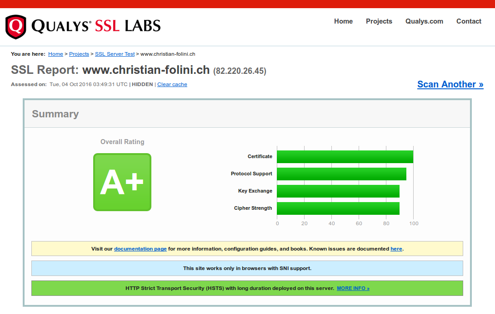

##Konfigurieren eines SSL Servers

###Was machen wir?
Wir setzen einen mit Serverzertifikat gesicherten Apache Webserver auf.

###Warum tun wir das?

Das HTTP Protokoll ist ein Klartext-Protokoll, das sich sehr gut abhören lässt. Die Erweiterung HTTPS umgibt den HTTP-Verkehr mit einer SSL-/TLS-Schutzschicht, welche das Abhören verhindert und sicherstellt, dass wir wirklich mit demjenigen Server sprechen, den wir angesprochen haben. Die Übertragung der Daten geschieht dann nur noch verschlüsselt. Das bedeutet noch keinen sicheren Webserver, aber es ist die Basis für einen gesicherten HTTP-Verkehr.

###Voraussetzungen

* Ein Apache Webserver, idealerweise mit einem File-Layout wie bei [Anleitung 1 (Kompilieren eines Apache Servers)](http://www.netnea.com/cms/apache_tutorial_1_apache_compilieren/) erstellt.
* Verständnis der minimalen Konfiguration in [Anleitung 2 (Apache minimal konfigurieren)](http://www.netnea.com/cms/apache_tutorial_2_apache_minimal_konfigurieren/).

###Schritt 1: Server mit SSL/TLS, aber ohne offiziell signiertes Zertifikat konfigurieren

Ein SSL Server muss sich beim Kontakt mit dem Client durch ein signiertes Zertifikat ausweisen. Für eine erfolgreiche Verbindung muss die Signierstelle dem Client bekannt sein, was er durch eine Überprüfung der Zertifikatskette vom Server- bis zum Root-Zertifikat der Signierstelle, der Certificate Authority, überprüft. Offiziell signierte Zertifikate bezieht man deshalb von einem öffentlichen (oder privaten) Anbieter, dessen Root-Zertifikat dem Browser bekannt ist. 

Die Konfiguration eines SSL-Servers umfasst also zwei Schritte: Den Bezug eines offiziell signierten Zertifikats und die Konfiguration des Servers. Die Konfiguration des Servers ist der interessantere und einfachere Teil, weshalb wir ihn vorziehen. Dazu bedienen wir uns eines inoffiziellen Behelfzertifikats, das auf unserem System bereits vorhanden ist (zumindest wenn es aus der Debian-Familie stammt und das Paket _ssl-cert_ installiert ist).

Das Zertifikat und der zugehörige Schlüssel befinden sich unter:

```bash
/etc/ssl/certs/ssl-cert-snakeoil.pem
/etc/ssl/private/ssl-cert-snakeoil.key
```

Die Namen der Dateien deuten bereits darauf hin, dass es sich hier um ein wenig vertrauenerweckendes Paar handelt. Der Browser wird denn auch eine Zertifikatswarnung abgeben, wenn man sie für einen Server einsetzt.

Für einen ersten Konfigurationsversuch taugen sie aber durchaus:

```bash

ServerName              localhost
ServerAdmin             root@localhost
ServerRoot              /apache
User                    www-data
Group                   www-data

ServerTokens            Prod
UseCanonicalName        On
TraceEnable             Off

Timeout                 5
MaxRequestWorkers       250

Listen                  127.0.0.1:80
Listen                  127.0.0.1:443

LoadModule              mpm_event_module        modules/mod_mpm_event.so
LoadModule              unixd_module            modules/mod_unixd.so

LoadModule              log_config_module       modules/mod_log_config.so

LoadModule              authn_core_module       modules/mod_authn_core.so
LoadModule              authz_core_module       modules/mod_authz_core.so

LoadModule              ssl_module              modules/mod_ssl.so
LoadModule              headers_module         	modules/mod_headers.so

ErrorLogFormat          "[%{cu}t] [%-m:%-l] %-a %-L %M"
LogFormat               "%h %l %u [%{%Y-%m-%d %H:%M:%S}t.%{usec_frac}t] \"%r\" %>s %b \"%{Referer}i\" \"%{User-Agent}i\"" combined

LogLevel                debug
ErrorLog                logs/error.log
CustomLog               logs/access.log combined

SSLCertificateKeyFile   /etc/ssl/private/ssl-cert-snakeoil.key
SSLCertificateFile      /etc/ssl/certs/ssl-cert-snakeoil.pem

SSLProtocol             All -SSLv2 -SSLv3
SSLCipherSuite          'kEECDH+ECDSA kEECDH kEDH HIGH +SHA !aNULL !eNULL !LOW !MEDIUM !MD5 !EXP !DSS !PSK !SRP !kECDH !CAMELLIA !RC4'
SSLHonorCipherOrder     On

SSLRandomSeed           startup file:/dev/urandom 2048
SSLRandomSeed           connect builtin

DocumentRoot            /apache/htdocs

<Directory />
      
        Require all denied

        Options SymLinksIfOwnerMatch
        AllowOverride None

</Directory>

<VirtualHost 127.0.0.1:80>
      
      <Directory /apache/htdocs>

        Require all granted

        Options None
        AllowOverride None

      </Directory>

</VirtualHost>

<VirtualHost 127.0.0.1:443>

        SSLEngine On
		Header always set Strict-Transport-Security "max-age=31536000; includeSubDomains"
		
        <Directory /apache/htdocs>

            Require all granted

            Options None
            AllowOverride None

        </Directory>

</VirtualHost>

```

Ich beschreibe nicht die gesamte Konfiguration, nur die gegenüber Lektion 2 hinzugekommenen Direktiven. Neu lauschen wir neben dem Port 80 auch noch auf Port 443; dem _HTTPS-Port_. Wie erwartet ist das *SSL-*Modul neu hinzugeladen und ferner das Header-Modul, das wir weiter unten benötigen. Dann konfigurieren wir den Schlüssel und das Zertifikat mittels der Direktiven _SSLCertificateKeyFile_ und _SSLCertificateFile_. In der Protokollzeile (_SSLProtocol_) ist es sehr wichtig, das wir das ältere und unsichere Protokoll _SSLv2_ ausschalten, aber auch _SSLv3_ ist seit der _POODLE_ Attacke nicht mehr länger sicher. Am besten wäre es, nurmehr _TLSv1.2_ zuzulassen, aber das beherrschen noch nicht alle Browser. Wir schliessen also einfach _SSLv2_ sowie _SSLv3_ vom Gebrauch aus und lassen damit zur Zeit faktisch TLSv1, das sehr seltene TLSv1.1 sowie das quantitativ dominierende TLSv1.2 zu. Der Handshake und die Verschlüsselung geschieht durch einen Satz von mehreren Algorithmen. Diese kryptographischen Algorithmen definieren wir mit der sogenannten _Cipher-Suite_. Es ist wichtig, eine saubere _Cipher-Suite_ zu verwenden, denn an dieser Stelle setzen Abhörangriffe typischerweise an: Sie nützen die Schwächen und die zu geringe Schlüssellänge älterer Algorithmen aus. Eine sehr eingeschränkte Suite verhindert allerdings, dass ältere Browser auf unseren Server zugreifen können. Die vorgeschlagene _Cipher-Suite_ weist eine hohe Sicherheit auf und berücksichtigt auch einige ältere Browser ab Windows Vista. Windows XP und sehr alte Android-Versionen schliessen wir damit aber von der Kommunikation aus.

Im Kern der _Cipher-Suite_ stehen die Algorithmen der Gruppe _HIGH_. Das ist die Gruppe der hochwertigen Ciphers, welche _OpenSSL_ uns via das _SSL-Modul_ zur Verfügung stellt. Die vor diesem Schlüsselwort angeführten Algorithmen, welche an sich auch Teil der _HIGH-Gruppe_ sind, erhalten durch das Voranstellen die Priorität. Danach fügen wir den Hashing-Algorithmus _SHA_ hinzu und schliessen dann eine Reihe von Algorithmen aus, die aus dem einen oder anderen Grund in unserer _Cipher-Suite_ nicht erwünscht sind.

Darauf folgt die Direktive _SSLHonorCipherOrder_. Sie ist von hoher Wichtigkeit. Man spricht bei SSL oft von _Downgrade Attacks_. Dabei versucht ein Angreifer, ein sogenannter Mittelsmann oder Man-in-the-Middle, in den Verkehr einzugreifen und beim Handshake die Parameter so zu beeinflussen, dass zum Schluss ein schlechteres Protokoll verwendet wird als eigentlich möglich wäre. Namentlich die in der _Cipher-Suite_ festgelegte Priorisierung wird damit ausgehebelt. Die Direktive _SSLHonorCipherOrder_ verhindert diese Angriffsart, indem auf der Algorithmen-Präferenz unseres Servers bestanden wird.

Verschlüsselung arbeitet mit Zufallszahlen. Der Zufallszahlengenerator will korrekt gestartet und benützt werden, wozu die Direktive _SSLRandomSeed_ dient. Dies ist wieder ein Punkt wo Performance und Sicherheit bedacht werden wollen. Beim Starten des Servers greifen wir auf die Zufallszahlen des Betriebssystems in _/dev/urandom_ zu. Während des Betriebs des Servers, beim _SSL-Handshake_ verwenden wir dann die apache-eigene Quelle für Zufallszahlen (_builtin_), die sich aus dem Verkehr des Servers speist. Zwar ist _/dev/urandom_ nicht die allerbeste Quelle für Zufallszahlen, aber es ist eine schnelle Quelle und zudem eine, die eine bestimmte Menge Entropie garantiert. Die qualitativ bessere Quelle _/dev/random_ könnte unseren Server unter widrigen Umständen beim Start blockieren, da nicht genügend Daten vorhanden sind, weshalb in aller Regel _/dev/urandom_ bevorzugt wird.

Wir haben auch noch einen zweiten _Virtual-Host_ eingeführt. Er gleicht dem _Virtual-Host_ für Port 80 sehr stark. Die Portnummer ist aber _443_ und wir aktivieren die _SSL-Engine_, die uns die Verschlüsselung des Verkehrs liefert und die oben gesetzen Konfigurationen erst aktiviert. Zusätzlich setzen wir mit Hilfe des oben geladenen Header-Moduls den _Strict-Tarnsport-Security_-Header (kurz _STS_-Header). Dieser HTTP Header ist Teil der Antwort und instruiert den Client, zukünftig für eine Dauer von 365 Tagen (dies entspricht 31536000 Sekunden) nurmehr verschlüsselt auf unseren Server zuzugreifen. Das Flag _includeSubDomains_ besagt, dass neben unserem Hostnamen auch Unter-Domänen in diese Option miteinbezogen werden soll. Der _STS_-Header ist der wichtigste einer Gruppe von neueren HTTP Antowrt Headern mit denen wir die Sicherheit unseres Servers verbessern können. Verschiedene Browser unterstützen unterschiedliche Header, so dass es nicht ganz einfach ist, den Überblick zu behalten. Der _STS_-Header sollte aber auf keinen Fall mehr fehlen. Wenn wir uns die Direktive _Header_ genauer ansehen, dann fällt noch das Flag _always_ ins Auge. Es gibt Fälle in denen das Modul nicht anspringt (etwa wenn eine Fehlermeldung an den Client retourniert wird). Mit _always_ garantieren wir, dass der Header in jedem Fall gesetzt wird.

Das wären alle Änderungen an unserer Konfiguration. Schreiten wir also zur Tat.

###Schritt 2: Ausprobieren

Zu Übungszwecken haben wir unseren Testserver wie in den vorangegangenen Lektionen auf der lokalen IP-Adresse _127.0.0.1_ konfiguriert. Probieren wir es also aus:

```bash
$> curl -v https://127.0.0.1/index.html
* Hostname was NOT found in DNS cache
*   Trying 127.0.0.1...
* Connected to 127.0.0.1 (127.0.0.1) port 443 (#0)
* successfully set certificate verify locations:
*   CAfile: none
  CApath: /etc/ssl/certs
* SSLv3, TLS handshake, Client hello (1):
* SSLv3, TLS handshake, Server hello (2):
* SSLv3, TLS handshake, CERT (11):
* SSLv3, TLS handshake, Server key exchange (12):
* SSLv3, TLS handshake, Server finished (14):
* SSLv3, TLS handshake, Client key exchange (16):
* SSLv3, TLS change cipher, Client hello (1):
* SSLv3, TLS handshake, Finished (20):
* SSLv3, TLS change cipher, Client hello (1):
* SSLv3, TLS handshake, Finished (20):
* SSL connection using ECDHE-RSA-AES256-GCM-SHA384
* Server certificate:
* 	 subject: CN=myhost.home
* 	 start date: 2013-10-26 18:00:21 GMT
* 	 expire date: 2023-10-24 18:00:21 GMT
* SSL: certificate subject name 'myhost.home' does not match target host name '127.0.0.1'
* Closing connection 0
* SSLv3, TLS alert, Client hello (1):
curl: (51) SSL: certificate subject name 'myhost.home' does not match target host name '127.0.0.1'
```

Leider waren wir noch nicht erfolgreich. Kein Wunder, denn wir haben einen Server unter der IP-Adresse _127.0.0.1_ angesprochen, er hat sich bei uns aber mit einem Zerifikat für _myhost.home_ gemeldet. Ein typischer Fall eines Handshake-Fehlers.

Wir können _curl_ instruieren, den Fehler zu ignorieren und dennoch eine Verbindung herzustellen. Dies geschieht mit dem Flag _--insecure_, respektive _-k_.:

```bash
curl -v -k https://127.0.0.1/index.html
* Hostname was NOT found in DNS cache
*   Trying 127.0.0.1...
* Connected to 127.0.0.1 (127.0.0.1) port 443 (#0)
* successfully set certificate verify locations:
*   CAfile: none
  CApath: /etc/ssl/certs
* SSLv3, TLS handshake, Client hello (1):
* SSLv3, TLS handshake, Server hello (2):
* SSLv3, TLS handshake, CERT (11):
* SSLv3, TLS handshake, Server key exchange (12):
* SSLv3, TLS handshake, Server finished (14):
* SSLv3, TLS handshake, Client key exchange (16):
* SSLv3, TLS change cipher, Client hello (1):
* SSLv3, TLS handshake, Finished (20):
* SSLv3, TLS change cipher, Client hello (1):
* SSLv3, TLS handshake, Finished (20):
* SSL connection using ECDHE-RSA-AES256-GCM-SHA384
* Server certificate:
* 	 subject: CN=myhost.home
* 	 start date: 2013-10-26 18:00:21 GMT
* 	 expire date: 2023-10-24 18:00:21 GMT
* 	 issuer: CN=myhost.home
* 	 SSL certificate verify ok.
> GET /index.html HTTP/1.1
> User-Agent: curl/7.35.0
> Host: 127.0.0.1
> Accept: */*
> 
< HTTP/1.1 200 OK
< Date: Thu, 01 Oct 2015 07:48:13 GMT
* Server Apache is not blacklisted
< Server: Apache
< Last-Modified: Thu, 24 Sep 2015 11:54:56 GMT
< ETag: "2d-5207ce664322e"
< Accept-Ranges: bytes
< Content-Length: 45
< 
<html><body><h1>It works!</h1></body></html>
* Connection #0 to host 127.0.0.1 left intact

```

Nun klappt es also und unser SSL-Server läuft. Freilich mit einem faulen Zertifikat und wir sind damit weit von einem produktiven Einsatz entfernt.

Im Folgenden geht es nun darum, ein offizielles Zertifikat zu beziehen, dieses dann korrekt zu installieren und unsere Konfiguration noch etwas zu verfeinern.


###Schritt 3a: SSL-Schlüssel und -Zertifikat beziehen

HTTPS erweitert das bekannte HTTP-Protokoll um eine SSL-Schicht. Technisch wurde SSL (_Secure Socket Layer_) zwar heute von TLS (_Transport Security Layer_) ersetzt, aber man spricht dennoch immer noch von SSL. Das Protokoll garantiert verschlüsselten und damit abhörsicheren Datenverkehr. Der Verkehr wird symmetrisch verschlüsselt, was einen hohen Durchsatz garantiert, setzt aber im Fall von HTTPS einen Public-/Private-Key Setup voraus, der den sicheren Austausch der symmetrischen Schlüssel durch sich zuvor unbekannte Kommunikationspartner voraus. Dieser Public-/Private-Key Handshake geschieht mit Hilfe eines Serverzertifikats, das durch eine offizielle Stelle signiert werden muss.

Serverzertifikate existieren in verschiedenen Formen, Validierungen und Gültigkeitsbereichen. Nicht jedes Merkmal ist wirklich technischer Natur, das Marketing spielt auch eine Rolle. Die Preisunterschiede sind sehr gross, weshalb sich ein Vergleich lohnt. Für unseren Test-Setup verwenden wir ein freies Zertifikat, das wir aber dennoch offiziell beglaubigen lassen. Bei <a href="https://www.startssl.com">_StartSSL_</a> lässt sich beides einfach und ohne Bezahlung mit einer Laufzeit von 12 Monaten beziehen. _StartSSL_ steht immer wieder in der Kritik, weshalb dieser Gratis-Service keinen guten Ruf besitzt (bspw. ist die Revozierung eines Zertifikats kostenpflichtig). Es ist allerdings ein einfacher Weg, um zu einem offiziellen Zertifikat für einen Test-Server zu kommen und vergleichbare Gratis-Angebote haben Laufzeiten von 90 Tagen und weniger.

Dieses Zertifikat ist an sich auch für einen sicheren Einsatz auf einem produktiven Server geeignet, allerdings tut man bis heute meist gut daran, eine qualifiziertere _Certificate Authority_ zu benützen als die vorgeschlagene. Für den 16. November 2015 ist die Eröffnung von _Let's Encrypt_ angekündigt. Dies ist eine _CA_, welche ausschliesslich Gratis-Zertifikate anbieten will. Sobald _Let's Encrypt_ erfolgreich aktiv ist, wird diese Anleitung hier angepasst werden.

Für den Moment setzen wir aber auf _StartSSL_. Der Anbieter überprüft zunächst die Identität eines Antragsstellers und dann vor der Ausstellung des Zertifikats auch noch dessen Berechtigung, ein bestimmtes Zertifikat für eine bestimmte Domain zu erhalten. Diese Überprüfung geschieht durch ein Email an eine vordefinierte Adresse der gewünschten Zertifikats-Domäne. Konkret bedeutet dies im Fall der Domäne _example.com_, dass _StartSSL_ eine Email-Nachricht mit einem Sicherheitscode an eine der drei Adressen _postmaster@example.com_, _webmaster@example.com_ oder _hostmaster@example.com_ versendet. Dies verhindert, dass jemand ein Zertifikat für eine fremde Domäne beziehen kann, denn in diesem Fall ginge die Nachricht mit dem Code ins Leere.

Zur Zeit kommt man über die folgenden Schritte zu einem Server-Zertifikat:

* Registrieren
* Persönliche Email-Adresse überprüfen
* Zertifikats- und Schlüssel-Erstellung starten
* Berechtigung für Domäne überprüfen
* Zertifikats- und Schlüssel-Erstellung abschliessen
* Zertifikat signieren
* Signiertes Zertifikat und Schlüssel herunterladen und installieren

Natürlich ist es auch möglich, Zertifikat und Private Key selbst zu erstellen und ersteres dann online nur noch signieren zu lassen. So bekommt die CA unseren Private Key erst gar nie in die Hände, was durchaus sehr empfohlen, wenn nicht sogar Pflicht ist. Wichtig ist in beiden Varianten, dass man den Schlüssel durch ein starkes Passwort schützt. Dieses Passwort benötigen wir später bei der Konfiguration des Servers.

###Schritt 3b: Zertifikat selbst erstellen und offiziell signieren lassen

Einen sehr guten Schlüssel generieren wir wie folgt:

```bash
$> openssl genrsa -des3 -out server.key 2048
```

Die Generierung des Schlüssels dürfte einen Moment in Anspruch nehmen, denn eine Länge von 2048 wie angegeben ist ziemlich gross und die notwendige Entropie muss erst gefunden werden. Es wäre auch möglich, mit einer Länge von 4096 zu arbeiten, aber der geringe kryptographische Mehrwert wird durch eine mehrfach schlechtere Performance auf dem Server erkauft. Wir erwarten folgenden Ablauf des Aufrufs:
 
```bash
Generating RSA private key, 2048 bit long modulus
.+++++++++++++++++++++++++++...
...
e is 65537 (0x10001)
Enter pass phrase for server.key:
Verifying - Enter pass phrase for server.key:
```

Merken Sie sich diese Passphrase gut. Mit dem neuen Schlüssel generieren wir nun einen Signierungsantrag, einen _Certificate Signing Request_, kurz _CSR_:

```bash
$> openssl req -new -key server.key > server.csr
```

Hier werden ein paar weitere Fragen gestellt, die wir gewissenhaft beantworten:

```bash
Enter pass phrase for server.key:
You are about to be asked to enter information that will be incorporated
into your certificate request.
What you are about to enter is what is called a Distinguished Name or a DN.
There are quite a few fields but you can leave some blank
For some fields there will be a default value,
If you enter '.', the field will be left blank.
-----
Country Name (2 letter code) [AU]:CH
State or Province Name (full name) [Some-State]:Bern
Locality Name (eg, city) []:Bern
Organization Name (eg, company) [Internet Widgits Pty Ltd]:example.com
Organizational Unit Name (eg, section) []:-
Common Name (eg, YOUR name) []:Christian Folini
Email Address []:webmaster@example.com

Please enter the following 'extra' attributes
to be sent with your certificate request
A challenge password []:sjk3hrer8jk   
An optional company name []:test company
```

Wir erhalten darauf einen _CSR_ mit Namen server.csr. Damit gehen wir zu _StartSSL_ und lassen ihn signieren.


###Schritt 4: Zertifikat für die Vertrauenskette beziehen

Ich setze voraus, dass Sie ein offiziell signiertes Zertifikat mit zugehörigem Schlüssel wie beschrieben bezogen oder selbst generiert und offiziell signiert haben.

Die Funktionsweise des _SSL-/TLS_-Protokolls ist anspruchsvoll. Eine gute Einführung bietet das _OpenSSL Cookbook_ von Ivan Ristić (siehe Links) oder sein umfassenderes Werk _Bulletproof SSL und TLS_. Ein Bereich, der schwer verständlich ist, umfasst die Vertrauensbeziehungen, die _SSL_ garantiert. Der Webbrowser vertraut von Beginn weg einer Liste von Zertifizierungs-Authoritäten, wozu auch _StartSSL_ gehört. Beim Aufbau der _SSL_-Verbindung wird dieses Vertrauen auf unseren Webserver erweitert. Dies geschieht mit Hilfe des Zertifikates. Es wird eine Vertrauenskette zwischen der Zertifizierungs-Authorität und unserem Server gebildet. Aus technischen Gründen gibt es ein Zwischenglied zwischen der Zertifizierungs-Authorität und unserem Webserver. Dieses Glied müssen wir in der Konfiguration auch definieren. Zunächst müssen wir die Datei aber beziehen:

```bash
$> wget https://www.startssl.com/certs/sub.class1.server.ca.pem -O startssl-class1-chain-ca.pem
```

Ich wähle beim Herunterladen einen etwas anderen Datei-Namen als vorgegeben. Wir gewinnen dadurch an Klarheit für die Konfiguration. Die signierten Dateien werden bei der Überprüfung durch den Client aneinandergereiht. Gemeinsam bilden die Signaturen auf den Zertifikaten dann die Vertrauenskette von unserem Zertifikat zur _Certificate Authority_.


###Schritt 5: SSL Schlüssel und Zertifikate installieren

Damit sind nun der Schlüssel und die zwei benötigten Zertifikate vorhanden. Konkret:

* server.key _Server-Schlüssel_
* server.crt _Server-Zertifikat_
* startssl-class1-chain-ca.pem _StartSSL-Chainfile_

Wir installieren sie in zwei speziell gesicherte Unterverzeichnisse des Konfigurations-Ordners:

```bash
$> mkdir /apache/conf/ssl.key
$> chmod 700 /apache/conf/ssl.key
$> mv server.key /apache/conf/ssl.key
$> chmod 400 /apache/conf/ssl.key/server.key
$> mkdir /apache/conf/ssl.crt
$> chmod 700 /apache/conf/ssl.crt
$> mv server.crt /apache/conf/ssl.crt
$> chmod 400 /apache/conf/ssl.crt/server.crt
$> mv startssl-class1-chain-ca.pem /apache/conf/ssl.crt/
$> chown -R root:root /apache/conf/ssl.*/
```

###Schritt 6: Passphrase Dialog automatisch beantworten

Beim Beziehen des Schlüssels mussten wir eine Passphrase definieren, um den Schlüssel zu entsperren. Damit unser Webserver den Schlüssel benutzen kann, müssen wir ihm diesen Code bekannt geben. Er wird uns beim Starten des Servers danach fragen. Möchten wir das nicht, dann müssen wir es in der Konfiguration mit angeben. Wir tun dies mittels einer separaten Datei, die auf Anfrage die Passphrase liefert. Nennen wir diese Datei _/apache/bin/gen_passphrase.sh_ und tragen wir die oben gewählte Passphrase ein:

```bash
#!/bin/sh
echo "S7rh29Hj3def-07hdkBgj4jDfg_skDg$48JuPhd"
```

Diese Datei muss speziell gesichert und vor fremden Augen geschützt werden.

```bash
$> sudo chmod 700 /apache/bin/gen_passphrase.sh
$> sudo chown root:root /apache/bin/gen_passphrase.sh
```

###Schritt 7: Apache konfigurieren

Nun sind alle Vorbereitungen abgeschlossen und wir können den Webserver final konfigurieren. Ich liefere hier nicht mehr die komplette Konfiguration, sondern nur noch den korrekten Servernamen und den verfeinerten SSL-Teil:


```bash
ServerName		www.example.com

...

LoadModule              socache_shmcb_module    modules/mod_socache_shmcb.so

...

SSLCertificateKeyFile   conf/ssl.key/server.key
SSLCertificateFile      conf/ssl.crt/server.crt
SSLCertificateChainFile conf/ssl.crt/startssl-class1-chain-ca.pem
SSLPassPhraseDialog     exec:bin/gen_passphrase.sh

SSLProtocol             All -SSLv2 -SSLv3
SSLCipherSuite		'kEECDH+ECDSA kEECDH kEDH HIGH +SHA !aNULL !eNULL !LOW !MEDIUM !MD5 !EXP !DSS !PSK !SRP !kECDH !CAMELLIA !RC4'
SSLHonorCipherOrder	On

SSLRandomSeed           startup file:/dev/urandom 2048
SSLRandomSeed           connect builtin

SSLSessionCache 	"shmcb:/apache/logs/ssl_gcache_data(1024000)"
SSLSessionTickets	On


...


<VirtualHost 127.0.0.1:443>

	ServerName              www.example.com
	
	SSLEngine On
	Header always set Strict-Transport-Security "max-age=31536000; includeSubDomains"

	...
```

Sinnvoll ist es, den mit dem Zertifikat übereinstimmenden _ServerName_ auch im _VirtualHost_ bekanntzugeben. Wenn wir das nicht tun, wird Apache eine Warnung ausgeben (und dann dennoch den einzigen konfigurierten VirtualHost wählen und korrekt weiterfunktionieren).

Neu hinzugekommen sind auch die beiden Optionen _SSLSessionCache_ sowie _SSLSessionTickets_. Die beiden Direktiven kontrollieren das Verhalten des _SSL Session Caches_. Voraussetzung für den Cache ist das Modul *socache_shmcb*, welches die Caching-Funktionalität zur Verfügung stellt und von *mod_ssl* angesprochen wird. Das funktioniert folgendermassen: Während des SSL Handshakes werden Parameter der Verbindung wie etwa der Schlüssel und ein Verschlüsselungsalgorithmus ausgehandelt. Dies geschieht im Public-Key Modus, der sehr rechenintensiv ist. Ist der Handshake erfolgreich beendet, verkehrt der Server mit dem Client über die performantere symmetrische Verschlüsselung mit Hilfe der eben ausgehandelten Parameter. Ist der Request beendet und die _Keep-Alive_ Periode ohne neue Anfrage verstrichen, dann gehen die TCP-Verbindung und die mit der Verbindung verhängten Parameter verloren. Wird die Verbindung kurze Zeit später neu aufgebaut, müssen die Parameter neu ausgehandelt werden. Das ist aufwändig, wie wir eben gesehen haben. Besser wäre es, man könnte die vormals ausgehandelten Parameter re-aktivieren. Diese Möglichkeit besteht in der Form des _SSL Session Caches_. Traditionell wird dieser Cache serverseitig verwaltet.

Beim Session Cache via Tickets werden die Parameter in einem Session Ticket zusammengefasst und dem Client übergeben, wo sie clientseitig gespeichert werden, was auf dem Webserver Speicherplatz spart. Beim Aufbau einer neuen Verbindung sendet der Client die Parameter an den Server und dieser konfiguriert die Verbindung entsprechend. Um eine Manipulation der Parameter im Ticket zu verhindern, signiert der Server das Ticket vorgängig und überprüft es beim Aufbei einer Verbindung wieder. Bei diesem Mechanismus ist daran zu denken, dass die Signatur von einem Signierschlüssel abhängt und es sinnvoll ist, diesen meist dynamisch erzeugten Schlüssel regelmässig zu erneuern. Ein neues Laden des Server gewährleistet dies.

SSL Session Tickets sind jünger und nunmehr von allen relevanten Browsern unterstützt. Sie gelten auch als sicher. Das ändert aber nichts an der Tatsache, dass zumindest eine theoretische Verwundbarkeit besteht, indem die Session Parameter clientseitig gestohlen werden können. 

Beide Varianten des Session Caches lassen sich ausschalten. Dies geschieht wie folgt: 

```bash
SSLSessionCache         nonenotnull
SSLSessionTickets	Off
```

Natürlich bleibt diese Anpassung nicht ohne Folgen für die Performance. Allerdings nimmt sich der Performance-Verlust durchaus klein aus. Es wäre überraschend, wenn ein Last-Test auf das Ausschalten mit einem Leistungsrückgang von mehr als 10% reagieren würde.


###Schritt 8: Ausprobieren

Zu Übungszwecken haben wir unseren Testserver erneut auf der lokalen IP-Adresse _127.0.0.1_ konfiguriert. Um das Funktionieren der Zertifikatskette zu testen, dürfen wir den Server nicht einfach mittels der IP-Adresse ansprechen, sondern wir müssen ihn mit dem korrekten Hostnamen kontaktieren. Und dieser Hostname muss natürlich mit demjenigen auf dem Zertifikat übereinstimmen. Im Fall von _127.0.0.1_ erreichen wir dies, indem wir das _Host-File_ unter _/etc/hosts_ anpassen:

```bash
127.0.0.1	localhost myhost www.example.com
...
```

Nun können wir entweder mit dem Browser oder mit curl auf die URL [https://www.example.com](https://www.example.com) zugreifen. Wenn dies ohne eine Zertifikats-Warnung funktioniert, dann haben wir den Server korrekt konfiguriert. Etwas genauer lässt sich die Verschlüsselung und die Vertrauenskette mit dem Kommendozeilen-Tool _OpenSSL_ überprüfen. Da _OpenSSL_ aber anders als der Browser und curl keine Liste mit Zertifikatsauthoritäten besitzt, müssen wir dem Tool das Zertifikat der Authorität auch mitgeben. Wir besorgen es uns bei _StartSSL_.

```bash
$> wget https://www.startssl.com/certs/ca.pem
...
$> openssl s_client -showcerts -CAfile ca.pem -connect www.example.com:443
```
Hier instruieren wir _OpenSSL_, den eingebauten client zu verwenden, uns die vollen Zertifikatsinformationen zu zeigen, das eben heruntergeladene CA-Zertifikat zu verwenden und mit diesen Parametern auf unseren Server zuzugreifen. Im optimalen Fall sieht der Output (leicht gekürzt) wie folgt aus:

```bash
CONNECTED(00000003)
---
Certificate chain
 0 s:/description=329817-gqai4gyx3JMxBbCV/C=CH/O=Persona Not Validated/OU=StartCom Free Certificate ...
   i:/C=IL/O=StartCom Ltd./OU=Secure Digital Certificate Signing/CN=StartCom Class 1 Primary ...
-----BEGIN CERTIFICATE-----
MIIHtDCCBpygAwIBAgIDArSFMA0GCSqGSIb3DQEBBQUAMIGMMQswCQYDVQQGEwJJ
...
...
...
x94JRF4camVVVDe3ae7TXZ/xl/Y8vR7TMbZJx4vg33IjnmLS6FOlf97BP6wA7wZN
zZnCQe+3NTU=
-----END CERTIFICATE-----
 1 s:/C=IL/O=StartCom Ltd./OU=Secure Digital Certificate Signing/CN=StartCom Class 1 Primary ...
   i:/C=IL/O=StartCom Ltd./OU=Secure Digital Certificate Signing/CN=StartCom Certification ...
-----BEGIN CERTIFICATE-----
MIIGNDCCBBygAwIBAgIBGDANBgkqhkiG9w0BAQUFADB9MQswCQYDVQQGEwJJTDEW
...
...
...
p/EiO/h94pDQehn7Skzj0n1fSoMD7SfWI55rjbRZotnvbIIp3XUZPD9MEI3vu3Un
0q6Dp6jOW6c=
-----END CERTIFICATE-----
---
Server certificate
subject=/description=329817-gqai4fgt3JMxBbCV/C=CH/O=Persona Not Validated/OU=StartCom Free Certificate ...
issuer=/C=IL/O=StartCom Ltd./OU=Secure Digital Certificate Signing/CN=StartCom Class 1 Primary ...
---
No client certificate CA names sent
---
SSL handshake has read 4526 bytes and written 319 bytes
---
New, TLSv1/SSLv3, Cipher is AES256-SHA
Server public key is 2048 bit
Secure Renegotiation IS supported
Compression: NONE
Expansion: NONE
SSL-Session:
    Protocol  : TLSv1
    Cipher    : AES256-SHA
    Session-ID: FE496BB191B6888EA9CA3ED4E166707857186D5B32F1A0D9E418145D1B721CB4
    Session-ID-ctx: 
    Master-Key: 1BF16E22B0DF086E1AF4E13D9158AC0A3B1039E334C0C7F177A8757694B516E00E20AC3D6250B10D...
    Key-Arg   : None
    Start Time: 1294591828
    Timeout   : 300 (sec)
    Verify return code: 0 (ok)
---
```

Damit haben wir einen sauberen _HTTPS-Server_ konfiguriert. 

Interessanterweise gibt es im Internet so etwas wie eine Hitparade, was sichere _HTTPS-Server_ betrifft. Das sehen wir uns nun noch als Bonus an.


###Schritt 9 (Bonus): Qualität der SSL Sicherung extern überprüfen lassen

Ivan Ristić, der oben erwähnte Autor von mehreren Büchern über Apache und SSL, betreibt im Dienst von Qualys einen Analyse-Service zur Überprüfung von _SSL-Webservern_. Er befindet sich unter [www.ssllabs.com](https://www.ssllabs.com/ssldb/index.html). Ein Webserver wie oben konfiguriert brachte mir im Test die Höchstnote von _A+_ ein.


Die Höchstnote ist mit dieser Anleitung in Reichweite.

###Verweise

* [Wikipedia OpenSSL](http://de.wikipedia.org/wiki/Openssl)
* [Apache Mod_SSL](http://httpd.apache.org/docs/2.4/mod/mod_ssl.html)
* [StartSSL Zertifikate](https://www.startssl.com)
* [SSLLabs](https://www.ssllabs.com)
* [OpenSSL Cookbook](https://www.feistyduck.com/books/openssl-cookbook/)
* [Bulletproof SSL und TLS](https://www.feistyduck.com/books/bulletproof-ssl-and-tls/)
* [Keylength.com - Hintergrundinformationen zu Ciphers und Keys](http://www.keylength.com)


### Lizenz / Kopieren / Weiterverwenden

<a rel="license" href="http://creativecommons.org/licenses/by-nc-sa/4.0/"></a><br />Diese Arbeit ist wie folgt lizenziert / This work is licensed under a <a rel="license" href="http://creativecommons.org/licenses/by-nc-sa/4.0/">Creative Commons Attribution-NonCommercial-ShareAlike 4.0 International License</a>.

