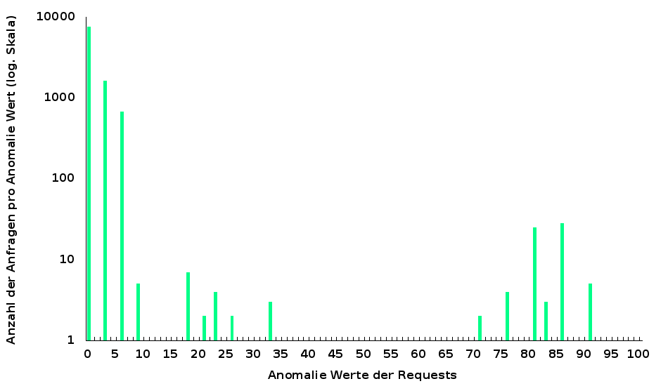

##Title: OWASP ModSecurity Core Rules tunen

###Was machen wir?

Wir reduzieren die *False Positives* einer frischen *OWASP ModSecurity Core Rules* Installation und setzen danach die Anomalie-Limite tief an, um Angreifer erfolgreich abzuwehren.

###Warum tun wir das?

Eine frische *Core Rules* Installation weist typischerweise viele Fehlalarme auf. Das geht gerne in die Tausende. Wir haben in der letzten Lektion verschiedene Techniken gesehen, wie man einzelne Fehlalarme zukünftig unterdrücken kann. Aber aller Anfang ist schwer und was fehlt ist eine Strategie, mit der schieren Menge der Fehlalarme fertig zu werden. Die Reduktion der Fehlalarme ist die Voraussetzung für die Reduktion der Anomalie-Limite der *Core Rules* und dies wiederum ist nötig, um Angreifer mittels *ModSecurity* tatsächlich abzuwehren. Und nur wenn die Fehlalarme wirklich ausgeschaltet oder zumindest sehr weit zurückgedrängt sind, erhalten wir einen Blick auf die tatsächlichen Angreifer.

###Voraussetzungen

* Ein Apache Webserver, idealerweise mit einem File-Layout wie bei [Anleitung 1 (Kompilieren eines Apache Servers)](https://www.netnea.com/cms/apache_tutorial_1_apache_compilieren/) erstellt.
* Verständnis der minimalen Konfiguration in [Anleitung 2 (Apache minimal konfigurieren)](https://www.netnea.com/cms/apache_tutorial_2_apache_minimal_konfigurieren/).
* Ein Apache Webserver mit SSL-/TLS-Unterstützung wie in [Anleitung 4 (Konfigurieren eines SSL Servers)](https://www.netnea.com/cms/apache-tutorial-4-ssl-server-konfigurieren)
* Ein Apache Webserver mit erweitertem Zugriffslog wie in [Anleitung 5 (Das Zugriffslog Ausbauen und Auswerten)](https://www.netnea.com/cms/apache-tutorial-5-zugriffslog-ausbauen/)
* Ein Apache Webserver mit ModSecurity wie in [Anleitung 6 (ModSecurity einbinden)](https://www.netnea.com/cms/apache-tutorial-6-modsecurity-einbinden/)
* Ein Apache Webserver mit einer Core Rules Installation wie in [Anleitung 7 (Core Rules einbinden)](https://www.netnea.com/cms/apache-tutorial-7-modsecurity-core-rules-einbinden/)


Ferner macht das natürlich nur Sinn, wenn wir auch eine richtige Applikation haben, die wir schützen können. In der Anleitung 3 haben wir gesehen, wie man einen PHP Applikationsserver aufsetzen kann. In einer späteren Anleitung werden wir einen Reverse Proxy oder Gateway Server einrichten. Eine solche Installation im produktiven Einsatz im Internet wird dann die gewünschte Menge an *Logfile* Einträgen bringen und mit sehr hoher Wahrscheinlichkeit die grosse Zahl von Fehlalarmen, welche die Voraussetzung für diese Anleitung ist.

Wo das nicht vorhanden ist, oder wo zu Übungszwecken ein funktionierendes Beispiel gesucht wird, bietet es sich an, mit bestehenden Übungsdaten zu arbeiten. Ich habe dazu zwei *Logfiles* als Übungsdateien zusammengestellt. Zusammengestellt deshalb, weil sie von einem ungetunten, produktiven System stammen, aber für den Einsatz in einer Übung erst anonymisiert werden mussten, indem sämtliche Daten, welche auf das Ursprungssystem hindeuteten, entfernt werden mussten. Ferner musste sicher gestellt werden, dass keine richtigen Angriffe mehr im Logfile vorhanden sind, denn wir möchten ja nur Fehlalarme entfernen und nicht die nötigen, richtigen Alarme unterdrücken.

* [labor-07-example-access.log](https://raw.githubusercontent.com/Apache-Labor/labor/master/labor-07/labor-07-example-access.log)
* [labor-07-example-error.log](https://raw.githubusercontent.com/Apache-Labor/labor/master/labor-07/labor-07-example-error.log)

Die Logfiles basieren auf 10'000 Requests. Das scheint mir das Minimum, um wirklich tunen zu können. Tatsächlich sind kleinere Logfiles zu zufällig und geben nur einen Teilaspekt eines Services wieder. Je grösser die Basis zum tunen, desto besser, aber gerade für die ersten Tuning-Schritte reicht es, mit dieser Grösse einzusteigen. Später mag es angezeigt sein, sich grössere Logfiles vorzunehmen um auch noch seltenere Fehlalarme ausmerzen zu können.

###Schritt 1: ModSecurity in Blocking Mode versetzen

In der letzten Anleitung habe ich bereits darauf hingewiesen, dass nur eine blockierende *Web Application Firewall* getunt wird. *ModSecurity* im *Monitoring Modus* wird beobachtet, einzelne Fehlalarme werden eliminiert und schliesslich gibt der Administrator trotz guten Vorsätzen auf; ohne klares Ziel vor Augen und erschlagen durch die schiere Menge der Fehlalarme.

Dem gegenüber postuliere ich einen klaren Ansatz:
* ModSecurity in den Blocking Modus versetzen
* Anomalie-Limiten sehr hoch setzen
* Relvante Fehlalarme tunen
* Anomalie-Limite leicht reduzieren
* Relvante Fehlalarme tunen
* ...
* Anomalie-Limite leicht auf einen tiefen Wert wie 5 oder 10 reduzieren

Es handelt sich also um einen iterativen Ansatz, der immer im Blocking Modus arbeitet und durch kleine Schritte eine graduelle Reduktion der Fehlalarme erreicht. In diesem Prozess wächst das Vertrauen in das System, die Reduktion der Fehlalarme und die eigenen Tuning-Fähigkeiten. Wenn wir von Anfang an im *Blocking Mode* arbeiten, brauchen wir uns auch nicht vor dem grossen Tag zu fürchten, wo wir den Hebel vom *Monitoring Modus* in den *Blocking Modus* umlegen. Vielmehr schärfen wir der WAF mit jeder Interaktion die Zähne und wenn wir sauber arbeiten werden dabei keine oder nur wenige legitime Requests blockiert.

###Schritt 2: Angriffsverkehr aus Logfile ausschliessen

*ModSecurity* soll uns helfen, Angreifer und legitime User zu unterscheiden; das ist überhaupt der Zweck der vielen Regeln und des ganzen Tunings. Es dient der Erhöhung der Trennschärfe. Um diesen Prozess aber durchführen zu können brauchen wir - es wurde bereits angesprochen - ein gesäubertes Logfiles. Aber wie erhalten wir dieses, denn in einem ungetunten System sind die Angreifer neben all den Fehlalarmen in den Logdateien nur sehr schwer zu identifizieren.

Es bieten sich mehrere Verfahren an:
* Wir arbeiten vor der Live-Schaltung des Services auf einem vom Internet getrennten Test-System.
* Wir verwenden einen Zugriffsschutz und berücksichtigen nur diejenigen Requests, welche den Schutz passieren.
* Wir filtern unbekannte IP Adressen aus dem Logfile weg

In der Praxis verwende ich eine Kombination dieser Verfahren. Das Herkunftsland der IP Adressen ist gerade für lokale Systeme in einem kleinen Land wie der Schweiz ein sehr taugliches Filterkriterium beim Tuning. Oft leite ich auch erfolgreiche Login-Versuche aus dem Logfile ab und eruiere daraus eine Liste von validen IP Adressen, anhand derer ich dann meine Logfiles als Basis für das Tuning zusammenstelle.

Diese Überlegungen führen uns aber weg vom eigentlichen Thema, dem Tuning. Deshalb stehen zumindest für diese Übung die obenstehenden Beispiel-Logfiles zur Verfügung.

###Schritt 3: Die Zusammenhänge zwischen Access- und Error-Log verstehen

In den vorangegangenen Anleitungen haben wir das *Access-Log* und das *Error-Log* des Webservers genau inspiziert. Stellen wir sie einmal nebeneinander:

```bash
192.168.146.78 CH - [2015-05-20 15:34:59.211464] "POST /EMail/MailHandler HTTP/1.1" 303 - "https://www.example.com/EMail/newMessage.aspx?msg=new" "Mozilla/5.0 (Windows NT 6.1; WOW64; Trident/7.0; rv:11.0) like Gecko" www.example.com 192.168.34.16 443 proxy-server - + "4a537de2.52283b4e6d77b" ViZDA6wxQzZrjCzQ-t8AAAAt TLSv1.2 ECDHE-RSA-AES128-SHA256 1796 4302 -% 1181278 14514 164330 149 18 0
``` 

In dieser Beispielzeile aus dem *Access-Log* wird eine Anfrage notiert. Es ist ein Postrequest auf die Ressource Email-Handler. Der Referrer weist auf eine Ressource *newMessage.aspx* hin, was dafür spricht, dass unser Request mit dem Versenden eines Emails in Zusammenhang stehen dürfte. Der zweitletzte Wert lautet *18* und bezeichnet den Anomalie-Wert des ankommenden Requests. (Die Antwort bringt 0 Punkte; zuhinterst). Unsere Limite ist noch extrem hoch gesetzt, von daher droht also keine Gefahr. Aber da es sich um gewaschenen respektive gefilterten Traffic handelt, wissen wir bereits, dass es sich um Fehlalarme handelt, welche gemeinsam einen Score von 18 Punkten brachten. Um welche False Positives handelt es sich? Schauen wir nach!

```bash
$> grep ViZDA6wxQzZrjCzQ-t8AAAAt labor-07-example-error.log
[2015-05-20 15:34:59.212369] [-:error] - - [client 192.168.146.78] ModSecurity: Warning. Pattern match "\\\\W{4,}" at ARGS:message. [file "/opt/modsecurity-rules/latest/base_rules/modsecurity_crs_40_generic_attacks.conf"] [line "37"] [id "960024"] [rev "2"] [msg "Meta-Character Anomaly Detection Alert - Repetative Non-Word Characters"] [data "..."] [hostname "www.example.com"] [uri "/EMail/MailHandler"] [unique_id "ViZDA6wxQzZrjCzQ-t8AAAAt"]
[2015-05-20 15:34:59.212639] [-:error] - - [client 192.168.146.78] ModSecurity: Warning. Pattern match "(?:\\\\bhttp\\\\/(?:0\\\\.9|1\\\\.[01])|<(?:html|meta)\\\\b)" at ARGS:message. [file "/opt/modsecurity-rules/latest/base_rules/modsecurity_crs_40_generic_attacks.conf"] [line "136"] [id "950911"] [rev "2"] [msg "HTTP Response Splitting Attack"] [data "..."] [hostname "www.example.com"] [uri "/EMail/MailHandler"] [unique_id "ViZDA6wxQzZrjCzQ-t8AAAAt"]
[2015-05-20 15:34:59.223143] [-:error] - - [client 192.168.146.78] ModSecurity: Warning. Pattern match "<(a|abbr|acronym|address|applet|area|audioscope|b|base|basefront|bdo|bgsound|big|blackface|blink|blockquote|body|bq|br|button|caption|center|cite|code|col|colgroup|comment|dd|del|dfn|dir|div|dl|dt|em|embed|fieldset|fn|font|form|frame|frameset|h1|head|h ..." at ARGS:message. [file "/opt/modsecurity-rules/latest/base_rules/modsecurity_crs_41_xss_attacks.conf"] [line "301"] [id "973300"] [rev "2"] [msg "Possible XSS Attack Detected - HTML Tag Handler"] [data "..."] [hostname "www.example.com"] [uri "/EMail/MailHandler"] [unique_id "ViZDA6wxQzZrjCzQ-t8AAAAt"]
[2015-05-20 15:34:59.225529] [-:error] - - [client 192.168.146.78] ModSecurity: Warning. Pattern match "<!(doctype|entity)" at ARGS:message. [file "/opt/modsecurity-rules/latest/base_rules/modsecurity_crs_41_xss_attacks.conf"] [line "464"] [id "973314"] [rev "2"] [msg "XSS Attack Detected"] [data "..."] [hostname "www.example.com"] [uri "/EMail/MailHandler"] [unique_id "ViZDA6wxQzZrjCzQ-t8AAAAt"]
``` 
Wir nehmen also die eindeutige *Request-ID* aus dem *Access-Log* und suchen damit im *Error-Log* nach den *False Positives*. Vier davon werden gefunden; etwas unübersichtlich zwar, aber wir wissen uns mit den zur Verfügung stehenden Aliasen zu helfen:

```bash
$> grep ViZDA6wxQzZrjCzQ-t8AAAAt labor-07-example-error.log | melidmsg
960024 Meta-Character Anomaly Detection Alert - Repetative Non-Word Characters
950911 HTTP Response Splitting Attack
973300 Possible XSS Attack Detected - HTML Tag Handler
973314 XSS Attack Detected
```

So wird ein Schuh draus. Unsere Aufgabe besteht nun darin, für all diese False Positives die genauen Bedingungen zu eruieren und sie zukünftig zu unterdrücken. Machen wir uns im nächsten Schritt ein Bild von dieser Aufgabe.

###Schritt 4: Die False Positives quantifizieren und eine Herangehensweise ableiten

Wir haben das Skript *modsec-positive-stats.rb* schon kennengelernt. Hier können wir es endlich richtig einsetzen:

```bash
$> cat labor-07-example-access.log | alscores | modsec-positive-stats.rb 
INCOMING                     Num of req. | % of req. |  Sum of % | Missing %
Number of incoming req. (total) |  10000 | 100.0000% | 100.0000% |   0.0000%

Empty or miss. incoming score   |      0 |   0.0000% |   0.0000% | 100.0000%
Reqs with incoming score of   0 |   7586 |  75.8600% |  75.8600% |  24.1400%
Reqs with incoming score of   1 |      0 |   0.0000% |  75.8600% |  24.1400%
Reqs with incoming score of   2 |      0 |   0.0000% |  75.8600% |  24.1400%
Reqs with incoming score of   3 |   1638 |  16.3800% |  92.2400% |   7.7600%
Reqs with incoming score of   4 |      0 |   0.0000% |  92.2400% |   7.7600%
Reqs with incoming score of   5 |      0 |   0.0000% |  92.2400% |   7.7600%
Reqs with incoming score of   6 |    676 |   6.7600% |  99.0000% |   1.0000%
Reqs with incoming score of   7 |      0 |   0.0000% |  99.0000% |   1.0000%
Reqs with incoming score of   8 |      0 |   0.0000% |  99.0000% |   1.0000%
Reqs with incoming score of   9 |      5 |   0.0500% |  99.0500% |   0.9500%
Reqs with incoming score of  10 |      0 |   0.0000% |  99.0500% |   0.9500%
Reqs with incoming score of  11 |      1 |   0.0100% |  99.0600% |   0.9400%
Reqs with incoming score of  12 |      0 |   0.0000% |  99.0600% |   0.9400%
Reqs with incoming score of  13 |      0 |   0.0000% |  99.0600% |   0.9400%
Reqs with incoming score of  14 |      0 |   0.0000% |  99.0600% |   0.9400%
Reqs with incoming score of  15 |      0 |   0.0000% |  99.0600% |   0.9400%
Reqs with incoming score of  16 |      0 |   0.0000% |  99.0600% |   0.9400%
Reqs with incoming score of  17 |      0 |   0.0000% |  99.0600% |   0.9400%
Reqs with incoming score of  18 |      7 |   0.0699% |  99.1300% |   0.8700%
Reqs with incoming score of  19 |      0 |   0.0000% |  99.1300% |   0.8700%
Reqs with incoming score of  20 |      0 |   0.0000% |  99.1300% |   0.8700%
Reqs with incoming score of  21 |      2 |   0.0200% |  99.1499% |   0.8501%
Reqs with incoming score of  22 |      0 |   0.0000% |  99.1499% |   0.8501%
Reqs with incoming score of  23 |      4 |   0.0400% |  99.1900% |   0.8100%
Reqs with incoming score of  24 |      0 |   0.0000% |  99.1900% |   0.8100%
Reqs with incoming score of  25 |      0 |   0.0000% |  99.1900% |   0.8100%
Reqs with incoming score of  26 |      2 |   0.0200% |  99.2099% |   0.7901%
Reqs with incoming score of  27 |      0 |   0.0000% |  99.2099% |   0.7901%
Reqs with incoming score of  28 |      0 |   0.0000% |  99.2099% |   0.7901%
Reqs with incoming score of  29 |      0 |   0.0000% |  99.2099% |   0.7901%
Reqs with incoming score of  30 |      0 |   0.0000% |  99.2099% |   0.7901%
Reqs with incoming score of  31 |      0 |   0.0000% |  99.2099% |   0.7901%
Reqs with incoming score of  32 |      0 |   0.0000% |  99.2099% |   0.7901%
Reqs with incoming score of  33 |      3 |   0.0300% |  99.2400% |   0.7600%
Reqs with incoming score of  34 |      1 |   0.0100% |  99.2500% |   0.7500%
Reqs with incoming score of  35 |      0 |   0.0000% |  99.2500% |   0.7500%
Reqs with incoming score of  36 |      0 |   0.0000% |  99.2500% |   0.7500%
Reqs with incoming score of  37 |      0 |   0.0000% |  99.2500% |   0.7500%
Reqs with incoming score of  38 |      0 |   0.0000% |  99.2500% |   0.7500%
Reqs with incoming score of  39 |      0 |   0.0000% |  99.2500% |   0.7500%
Reqs with incoming score of  40 |      0 |   0.0000% |  99.2500% |   0.7500%
Reqs with incoming score of  41 |      0 |   0.0000% |  99.2500% |   0.7500%
Reqs with incoming score of  42 |      0 |   0.0000% |  99.2500% |   0.7500%
Reqs with incoming score of  43 |      1 |   0.0100% |  99.2600% |   0.7400%
Reqs with incoming score of  44 |      0 |   0.0000% |  99.2600% |   0.7400%
Reqs with incoming score of  45 |      0 |   0.0000% |  99.2600% |   0.7400%
Reqs with incoming score of  46 |      0 |   0.0000% |  99.2600% |   0.7400%
Reqs with incoming score of  47 |      0 |   0.0000% |  99.2600% |   0.7400%
Reqs with incoming score of  48 |      0 |   0.0000% |  99.2600% |   0.7400%
Reqs with incoming score of  49 |      0 |   0.0000% |  99.2600% |   0.7400%
Reqs with incoming score of  50 |      0 |   0.0000% |  99.2600% |   0.7400%
Reqs with incoming score of  51 |      0 |   0.0000% |  99.2600% |   0.7400%
Reqs with incoming score of  52 |      0 |   0.0000% |  99.2600% |   0.7400%
Reqs with incoming score of  53 |      0 |   0.0000% |  99.2600% |   0.7400%
Reqs with incoming score of  54 |      0 |   0.0000% |  99.2600% |   0.7400%
Reqs with incoming score of  55 |      0 |   0.0000% |  99.2600% |   0.7400%
Reqs with incoming score of  56 |      0 |   0.0000% |  99.2600% |   0.7400%
Reqs with incoming score of  57 |      0 |   0.0000% |  99.2600% |   0.7400%
Reqs with incoming score of  58 |      0 |   0.0000% |  99.2600% |   0.7400%
Reqs with incoming score of  59 |      1 |   0.0100% |  99.2700% |   0.7300%
Reqs with incoming score of  60 |      0 |   0.0000% |  99.2700% |   0.7300%
Reqs with incoming score of  61 |      0 |   0.0000% |  99.2700% |   0.7300%
Reqs with incoming score of  62 |      0 |   0.0000% |  99.2700% |   0.7300%
Reqs with incoming score of  63 |      0 |   0.0000% |  99.2700% |   0.7300%
Reqs with incoming score of  64 |      0 |   0.0000% |  99.2700% |   0.7300%
Reqs with incoming score of  65 |      0 |   0.0000% |  99.2700% |   0.7300%
Reqs with incoming score of  66 |      1 |   0.0100% |  99.2800% |   0.7200%
Reqs with incoming score of  67 |      0 |   0.0000% |  99.2800% |   0.7200%
Reqs with incoming score of  68 |      0 |   0.0000% |  99.2800% |   0.7200%
Reqs with incoming score of  69 |      1 |   0.0100% |  99.2900% |   0.7100%
Reqs with incoming score of  70 |      0 |   0.0000% |  99.2900% |   0.7100%
Reqs with incoming score of  71 |      2 |   0.0200% |  99.3100% |   0.6900%
Reqs with incoming score of  72 |      0 |   0.0000% |  99.3100% |   0.6900%
Reqs with incoming score of  73 |      1 |   0.0100% |  99.3200% |   0.6800%
Reqs with incoming score of  74 |      0 |   0.0000% |  99.3200% |   0.6800%
Reqs with incoming score of  75 |      0 |   0.0000% |  99.3200% |   0.6800%
Reqs with incoming score of  76 |      4 |   0.0400% |  99.3600% |   0.6400%
Reqs with incoming score of  77 |      0 |   0.0000% |  99.3600% |   0.6400%
Reqs with incoming score of  78 |      0 |   0.0000% |  99.3600% |   0.6400%
Reqs with incoming score of  79 |      1 |   0.0100% |  99.3700% |   0.6300%
Reqs with incoming score of  80 |      0 |   0.0000% |  99.3700% |   0.6300%
Reqs with incoming score of  81 |     25 |   0.2500% |  99.6200% |   0.3800%
Reqs with incoming score of  82 |      0 |   0.0000% |  99.6200% |   0.3800%
Reqs with incoming score of  83 |      3 |   0.0300% |  99.6500% |   0.3500%
Reqs with incoming score of  84 |      1 |   0.0100% |  99.6600% |   0.3400%
Reqs with incoming score of  85 |      0 |   0.0000% |  99.6600% |   0.3400%
Reqs with incoming score of  86 |     28 |   0.2799% |  99.9400% |   0.0600%
Reqs with incoming score of  87 |      0 |   0.0000% |  99.9400% |   0.0600%
Reqs with incoming score of  88 |      0 |   0.0000% |  99.9400% |   0.0600%
Reqs with incoming score of  89 |      1 |   0.0100% |  99.9500% |   0.0500%
Reqs with incoming score of  90 |      0 |   0.0000% |  99.9500% |   0.0500%
Reqs with incoming score of  91 |      5 |   0.0500% | 100.0000% |   0.0000%

Average:   1.5616        Median   0.0000         Standard deviation   7.3050


OUTGOING                     Num of req. | % of req. |  Sum of % | Missing %
Number of outgoing req. (total) |  10000 | 100.0000% | 100.0000% |   0.0000%

Empty or miss. outgoing score   |      0 |   0.0000% |   0.0000% | 100.0000%
Reqs with outgoing score of   0 |   9886 |  98.8600% |  98.8600% |   1.1400%
Reqs with outgoing score of   1 |      0 |   0.0000% |  98.8600% |   1.1400%
Reqs with outgoing score of   2 |      0 |   0.0000% |  98.8600% |   1.1400%
Reqs with outgoing score of   3 |    114 |   1.1400% | 100.0000% |   0.0000%

Average:   0.0342        Median   0.0000         Standard deviation   0.3185
```

Bei den eingehenden 10'000 Anfragen haben also knappe 2'500 Anfragen eine oder mehrere Regeln verletzt. Gemeinsam sind dies gut 5'400 Regelverletzungen, was eine sehr grosse Menge darstellt, wenn man sich überlegt, dass wir diese Verletzungen alle behandeln müssen. Bei den Anworten sieht es mit 114 Mal Score 3 besser aus, aber die False Positives auf der Anfrageseite drohen uns zu überfordern. Was wir brauchen ist ein Plan, der das Problem bewältigbar macht. Fangen wir mit einer grafischen Umsetzung der obenstehenden Statistik an. Das ist nicht wirklich nötig, hilft aber bei der folgenden konzeptionellen Überlegung:



Ich habe eine logarithmische Skala benützt, um die zum Teil kleinen Werte neben den Anfragen ohne Regelverletzung nicht verschwinden zu lassen. Auf der X-Achse sehen wir die Anzahl der Requests, welche einen bestimmten Anomalie-Wert erreichte. Das Gewicht liegt deutlich auf der linken seite, wo über tausend Requests einen Wert von 3 erreichten und dann mehrere hundert einen Wert von 6 etc. In der Menge sind diese Requests unangenehm, aber was die Zahl der Regelverletzungen betrifft, so ist eine 3 beispielsweise durch das Verletzen einer einzigen Regel zu erreichen.

Das sieht am rechten Rand der Grafik anders aus. Um einen Wert von gegen 90 zu erreichen sind 15 bis 20 Regelverletzungen nötig. Hier sind also die Zahl der Anfragen insgesamt deutlich kleiner, aber jede für sich genommen verletzte zahlreiche Regeln.

Wenn wir die Grafik als Ganzes überblicken, dann dominiert zahlenmässig die linke Seite. Denken wir aber an die Anomalie-Limite, welche wir reduzieren möchten, dann stören uns die Anfragen links kaum, während die rechts abgebildeten Fehlalarme uns daran hindern, die Anomalie-Limite auf einen Wert unter hundert abzusenken. Konkret: Wollen wir die Limite auf 90 senken, müssen wir die fünf Anfragen mit einem Anomalie Wert von 91 behandeln. Wollen wir danach auf 85 gehen, dann müssen wir den Request mit einem Wert von 89 und die 28 Requests mit einem Score von 86 behandeln. Für eine Absenkung auf 80 stehen dann die Anfragen mit Werten von 84, 83 und 81 zur Diskussion. Und so weiter.

Wenn wir auf der rechten Seite der Grafik anfangen, dann können wir uns in überblickbaren Schritten durch die Fehlalarme arbeiten und wir erreichen sofort eine Verbesserung, welche uns ein Absenken der Anomalie-Limiten erlaubt.

Das heisst, wir brauchen aus dem Wust an Daten fünf Anfragen zu behandeln und können danach bereits die Anomalie-Limite absenken, ohne mit einer Blockade der legitimen User rechnen zu müssen. In der Praxis empfehle ich bei diesem Schritt Vorsicht walten zu lassen (also in unserem Fall nicht etwa die sofortige Absenkung auf 90, aber vielleicht auf 100; etwas Sicherheitsmarge macht Sinn). Selbst wenn es dann zu einzelnen Blockaden kommen sollte, so können wir doch sicher sein, dass sie selten sein werden. Denn die Grosszahl der Requests auf dem zu behandelnden Service bringen deutlich kleinere Anomalie-Werte.

###Schritt 5: Auf verletzte ModSec Core Rules zurückschliessen und Ignore-Rules ableiten

Unser Behandlungsziel sind also die fünf Anfragen mit einem Anomalie-Score von 91. Um welche Requests handelt es sich?

```bash
$> grep -E " 91 [0-9-]+$" labor-07-example-access.log
192.168.186.76 CH - [2015-05-22 09:25:35.064580] "POST /EMail/MailHandler HTTP/1.1" 303 - "https://www.example.com/EMail/newMessage.aspx?action=reply&mailId=3891_32&folderId=947_65&showPics=false" "Mozilla/5.0 (Windows NT 6.3; WOW64; Trident/7.0; rv:11.0) like Gecko" www.example.com 192.168.34.16 443 proxy-server - + "b49f5038.522aa9d333675" ViiPb6wxQzZrjBP3RHUAAAAs TLSv1.2 ECDHE-RSA-AES256-SHA384 7969 630 -% 1585494 309159 255001 491 91 0
192.168.186.76 CH - [2015-05-27 08:43:47.363527] "POST /EMail/MailHandler HTTP/1.1" 303 - "https://www.example.com/EMail/newMessage.aspx?action=reply&mailId=3904_9&folderId=947_65&showPics=false" "Mozilla/5.0 (Windows NT 6.3; WOW64; Trident/7.0; rv:11.0) like Gecko" www.example.com 192.168.34.16 443 proxy-server - + "8e2ac2ca.52310227db9e9" Vi8rM6wxQzZrjFeGPFsAAAAl TLSv1.2 ECDHE-RSA-AES256-SHA384 7985 630 -% 1413745 303533 90351 179 91 0
192.168.186.76 CH - [2015-05-29 15:24:59.946738] "POST /EMail/MailHandler HTTP/1.1" 303 - "https://www.example.com/EMail/newMessage.aspx?action=reply&mailId=3920_9&folderId=947_65&showPics=false" "Mozilla/5.0 (Windows NT 6.3; WOW64; Trident/7.0; rv:11.0) like Gecko" www.example.com 192.168.34.16 443 proxy-server - + "f139da27.52338400e3ec8" VjIsO6wxQzZrjAbVVkAAAABs TLSv1.2 ECDHE-RSA-AES256-SHA384 7831 630 -% 3678101 290095 368102 212 91 0
192.168.186.76 CH - [2015-05-30 09:52:00.029400] "POST /EMail/MailHandler HTTP/1.1" 303 - "https://www.example.com/EMail/newMessage.aspx?action=reply&mailId=3920_35&folderId=947_65&showPics=false" "Mozilla/5.0 (Windows NT 6.3; WOW64; Trident/7.0; rv:11.0) like Gecko" www.example.com 192.168.34.16 443 proxy-server - + "280bc544.5234c6c781c1a" VjMvsKwxQzZrjDjiL4UAAAAD TLSv1.2 ECDHE-RSA-AES256-SHA384 8972 4545 -% 1801042 444496 335489 173 91 0
192.168.186.76 CH - [2015-05-30 11:00:28.476417] "POST /EMail/MailHandler HTTP/1.1" 303 - "https://www.example.com/EMail/newMessage.aspx?action=reply&mailId=3923_2&folderId=947_65&showPics=false" "Mozilla/5.0 (Windows NT 6.3; WOW64; Trident/7.0; rv:11.0) like Gecko" www.example.com 192.168.34.16 443 proxy-server - + "280bc544.5234c6c781c1a" VjM-vKwxQzZrjDjiMJQAAAAW TLSv1.2 ECDHE-RSA-AES256-SHA384 8375 630 -% 1528716 365798 141645 295 91 0
```
Diese Anfragen ähneln sich deutlich. Der Schluss liegt nahe, dass sie alle fünf dieselben Regeln verletzen. Aber welche sind dies? Dazu lesen wir die eindeutige *Request-ID* aus:

```bash
$> grep -E " 91 [0-9-]+$" labor-07-example-access.log | alreqid 
ViiPb6wxQzZrjBP3RHUAAAAs
Vi8rM6wxQzZrjFeGPFsAAAAl
VjIsO6wxQzZrjAbVVkAAAABs
VjMvsKwxQzZrjDjiL4UAAAAD
VjM-vKwxQzZrjDjiMJQAAAAW
$> 
```

Wir schreiben diese Identifikationsschlüssel nun in eine Datei und benützen sie, um im *Error-Log* nach den korrespondierenden Regelverletzungen zu suchen, die wir sogleich in einem lesbaren Format zusammenfassen.

```bash
$> grep -E " 91 [0-9-]+$" labor-07-example-access.log | alreqid > ids-score-91
$> grep -F -f ids-score-91 labor-07-example-error.log | melidmsg | sucs
      5 950911 HTTP Response Splitting Attack
      5 960024 Meta-Character Anomaly Detection Alert - Repetative Non-Word Characters
      5 973300 Possible XSS Attack Detected - HTML Tag Handler
      5 973304 XSS Attack Detected
      5 973306 XSS Attack Detected
      5 973314 XSS Attack Detected
      5 973316 IE XSS Filters - Attack Detected.
      5 973332 IE XSS Filters - Attack Detected.
      5 973333 IE XSS Filters - Attack Detected.
      5 973335 IE XSS Filters - Attack Detected.
      5 973338 XSS Filter - Category 3: Javascript URI Vector
      5 981172 Restricted SQL Character Anomaly Detection Alert - Total # of special characters exceeded
      5 981231 SQL Comment Sequence Detected.
      5 981243 Detects classic SQL injection probings 2/2
      5 981244 Detects basic SQL authentication bypass attempts 1/3
      5 981245 Detects basic SQL authentication bypass attempts 2/3
      5 981246 Detects basic SQL authentication bypass attempts 3/3
      5 981248 Detects chained SQL injection attempts 1/2
      5 981257 Detects MySQL comment-/space-obfuscated injections and backtick termination
```

Die Vermutung hat sich also bestätigt: Jede dieser Regeln wurde genau fünf Mal verletzt. Wir haben es also mit sehr hoher Wahrscheinlichkeit mit fünf identischen Requests zu tun, welche dieselbe Gruppe von Regeln verletzte. Es riecht deutlich nach *Cross-Site-Scripting* Attacke und nach dem Versuch einer *SQL Injection*. Aber wir wissen, es sind nur Fehlalarme. Wo traten sie genau auf?

```bash
$> grep -F -f ids-score-91 labor-07-example-error.log | melmatch | sucs
      5 REQUEST_COOKIES:X0_org
     90 ARGS:message
```

Interessant. Es ist also vor allem der Parameter *message*, der zum hohen Score von 91 führte. Die Anfragenzeile unserer fünf Anfragen lautete ja auch `POST /EMail/MailHandler HTTP/1.1`, so dass rasch klar wird, dass wir es mit dem Inhalt eines abzuschickenden Emails zu tun haben. Es liegt auf der Hand, dass in unserem Service auf genau diesem Freitextfeld am ehesten mit Fehlalarmen zu rechnen ist, da unsere Nutzer hier frei Daten eingeben können. Wollen wir die Fehlalarme unterdrücken, müssen wir die betreffenden *Core-Rules* auf genau diesem Pfad und diesem Parameter ausschalten. Dies bedeutet wohlgemerkt, dass wir punktuell Löcher in unsere Schutzmauer boren. Angesichts der über 200 verschiedenen Core-Rules und der insgesamt sehr grossen Zahl gerade von *XSS* und *SQLInjection* sind diese Löcher aber vertretbar und die Voraussetzung dafür, überhaupt mit den *Core Rules* mit harten Limiten arbeiten zu können.

Das Unterdrücken von einzelnen Regeln für einen Paramater auf einem bestimmten Pfad haben wir in der letzten Anleitung bereits kennengelernt. Auf unseren Fall angewendet ergibt das für die erste Regelverletzung folgende *Tuning-Regel* oder *Ignore-Rule*:

```bash
SecRule REQUEST_FILENAME "@beginsWith /EMail/MailHandler" "phase:2,nolog,pass,t:none,id:10000,ctl:ruleRemoveTargetById=950911;ARGS:message"
```

Von den 20 oben angeführten Regelverletzungen ist damit eine behandelt. Für die 19 anderen verfahren wir analog. Das ist aber viel Handarbeit, weshalb wir uns mit einem weiteren Skript behelfen, welches das Ableiten in eine Tuning-Regel für uns übernimmt: [modsec-rulereport.rb](https://github.com/Apache-Labor/labor/blob/master/bin/modsec-rulereport.rb)

Dieses Skript ist in der Lage, die *ModSecurity* Alerts zu lesen und zu interpretieren. *-h* liefert einen Überblick über die verschiedenen Benutzungsarten. Wir haben vor allem ein Interesse an der Fähigkeit des Skripts, selbstständig die von uns gewünschten *Ignore-Rules* zu generieren und uns damit viel Arbeit abzunehmen. Die in der letzten Anleitung gesehenen Varianten dieser Regeln sind über die Betriebsmodi *Path*, *Parameter* und *Combined* zugänglich. Einen Modus für die komplizierten Scoring-Unterdrückungsregeln gibt es noch nicht. Hier das Skript in Aktion:

```bash
$> grep -F -f ids-score-91 labor-07-example-error.log | modsec-rulereport.rb --mode combined

5 x 950911 HTTP Response Splitting Attack (severity:  NONE/UNKOWN)
------------------------------------------------------------------
      # ModSec Rule Exclusion: 950911 : HTTP Response Splitting Attack (severity:  NONE/UNKOWN)
      SecRule REQUEST_FILENAME "@beginsWith /EMail/MailHandler" "phase:2,nolog,pass,id:10001,ctl:ruleRemoveTargetById=950911;ARGS:message"

5 x 960024 Meta-Character Anomaly Detection Alert - Repetative Non-Word Characters (severity:  NONE/UNKOWN)
-----------------------------------------------------------------------------------------------------------
      # ModSec Rule Exclusion: 960024 : Meta-Character Anomaly Detection Alert - Repetative Non-Word Characters (severity:  NONE/UNKOWN)
      SecRule REQUEST_FILENAME "@beginsWith /EMail/MailHandler" "phase:2,nolog,pass,id:10002,ctl:ruleRemoveTargetById=960024;ARGS:message"

5 x 973300 Possible XSS Attack Detected - HTML Tag Handler (severity:  NONE/UNKOWN)
-----------------------------------------------------------------------------------
      # ModSec Rule Exclusion: 973300 : Possible XSS Attack Detected - HTML Tag Handler (severity:  NONE/UNKOWN)
      SecRule REQUEST_FILENAME "@beginsWith /EMail/MailHandler" "phase:2,nolog,pass,id:10003,ctl:ruleRemoveTargetById=973300;ARGS:message"

5 x 973304 XSS Attack Detected (severity:  NONE/UNKOWN)
-------------------------------------------------------
      # ModSec Rule Exclusion: 973304 : XSS Attack Detected (severity:  NONE/UNKOWN)
      SecRule REQUEST_FILENAME "@beginsWith /EMail/MailHandler" "phase:2,nolog,pass,id:10004,ctl:ruleRemoveTargetById=973304;ARGS:message"

5 x 973306 XSS Attack Detected (severity:  NONE/UNKOWN)
-------------------------------------------------------
      # ModSec Rule Exclusion: 973306 : XSS Attack Detected (severity:  NONE/UNKOWN)
      SecRule REQUEST_FILENAME "@beginsWith /EMail/MailHandler" "phase:2,nolog,pass,id:10005,ctl:ruleRemoveTargetById=973306;ARGS:message"

5 x 973314 XSS Attack Detected (severity:  NONE/UNKOWN)
-------------------------------------------------------
      # ModSec Rule Exclusion: 973314 : XSS Attack Detected (severity:  NONE/UNKOWN)
      SecRule REQUEST_FILENAME "@beginsWith /EMail/MailHandler" "phase:2,nolog,pass,id:10006,ctl:ruleRemoveTargetById=973314;ARGS:message"

5 x 973316 IE XSS Filters - Attack Detected. (severity:  NONE/UNKOWN)
---------------------------------------------------------------------
      # ModSec Rule Exclusion: 973316 : IE XSS Filters - Attack Detected. (severity:  NONE/UNKOWN)
      SecRule REQUEST_FILENAME "@beginsWith /EMail/MailHandler" "phase:2,nolog,pass,id:10007,ctl:ruleRemoveTargetById=973316;ARGS:message"

5 x 973332 IE XSS Filters - Attack Detected. (severity:  NONE/UNKOWN)
---------------------------------------------------------------------
      # ModSec Rule Exclusion: 973332 : IE XSS Filters - Attack Detected. (severity:  NONE/UNKOWN)
      SecRule REQUEST_FILENAME "@beginsWith /EMail/MailHandler" "phase:2,nolog,pass,id:10008,ctl:ruleRemoveTargetById=973332;ARGS:message"

5 x 973333 IE XSS Filters - Attack Detected. (severity:  NONE/UNKOWN)
---------------------------------------------------------------------
      # ModSec Rule Exclusion: 973333 : IE XSS Filters - Attack Detected. (severity:  NONE/UNKOWN)
      SecRule REQUEST_FILENAME "@beginsWith /EMail/MailHandler" "phase:2,nolog,pass,id:10009,ctl:ruleRemoveTargetById=973333;ARGS:message"

5 x 973335 IE XSS Filters - Attack Detected. (severity:  NONE/UNKOWN)
---------------------------------------------------------------------
      # ModSec Rule Exclusion: 973335 : IE XSS Filters - Attack Detected. (severity:  NONE/UNKOWN)
      SecRule REQUEST_FILENAME "@beginsWith /EMail/MailHandler" "phase:2,nolog,pass,id:10010,ctl:ruleRemoveTargetById=973335;ARGS:message"

5 x 973338 XSS Filter - Category 3: Javascript URI Vector (severity:  NONE/UNKOWN)
----------------------------------------------------------------------------------
      # ModSec Rule Exclusion: 973338 : XSS Filter - Category 3: Javascript URI Vector (severity:  NONE/UNKOWN)
      SecRule REQUEST_FILENAME "@beginsWith /EMail/MailHandler" "phase:2,nolog,pass,id:10011,ctl:ruleRemoveTargetById=973338;ARGS:message"

5 x 981172 Restricted SQL Character Anomaly Detection Alert - Total # of special characters exceeded (severity:  NONE/UNKOWN)
-----------------------------------------------------------------------------------------------------------------------------
      # ModSec Rule Exclusion: 981172 : Restricted SQL Character Anomaly Detection Alert - Total # of special characters exceeded (severity:  NONE/UNKOWN)
      SecRule REQUEST_FILENAME "@beginsWith /EMail/MailHandler" "phase:2,nolog,pass,id:10012,ctl:ruleRemoveTargetById=981172;REQUEST_COOKIES:X0_org"

5 x 981231 SQL Comment Sequence Detected. (severity:  NONE/UNKOWN)
------------------------------------------------------------------
      # ModSec Rule Exclusion: 981231 : SQL Comment Sequence Detected. (severity:  NONE/UNKOWN)
      SecRule REQUEST_FILENAME "@beginsWith /EMail/MailHandler" "phase:2,nolog,pass,id:10013,ctl:ruleRemoveTargetById=981231;ARGS:message"

5 x 981243 Detects classic SQL injection probings 2/2 (severity:  NONE/UNKOWN)
------------------------------------------------------------------------------
      # ModSec Rule Exclusion: 981243 : Detects classic SQL injection probings 2/2 (severity:  NONE/UNKOWN)
      SecRule REQUEST_FILENAME "@beginsWith /EMail/MailHandler" "phase:2,nolog,pass,id:10014,ctl:ruleRemoveTargetById=981243;ARGS:message"

5 x 981244 Detects basic SQL authentication bypass attempts 1/3 (severity:  NONE/UNKOWN)
----------------------------------------------------------------------------------------
      # ModSec Rule Exclusion: 981244 : Detects basic SQL authentication bypass attempts 1/3 (severity:  NONE/UNKOWN)
      SecRule REQUEST_FILENAME "@beginsWith /EMail/MailHandler" "phase:2,nolog,pass,id:10015,ctl:ruleRemoveTargetById=981244;ARGS:message"

5 x 981245 Detects basic SQL authentication bypass attempts 2/3 (severity:  NONE/UNKOWN)
----------------------------------------------------------------------------------------
      # ModSec Rule Exclusion: 981245 : Detects basic SQL authentication bypass attempts 2/3 (severity:  NONE/UNKOWN)
      SecRule REQUEST_FILENAME "@beginsWith /EMail/MailHandler" "phase:2,nolog,pass,id:10016,ctl:ruleRemoveTargetById=981245;ARGS:message"

5 x 981246 Detects basic SQL authentication bypass attempts 3/3 (severity:  NONE/UNKOWN)
----------------------------------------------------------------------------------------
      # ModSec Rule Exclusion: 981246 : Detects basic SQL authentication bypass attempts 3/3 (severity:  NONE/UNKOWN)
      SecRule REQUEST_FILENAME "@beginsWith /EMail/MailHandler" "phase:2,nolog,pass,id:10017,ctl:ruleRemoveTargetById=981246;ARGS:message"

5 x 981248 Detects chained SQL injection attempts 1/2 (severity:  NONE/UNKOWN)
------------------------------------------------------------------------------
      # ModSec Rule Exclusion: 981248 : Detects chained SQL injection attempts 1/2 (severity:  NONE/UNKOWN)
      SecRule REQUEST_FILENAME "@beginsWith /EMail/MailHandler" "phase:2,nolog,pass,id:10018,ctl:ruleRemoveTargetById=981248;ARGS:message"

5 x 981257 Detects MySQL comment-/space-obfuscated injections and backtick termination (severity:  NONE/UNKOWN)
---------------------------------------------------------------------------------------------------------------
      # ModSec Rule Exclusion: 981257 : Detects MySQL comment-/space-obfuscated injections and backtick termination (severity:  NONE/UNKOWN)
      SecRule REQUEST_FILENAME "@beginsWith /EMail/MailHandler" "phase:2,nolog,pass,id:10019,ctl:ruleRemoveTargetById=981257;ARGS:message"
```

Das Skript listet für jede Regel die totale Anzahl der Regelverletzungen auf und bietet dann einen Vorschlag für eine *Ignore-Rule*, die man in die *Apache-Konfiguration* übernehmen kann; angepasst werden muss allein die *Regel-ID* für die *Ignore-Rule*. Nebeneinander sind die Regeln etwas unübersichtlich; in der Praxis fasse ich es von Hand oft wie folgt zusammen. Wichtig ist dabei, die Kommentare zu den Regeln mitzunehmen, denn die einzelnen Nummern sind ja nicht sehr vielsagend:

```bash
      # Ignore-Rules for ARGS:message 
      # -----------------------------
      # ModSec Rule Exclusion: 950911 : HTTP Response Splitting Attack (severity:  NONE/UNKOWN)
      # ModSec Rule Exclusion: 960024 : Meta-Character Anomaly Detection Alert - Repetative Non-Word Characters (severity:  NONE/UNKOWN)
      # ModSec Rule Exclusion: 973300 : Possible XSS Attack Detected - HTML Tag Handler (severity:  NONE/UNKOWN)
      # ModSec Rule Exclusion: 973304 : XSS Attack Detected (severity:  NONE/UNKOWN)
      # ModSec Rule Exclusion: 973306 : XSS Attack Detected (severity:  NONE/UNKOWN)
      # ModSec Rule Exclusion: 973314 : XSS Attack Detected (severity:  NONE/UNKOWN)
      # ModSec Rule Exclusion: 973316 : IE XSS Filters - Attack Detected. (severity:  NONE/UNKOWN)
      # ModSec Rule Exclusion: 973332 : IE XSS Filters - Attack Detected. (severity:  NONE/UNKOWN)
      # ModSec Rule Exclusion: 973333 : IE XSS Filters - Attack Detected. (severity:  NONE/UNKOWN)
      # ModSec Rule Exclusion: 973335 : IE XSS Filters - Attack Detected. (severity:  NONE/UNKOWN)
      # ModSec Rule Exclusion: 973338 : XSS Filter - Category 3: Javascript URI Vector (severity:  NONE/UNKOWN)
      # ModSec Rule Exclusion: 981231 : SQL Comment Sequence Detected. (severity:  NONE/UNKOWN)
      # ModSec Rule Exclusion: 981243 : Detects classic SQL injection probings 2/2 (severity:  NONE/UNKOWN)
      # ModSec Rule Exclusion: 981244 : Detects basic SQL authentication bypass attempts 1/3 (severity:  NONE/UNKOWN)
      # ModSec Rule Exclusion: 981245 : Detects basic SQL authentication bypass attempts 2/3 (severity:  NONE/UNKOWN)
      # ModSec Rule Exclusion: 981246 : Detects basic SQL authentication bypass attempts 3/3 (severity:  NONE/UNKOWN)
      # ModSec Rule Exclusion: 981248 : Detects chained SQL injection attempts 1/2 (severity:  NONE/UNKOWN)
      # ModSec Rule Exclusion: 981257 : Detects MySQL comment-/space-obfuscated injections and backtick termination (severity:  NONE/UNKOWN)
      SecRule REQUEST_FILENAME "@beginsWith /EMail/MailHandler" "phase:2,nolog,pass,id:10000,ctl:ruleRemoveTargetById=950911;ARGS:message,ctl:ruleRemoveTargetById=960024;ARGS:message,ctl:ruleRemoveTargetById=973300;ARGS:message,ctl:ruleRemoveTargetById=973304;ARGS:message,ctl:ruleRemoveTargetById=973306;ARGS:message,ctl:ruleRemoveTargetById=973314;ARGS:message,ctl:ruleRemoveTargetById=973316;ARGS:message,ctl:ruleRemoveTargetById=973332;ARGS:message,ctl:ruleRemoveTargetById=973333;ARGS:message,ctl:ruleRemoveTargetById=973335;ARGS:message,ctl:ruleRemoveTargetById=973338;ARGS:message,ctl:ruleRemoveTargetById=981231;ARGS:message,ctl:ruleRemoveTargetById=981243;ARGS:message,ctl:ruleRemoveTargetById=981244;ARGS:message,ctl:ruleRemoveTargetById=981245;ARGS:message,ctl:ruleRemoveTargetById=981246;ARGS:message,ctl:ruleRemoveTargetById=981248;ARGS:message,ctl:ruleRemoveTargetById=981257;ARGS:message"
```

Das ist nun ein kompakter und vergleichsweise gut lesbarer Block mit *Ignore-Rules*, die alle denselben Parameter auf demselben Pfad betreffen. Aber unsere fünf Requests mit dem Anomalie-Score von 91 weisen noch einen weiteren verletzten Parameter auf, den wir nicht vergessen sollten: REQUEST_COOKIES:X0_org. Dabei zeigt sich die Eleganz des postulierten Ansatzes. Neben den fünf Regelverletzungen, die wir bei diesem Cookie vor uns haben, ist es total für über 2'000 Alarme und damit fast die Hälfte der Regelverletzungen verantwortlich:

```bash
$> cat labor-07-example-error.log | grep "REQUEST_COOKIES:X0_org" | melidmsg | sucs
   2113 981172 Restricted SQL Character Anomaly Detection Alert - Total # of special characters exceeded
```

Dies ist typisch, denn ein Cookie wird ja je nach *Path-Parameter* des Cookies bei jedem Request mitgeschickt. Besitzt ein Cookie also einen Wert, der eine *False Positive* hervorruft, dann ergeben sich rasant eine Vielzahl von Fehlalarmen. Es wäre nun interessant, den Inhalt des Cookies zu überprüfen, aber bei der Vorbereitung des Beispiel-Logfiles wurden sämtliche Parameterinhalte gelöscht. Es sei hier angemerkt, dass es sich um ein Cookie mit dem Inhalt einer `uuid` handelt und die vier Bindestriche einer `uuid` führen bereits zu einem Fehlalarm. Aber das nur am Rande, kommen wir zur *Ignore-Rule*. Das Skript `modsec-rulereport.rb` kann uns auch hier eine Empfehlung angeben: 

```bash
$> cat labor-07-example-error.log | grep "REQUEST_COOKIES:X0_org" | modsec-rulereport.rb --mode parameter

2113 x 981172 Restricted SQL Character Anomaly Detection Alert - Total # of special characters exceeded (severity:  NONE/UNKOWN)
--------------------------------------------------------------------------------------------------------------------------------
      # ModSec Rule Exclusion: 981172 : Restricted SQL Character Anomaly Detection Alert - Total # of special characters exceeded (severity:  NONE/UNKOWN)
      SecRuleUpdateTargetById 981172 "!REQUEST_COOKIES:X0_org"
```

Damit haben wir die zwanzig verschiedenen Fehlalarme, welche unsere fünf Requests mit dem Anomalie-Wert von 91 hervorriefen, abgehandelt. Mit den daraus abgeleiteten Ignore-Rules haben wir bereits weit über die Hälfte der Regelverletzungen behandelt:

```bash
$> (cat labor-07-example-error.log | grep -E "950911|960024|973300|973304|973306|973314|973316|973332|973333|973335|973338|981231|981243|981244|981245|981246|981248|981257" | grep "ARGS:message"; cat labor-07-example-error.log | grep 981172 | grep REQUEST_COOKIES:X0_org) | wc -l
3415
```

###Schritt 6: Ignore-Rules in Produktion bringen und Anomalie-Limite reduzieren

Es wäre nun angebracht, diese wenigen Regeln in die Produktion zu bringen und das System einige Zeit zu beobachten. Kommt tatsächlich eine Reduktion der Anomalie-Werte zu Stande? Können wir mit gutem Gewissen die Anomalie-Limite reduzieren? Wenn dies beides der Fall ist, dann könnte die Limite bereits reduziert werden. Wir haben auf Anfragen mit einem Wert von 91 gearbeitet. Ich empfehle grundsätzlich ein konservatives Vorgehen und würde die Regeln in die Produktion bringen und dann ein, zwei Wochen beobachten. Wenn sich keine Überraschungen einstellen, dann würde ich die Limite auf 100 oder sogar 90 reduzieren. Gleichzeitig würde ich aber bereits wieder die nächste Tuning-Runde durchführen und mich wieder um die legitimen Requests mit den höchsten Scores kümmern.

Tatsächlich ist es gut möglich, dass plötzlich neue, ähnlich hohe Werte auftauchen. Dies liegt vor allem daran, dass das ursprüngliche Sample zu wenig gross war, um wirklich alles abzudecken. Das bedeutet, dass man einfach nochmals tunen muss. Erneut nach demselben Muster: Die legitimen Requests mit den höchsten Scores als Gegenstand der Tuning-Runde.

###Schritt 7: Wiederholen der Schritte 5 und 6

Erfolgreiches Tuning der *ModSecurity Core Rules* besteht im iterativen Wiederholen der Schritte: Eine Gruppe von legitimen Requests untersuchen, daraus *Ignore-Rules* ableiten, in die Produktion bringen, beobachten und gegebenenfalls die Anomalie-Limite absenken. Wichtig ist ein systematisches Vorgehen und ein fester Rhythmus, zum Beispiel alle zwei Wochen eine neue Gruppe von *Ignore-Rules* einspielen, einige Tage lang beobachten, dann neue *Ignore-Rules* ableiten und zusammen mit einer tieferen Limite einspielen.

###Schritt 8: Weitere Ignore-Rules ableiten (Scores 50-89)

Weil wir diese Anleitung aber zu Übungszwecken abarbeiten und keine produktive Umgebung vor uns haben, bringen wir die verfertigten *Ignore-Rules* nicht auf den Server, sondern üben uns noch etwas beim Schreiben dieser Regeln. In dieser zweiten Runde nehmen wir uns diejenigen Anfragen vor, die einen Score in den 50er bis 80ern ereichten. Als Basis dient uns ein Beispiel-Logfile aus dem die oben unterdrückten Regeln herausgefiltert wurden ([labor-07-example-error.log-step-7](https://raw.githubusercontent.com/Apache-Labor/labor/master/labor-07/labor-04-example-error.log-step-7)). Regelverletzungen von 50 bis 89 waren in der urspünglichen Statistik sehr viele, aber es wird sich zeigen, dass nicht mehr viel zu unseren bestehenden Regelverletzungen hinzukommt. Um nicht dieselben Regelverletzungen erneut zu behandeln, unterdrücken wir die bereits behandelten Kombinationen mit einem etwas anspruchsvollen *One-Liner*:

```bash
$> cat labor-07-example-access.log | grep -E "[5-8][0-9] [0-9-]$" | alreqid > ids
$> grep -F -f ids labor-07-example-error.log-step-7 | melidmsg | sucs
      1 973300 Possible XSS Attack Detected - HTML Tag Handler
      1 973304 XSS Attack Detected
      1 973338 XSS Filter - Category 3: Javascript URI Vector
      1 981245 Detects basic SQL authentication bypass attempts 2/3
      1 981249 Detects chained SQL injection attempts 2/2
      1 981317 SQL SELECT Statement Anomaly Detection Alert
      2 960024 Meta-Character Anomaly Detection Alert - Repetative Non-Word Characters
      5 981172 Restricted SQL Character Anomaly Detection Alert - Total # of special characters exceeded
$> grep -F -f ids labor-07-example-error.log | melmatch | sucs
      1 ARGS:message
      1 ARGS:subject
      1 TX:sqli_select_statement_count
      5 ARGS:attachInfo
      5 REQUEST_COOKIES:utag_main
```

Mit *utag_main* haben wir erneut ein Cookie vor uns. Das behandeln wir wieder separat:

```bash
$> grep -F -f ids labor-07-example-error.log | grep -v -E "ARGS:message.*(950911|960024|973300|973304|973306|973314|973316|973332|973333|973335|973338|981231|981243|981244|981245|981246|981248|981257)" | grep -v -E "REQUEST_COOKIES:X0_org.*981172" | grep "REQUEST_COOKIES:utag_main" | modsec-rulereport.rb -m parameter
5 x 981172 Restricted SQL Character Anomaly Detection Alert - Total # of special characters exceeded (severity:  NONE/UNKOWN)
-----------------------------------------------------------------------------------------------------------------------------
      # ModSec Rule Exclusion: 981172 : Restricted SQL Character Anomaly Detection Alert - Total # of special characters exceeded (severity:  NONE/UNKOWN)
      SecRuleUpdateTargetById 981172 "!REQUEST_COOKIES:utag_main"
```

Das Argument *attachInfo* verletzt mehrere Regeln. Wir lassen uns *Ignore-Rules* vorschlagen und fassen sie dann händisch zusammen:

```bash
$> grep -F -f ids labor-07-example-error.log | grep -v -E "ARGS:message.*(950911|960024|973300|973304|973306|973314|973316|973332|973333|973335|973338|981231|981243|981244|981245|981246|981248|981257)" | grep -v -E "REQUEST_COOKIES:X0_org.*981172" | grep "ARGS:attachInfo" | modsec-rulereport.rb -m combined

1 x 960024 Meta-Character Anomaly Detection Alert - Repetative Non-Word Characters (severity:  NONE/UNKOWN)
-----------------------------------------------------------------------------------------------------------
      # ModSec Rule Exclusion: 960024 : Meta-Character Anomaly Detection Alert - Repetative Non-Word Characters (severity:  NONE/UNKOWN)
      SecRule REQUEST_FILENAME "@beginsWith /EMail/MailHandler" "phase:2,nolog,pass,id:10000,ctl:ruleRemoveTargetById=960024;ARGS:attachInfo"

1 x 973300 Possible XSS Attack Detected - HTML Tag Handler (severity:  NONE/UNKOWN)
-----------------------------------------------------------------------------------
      # ModSec Rule Exclusion: 973300 : Possible XSS Attack Detected - HTML Tag Handler (severity:  NONE/UNKOWN)
      SecRule REQUEST_FILENAME "@beginsWith /EMail/MailHandler" "phase:2,nolog,pass,id:10001,ctl:ruleRemoveTargetById=973300;ARGS:attachInfo"

1 x 973304 XSS Attack Detected (severity:  NONE/UNKOWN)
-------------------------------------------------------
      # ModSec Rule Exclusion: 973304 : XSS Attack Detected (severity:  NONE/UNKOWN)
      SecRule REQUEST_FILENAME "@beginsWith /EMail/MailHandler" "phase:2,nolog,pass,id:10002,ctl:ruleRemoveTargetById=973304;ARGS:attachInfo"

1 x 973338 XSS Filter - Category 3: Javascript URI Vector (severity:  NONE/UNKOWN)
----------------------------------------------------------------------------------
      # ModSec Rule Exclusion: 973338 : XSS Filter - Category 3: Javascript URI Vector (severity:  NONE/UNKOWN)
      SecRule REQUEST_FILENAME "@beginsWith /EMail/MailHandler" "phase:2,nolog,pass,id:10003,ctl:ruleRemoveTargetById=973338;ARGS:attachInfo"

1 x 981245 Detects basic SQL authentication bypass attempts 2/3 (severity:  NONE/UNKOWN)
----------------------------------------------------------------------------------------
      # ModSec Rule Exclusion: 981245 : Detects basic SQL authentication bypass attempts 2/3 (severity:  NONE/UNKOWN)
      SecRule REQUEST_FILENAME "@beginsWith /EMail/MailHandler" "phase:2,nolog,pass,id:10004,ctl:ruleRemoveTargetById=981245;ARGS:attachInfo"
```

Hier die Zusammenfassung:


```bash
      # Ignore-Rules for ARGS:attachInfo 
      # --------------------------------
      # ModSec Rule Exclusion: 960024 : Meta-Character Anomaly Detection Alert - Repetative Non-Word Characters (severity:  NONE/UNKOWN)
      # ModSec Rule Exclusion: 973300 : Possible XSS Attack Detected - HTML Tag Handler (severity:  NONE/UNKOWN)
      # ModSec Rule Exclusion: 973304 : XSS Attack Detected (severity:  NONE/UNKOWN)
      # ModSec Rule Exclusion: 973338 : XSS Filter - Category 3: Javascript URI Vector (severity:  NONE/UNKOWN)
      # ModSec Rule Exclusion: 981245 : Detects basic SQL authentication bypass attempts 2/3 (severity:  NONE/UNKOWN)
      SecRule REQUEST_FILENAME "@beginsWith /EMail/MailHandler" "phase:2,nolog,pass,id:10003,ctl:ruleRemoveTargetById=960024;ARGS:attachInfo,ctl:ruleRemoveTargetById=973300;ARGS:attachInfo,ctl:ruleRemoveTargetById=973304;ARGS:attachInfo,ctl:ruleRemoveTargetById=973338;ARGS:attachInfo,ctl:ruleRemoveTargetById=981245;ARGS:attachInfo"

```
Wichtig ist es, für diese Regel eine neue ID zu wählen. Das Skript fängt per Default mit seiner Zählung immer bei 10000 an. Hier habe ich die ID von Hand auf 10001 gesetzt.

Damit verbleiben noch drei einzelne zu behandelnde Regelverletzungen in unserer Gruppe:

```bash
$> grep -F -f ids labor-07-example-error.log | grep -v -E "ARGS:message.*(950911|960024|973300|973304|973306|973314|973316|973332|973333|973335|973338|981231|981243|981244|981245|981246|981248|981257)" | grep -v -E "REQUEST_COOKIES:X0_org.*981172" | grep -E "ARGS:(message|subject)" | modsec-rulereport.rb -m combined
1 x 960024 Meta-Character Anomaly Detection Alert - Repetative Non-Word Characters (severity:  NONE/UNKOWN)
-----------------------------------------------------------------------------------------------------------
      # ModSec Rule Exclusion: 960024 : Meta-Character Anomaly Detection Alert - Repetative Non-Word Characters (severity:  NONE/UNKOWN)
      SecRule REQUEST_FILENAME "@beginsWith /EMail/MailHandler" "phase:2,nolog,pass,id:10000,ctl:ruleRemoveTargetById=960024;ARGS:subject"

1 x 981249 Detects chained SQL injection attempts 2/2 (severity:  NONE/UNKOWN)
------------------------------------------------------------------------------
      # ModSec Rule Exclusion: 981249 : Detects chained SQL injection attempts 2/2 (severity:  NONE/UNKOWN)
      SecRule REQUEST_FILENAME "@beginsWith /EMail/MailHandler" "phase:2,nolog,pass,id:10001,ctl:ruleRemoveTargetById=981249;ARGS:message"
```

Damit rückt das Freitextfeld *subject*, das man ebenfalls beim Schreiben einer Email füllt, in den Fokus. Es wurde da nur eine Regelverletzung entdeckt. Wir können aber annehmen, dass auf diesem Freitextfeld generell dieselben Regeln verletzt werden wie auf *message* und dass es bis dato noch nicht vorgekommen ist, zeigt nur dass unser Logfile noch nicht alle Möglichkeiten abdeckt. Wenn wir *subject* ähnlich behandeln möchten wie *message*, dann können wir dazu einen Block von *Ignore-Rules* aus den *message-Ignore-Rules* ableiten. Bevor wir das tun erweitern wir letzteren aber noch um die neue Unterdrückungs-Regel für id `981249`:

```bash
      # Ignore-Rules for ARGS:subject
      # -----------------------------
      # ModSec Rule Exclusion: 950911 : HTTP Response Splitting Attack (severity:  NONE/UNKOWN)
      # ModSec Rule Exclusion: 960024 : Meta-Character Anomaly Detection Alert - Repetative Non-Word Characters (severity:  NONE/UNKOWN)
      # ModSec Rule Exclusion: 973300 : Possible XSS Attack Detected - HTML Tag Handler (severity:  NONE/UNKOWN)
      # ModSec Rule Exclusion: 973304 : XSS Attack Detected (severity:  NONE/UNKOWN)
      # ModSec Rule Exclusion: 973306 : XSS Attack Detected (severity:  NONE/UNKOWN)
      # ModSec Rule Exclusion: 973314 : XSS Attack Detected (severity:  NONE/UNKOWN)
      # ModSec Rule Exclusion: 973316 : IE XSS Filters - Attack Detected. (severity:  NONE/UNKOWN)
      # ModSec Rule Exclusion: 973332 : IE XSS Filters - Attack Detected. (severity:  NONE/UNKOWN)
      # ModSec Rule Exclusion: 973333 : IE XSS Filters - Attack Detected. (severity:  NONE/UNKOWN)
      # ModSec Rule Exclusion: 973335 : IE XSS Filters - Attack Detected. (severity:  NONE/UNKOWN)
      # ModSec Rule Exclusion: 973338 : XSS Filter - Category 3: Javascript URI Vector (severity:  NONE/UNKOWN)
      # ModSec Rule Exclusion: 981231 : SQL Comment Sequence Detected. (severity:  NONE/UNKOWN)
      # ModSec Rule Exclusion: 981243 : Detects classic SQL injection probings 2/2 (severity:  NONE/UNKOWN)
      # ModSec Rule Exclusion: 981244 : Detects basic SQL authentication bypass attempts 1/3 (severity:  NONE/UNKOWN)
      # ModSec Rule Exclusion: 981245 : Detects basic SQL authentication bypass attempts 2/3 (severity:  NONE/UNKOWN)
      # ModSec Rule Exclusion: 981246 : Detects basic SQL authentication bypass attempts 3/3 (severity:  NONE/UNKOWN)
      # ModSec Rule Exclusion: 981248 : Detects chained SQL injection attempts 1/2 (severity:  NONE/UNKOWN)
      # ModSec Rule Exclusion: 981249 : Detects chained SQL injection attempts 2/2 (severity:  NONE/UNKOWN)
      # ModSec Rule Exclusion: 981257 : Detects MySQL comment-/space-obfuscated injections and backtick termination (severity:  NONE/UNKOWN)
      SecRule REQUEST_FILENAME "@beginsWith /EMail/MailHandler" "phase:2,nolog,pass,id:10001,ctl:ruleRemoveTargetById=950911;ARGS:subject,ctl:ruleRemoveTargetById=960024;ARGS:subject,ctl:ruleRemoveTargetById=973300;ARGS:subject,ctl:ruleRemoveTargetById=973304;ARGS:subject,ctl:ruleRemoveTargetById=973306;ARGS:subject,ctl:ruleRemoveTargetById=973314;ARGS:subject,ctl:ruleRemoveTargetById=973316;ARGS:subject,ctl:ruleRemoveTargetById=973332;ARGS:subject,ctl:ruleRemoveTargetById=973333;ARGS:subject,ctl:ruleRemoveTargetById=973335;ARGS:subject,ctl:ruleRemoveTargetById=973338;ARGS:subject,ctl:ruleRemoveTargetById=981231;ARGS:subject,ctl:ruleRemoveTargetById=981243;ARGS:subject,ctl:ruleRemoveTargetById=981244;ARGS:subject,ctl:ruleRemoveTargetById=981245;ARGS:subject,ctl:ruleRemoveTargetById=981246;ARGS:subject,ctl:ruleRemoveTargetById=981248;ARGS:subject,ctl:ruleRemoveTargetById=981249;ARGS:subject,ctl:ruleRemoveTargetById=981257;ARGS:subject"
```
	
Dabei halten wir *message* und *subject* weiterhin separat. Die Lesbarkeit würde leiden, wenn wir in den Blöcken die Parameter mischten.

In unserer Gruppe von Fehlalarmen bleibt das kryptische Argument *TX:sqli_select_statement_count*. Die komplette Fehlermeldung sieht so aus:

```bash
[2015-05-26 22:13:36.867916] [-:error] - - [client 192.168.146.78] ModSecurity: Warning. Operator GE matched 3 at TX:sqli_select_statement_count. [file "/opt/modsecurity-rules/latest/base_rules/modsecurity_crs_41_sql_injection_attacks.conf"] [line "108"] [id "981317"] [rev "2"] [msg "SQL SELECT Statement Anomaly Detection Alert"] [data "..."] [hostname "www.example.com"] [uri "/EMail/MailHandler"] [unique_id "Vi6XgKwxQzZrjFreMRsAAAB3"]
```

Die Engine zählt also die *SQL Statements* aus, speichert sie in einer internen Transaktionsvariablen ab und wenn sie zu drei oder mehr gelangt, dann gibt das einen Alarm. Erneut sehen wir uns mit dem Pfad */EMail/MailHandler* konfrontiert. Ich schlage vor, die interne Variable wie jedes andere Argument zu behandeln und diesen Zähler - der übrigens sehr selten anschlägt - beim Abfassen von Emails auszuschalten:

```bash
      # Ignore-Rules for TX:sqli_select_statement_count (SQL Statement counter)
      # -----------------------------------------------------------------------
      # ModSec Rule Exclusion: 981317 : SQL SELECT Statement Anomaly Detection Alert (severity:  NONE/UNKOWN)
      SecRule REQUEST_FILENAME "@beginsWith /EMail/MailHandler" "phase:2,nolog,pass,id:10002,ctl:ruleRemoveTargetById=981317;TX:sqli_select_statement_count"
```

###Schritt 9: Weitere Ignore-Rules ableiten (Scores 10-49)

In diese Gruppe fallen 21 Requests, aber nur eine einzige uns unbekannte Regelverletzung. Ich habe als Basis ([labor-07-example-error.log-step-8](https://raw.githubusercontent.com/Apache-Labor/labor/master/labor-07/labor-04-example-error.log-step-8)) vorbereitet. Es handelt sich um das ursprüngliche Logfile aus dem sämtliche oben unterdrückten Regelverletzungen herausgefiltert wurden:

```bash
$> cat labor-07-example-access.log | grep -E "[1-4][0-9] [0-9-]$" | alreqid > ids
$> wc -l ids
21
$> grep -F -f ids labor-07-example-error.log-step-8 | melidmsg
960000 Attempted multipart/form-data bypass
$> grep -F -f ids labor-07-example-error.log-step-8 | melmatch 
FILES:upFile
```

Es schleicht sich nun der Eindruck ein, dass je weiter wir nach unten kommen, desto leichter die Arbeit beim tunen wird: Wir haben in diesem ansehnlich grossen Block von Regelverletzungen tatsächlich nur einen neuen Fehlalarm zu behandeln: Eine Verletzung beim File-Upload. Sie lässt sich leicht mit unserem Skript ableiten.

```bash
      # Ignore-Rules for FILES:upFile
      # -----------------------------
      # ModSec Rule Exclusion: 960000 : Attempted multipart/form-data bypass (severity:  NONE/UNKOWN)
      SecRule REQUEST_FILENAME "@beginsWith /EMail/MailHandler" "phase:2,nolog,pass,id:10004,ctl:ruleRemoveTargetById=960000;FILES:upFile"

```

###Schritt 10: Weitere Ignore-Rules ableiten (Scores 1-9)

Im letzten Block der *Ignore Rules* (die Werte von 1 bis und mit 9) haben wir nun zahlenmässig sehr viele Regelverletzungen vor uns. Aber handelt es sich wirklich um neue Fehlalarme oder kommen wir ähnlich gimpflich davon wie bei den Scores 10-49? Als Basis dient ([labor-07-example-error.log-step-9](https://raw.githubusercontent.com/Apache-Labor/labor/master/labor-07/labor-04-example-error.log-step-9)), das auf den vorangegangenen Schritten aufbaut.

```bash
$> cat labor-07-example-access.log | grep -E " [1-9] [0-9-]$" | alreqid > ids
$> wc -l ids
2319 ids
$> grep -F -f ids labor-07-example-error.log-step-9 | melidmsg | sucs
    114 981000 Possibly malicious iframe tag in output
```

Wir kommen tatsächlich sehr glimpflich davon. Nur noch ein einziges Problem ist zurückgeblieben, zudem scheint es nicht mehr den Input, sondern den Output zu betreffen. Wir verwahren wie bis dato bekannt:

```bash
      # Ignore-Rules for RESPONSE_BODY
      # ------------------------------
      # ModSec Rule Exclusion: 981000 : Possibly malicious iframe tag in output (severity:  NONE/UNKOWN)
      SecRule REQUEST_FILENAME "@beginsWith /EMail/newMessage.aspx" "phase:2,nolog,pass,id:10005,ctl:ruleRemoveTargetById=981000;RESPONSE_BODY"
```

Und damit sind wir am Ende angekommen. Damit haben wir unseren Bestand von 10000 Anfragen und über 5000 Fehlalarmen abschliessend behandelt. Wenn wir diese Regeln in die Produktion bringen, dann müssen wir trotzdem mit einzelnen neuen False-Positives rechnen. Aber wir können sicher sein, dass sie nur noch vereinzelt auftreten werden. Es wäre also verfrüht nun sogleich eine ganz tiefe Anomalie-Limite einzustellen. Aber ein Wert von 5 oder 10, den ich auf produktiven Systemen empfehle, kann in einigen Absenkungsschritten und kleineren dazwischen geschobenen Tuning-Runden gut erreicht werden.

###Schritt 11: Sämtliche Ignore-Rules zusammengefasst

Fassen wir die verschiedenen Regeln zur Unterdrückung der Fehlalarme nochmals zusammen. Die Regeln gliedern sich in der Konfiguration in zwei Blöcke: *Ignore-Rules* vor dem *Include* der *Core-Rules* sowie Regeln nach dem *Include* der *Core-Rules*. Zwischen den beiden Blöcken eingeschoben das *Include-Statement* selbst. Die Regeln und die Zwischentitel sind nun so formatiert, dass sie einfach in eine Konfiguration wie in Anleitung 6 oder 7 eingefügt werden können.

```bash
      # === ModSecurity Ignore Rules Before Core Rules Inclusion; order by id of ignored rule (ids: 10000-49999)

      # Ignore-Rules for ARGS:message 
      # -----------------------------
      # ModSec Rule Exclusion: 950911 : HTTP Response Splitting Attack (severity:  NONE/UNKOWN)
      # ModSec Rule Exclusion: 960024 : Meta-Character Anomaly Detection Alert - Repetative Non-Word Characters (severity:  NONE/UNKOWN)
      # ModSec Rule Exclusion: 973300 : Possible XSS Attack Detected - HTML Tag Handler (severity:  NONE/UNKOWN)
      # ModSec Rule Exclusion: 973304 : XSS Attack Detected (severity:  NONE/UNKOWN)
      # ModSec Rule Exclusion: 973306 : XSS Attack Detected (severity:  NONE/UNKOWN)
      # ModSec Rule Exclusion: 973314 : XSS Attack Detected (severity:  NONE/UNKOWN)
      # ModSec Rule Exclusion: 973316 : IE XSS Filters - Attack Detected. (severity:  NONE/UNKOWN)
      # ModSec Rule Exclusion: 973332 : IE XSS Filters - Attack Detected. (severity:  NONE/UNKOWN)
      # ModSec Rule Exclusion: 973333 : IE XSS Filters - Attack Detected. (severity:  NONE/UNKOWN)
      # ModSec Rule Exclusion: 973335 : IE XSS Filters - Attack Detected. (severity:  NONE/UNKOWN)
      # ModSec Rule Exclusion: 973338 : XSS Filter - Category 3: Javascript URI Vector (severity:  NONE/UNKOWN)
      # ModSec Rule Exclusion: 981231 : SQL Comment Sequence Detected. (severity:  NONE/UNKOWN)
      # ModSec Rule Exclusion: 981243 : Detects classic SQL injection probings 2/2 (severity:  NONE/UNKOWN)
      # ModSec Rule Exclusion: 981244 : Detects basic SQL authentication bypass attempts 1/3 (severity:  NONE/UNKOWN)
      # ModSec Rule Exclusion: 981245 : Detects basic SQL authentication bypass attempts 2/3 (severity:  NONE/UNKOWN)
      # ModSec Rule Exclusion: 981246 : Detects basic SQL authentication bypass attempts 3/3 (severity:  NONE/UNKOWN)
      # ModSec Rule Exclusion: 981248 : Detects chained SQL injection attempts 1/2 (severity:  NONE/UNKOWN)
      # ModSec Rule Exclusion: 981249 : Detects chained SQL injection attempts 2/2 (severity:  NONE/UNKOWN)
      # ModSec Rule Exclusion: 981257 : Detects MySQL comment-/space-obfuscated injections and backtick termination (severity:  NONE/UNKOWN)
      SecRule REQUEST_FILENAME "@beginsWith /EMail/MailHandler" "phase:2,nolog,pass,id:10000,ctl:ruleRemoveTargetById=950911;ARGS:message,ctl:ruleRemoveTargetById=960024;ARGS:message,ctl:ruleRemoveTargetById=973300;ARGS:message,ctl:ruleRemoveTargetById=973304;ARGS:message,ctl:ruleRemoveTargetById=973306;ARGS:message,ctl:ruleRemoveTargetById=973314;ARGS:message,ctl:ruleRemoveTargetById=973316;ARGS:message,ctl:ruleRemoveTargetById=973332;ARGS:message,ctl:ruleRemoveTargetById=973333;ARGS:message,ctl:ruleRemoveTargetById=973335;ARGS:message,ctl:ruleRemoveTargetById=973338;ARGS:message,ctl:ruleRemoveTargetById=981231;ARGS:message,ctl:ruleRemoveTargetById=981243;ARGS:message,ctl:ruleRemoveTargetById=981244;ARGS:message,ctl:ruleRemoveTargetById=981245;ARGS:message,ctl:ruleRemoveTargetById=981246;ARGS:message,ctl:ruleRemoveTargetById=981248;ARGS:message,ctl:ruleRemoveTargetById=981249;ARGS:message,ctl:ruleRemoveTargetById=981257;ARGS:message"

      # Ignore-Rules for ARGS:subject
      # -----------------------------
      # ModSec Rule Exclusion: 950911 : HTTP Response Splitting Attack (severity:  NONE/UNKOWN)
      # ModSec Rule Exclusion: 960024 : Meta-Character Anomaly Detection Alert - Repetative Non-Word Characters (severity:  NONE/UNKOWN)
      # ModSec Rule Exclusion: 973300 : Possible XSS Attack Detected - HTML Tag Handler (severity:  NONE/UNKOWN)
      # ModSec Rule Exclusion: 973304 : XSS Attack Detected (severity:  NONE/UNKOWN)
      # ModSec Rule Exclusion: 973306 : XSS Attack Detected (severity:  NONE/UNKOWN)
      # ModSec Rule Exclusion: 973314 : XSS Attack Detected (severity:  NONE/UNKOWN)
      # ModSec Rule Exclusion: 973316 : IE XSS Filters - Attack Detected. (severity:  NONE/UNKOWN)
      # ModSec Rule Exclusion: 973332 : IE XSS Filters - Attack Detected. (severity:  NONE/UNKOWN)
      # ModSec Rule Exclusion: 973333 : IE XSS Filters - Attack Detected. (severity:  NONE/UNKOWN)
      # ModSec Rule Exclusion: 973335 : IE XSS Filters - Attack Detected. (severity:  NONE/UNKOWN)
      # ModSec Rule Exclusion: 973338 : XSS Filter - Category 3: Javascript URI Vector (severity:  NONE/UNKOWN)
      # ModSec Rule Exclusion: 981231 : SQL Comment Sequence Detected. (severity:  NONE/UNKOWN)
      # ModSec Rule Exclusion: 981243 : Detects classic SQL injection probings 2/2 (severity:  NONE/UNKOWN)
      # ModSec Rule Exclusion: 981244 : Detects basic SQL authentication bypass attempts 1/3 (severity:  NONE/UNKOWN)
      # ModSec Rule Exclusion: 981245 : Detects basic SQL authentication bypass attempts 2/3 (severity:  NONE/UNKOWN)
      # ModSec Rule Exclusion: 981246 : Detects basic SQL authentication bypass attempts 3/3 (severity:  NONE/UNKOWN)
      # ModSec Rule Exclusion: 981248 : Detects chained SQL injection attempts 1/2 (severity:  NONE/UNKOWN)
      # ModSec Rule Exclusion: 981249 : Detects chained SQL injection attempts 2/2 (severity:  NONE/UNKOWN)
      # ModSec Rule Exclusion: 981257 : Detects MySQL comment-/space-obfuscated injections and backtick termination (severity:  NONE/UNKOWN)
      SecRule REQUEST_FILENAME "@beginsWith /EMail/MailHandler" "phase:2,nolog,pass,id:10001,ctl:ruleRemoveTargetById=950911;ARGS:subject,ctl:ruleRemoveTargetById=960024;ARGS:subject,ctl:ruleRemoveTargetById=973300;ARGS:subject,ctl:ruleRemoveTargetById=973304;ARGS:subject,ctl:ruleRemoveTargetById=973306;ARGS:subject,ctl:ruleRemoveTargetById=973314;ARGS:subject,ctl:ruleRemoveTargetById=973316;ARGS:subject,ctl:ruleRemoveTargetById=973332;ARGS:subject,ctl:ruleRemoveTargetById=973333;ARGS:subject,ctl:ruleRemoveTargetById=973335;ARGS:subject,ctl:ruleRemoveTargetById=973338;ARGS:subject,ctl:ruleRemoveTargetById=981231;ARGS:subject,ctl:ruleRemoveTargetById=981243;ARGS:subject,ctl:ruleRemoveTargetById=981244;ARGS:subject,ctl:ruleRemoveTargetById=981245;ARGS:subject,ctl:ruleRemoveTargetById=981246;ARGS:subject,ctl:ruleRemoveTargetById=981248;ARGS:subject,ctl:ruleRemoveTargetById=981249;ARGS:subject,ctl:ruleRemoveTargetById=981257;ARGS:subject"

      # Ignore-Rules for TX:sqli_select_statement_count (SQL Statement counter)
      # -----------------------------------------------------------------------
      # ModSec Rule Exclusion: 981317 : SQL SELECT Statement Anomaly Detection Alert (severity:  NONE/UNKOWN)
      SecRule REQUEST_FILENAME "@beginsWith /EMail/MailHandler" "phase:2,nolog,pass,id:10002,ctl:ruleRemoveTargetById=981317;TX:sqli_select_statement_count"
      
      # Ignore-Rules for ARGS:attachInfo 
      # --------------------------------
      # ModSec Rule Exclusion: 960024 : Meta-Character Anomaly Detection Alert - Repetative Non-Word Characters (severity:  NONE/UNKOWN)
      # ModSec Rule Exclusion: 973300 : Possible XSS Attack Detected - HTML Tag Handler (severity:  NONE/UNKOWN)
      # ModSec Rule Exclusion: 973304 : XSS Attack Detected (severity:  NONE/UNKOWN)
      # ModSec Rule Exclusion: 973338 : XSS Filter - Category 3: Javascript URI Vector (severity:  NONE/UNKOWN)
      # ModSec Rule Exclusion: 981245 : Detects basic SQL authentication bypass attempts 2/3 (severity:  NONE/UNKOWN)
      SecRule REQUEST_FILENAME "@beginsWith /EMail/MailHandler" "phase:2,nolog,pass,id:10003,ctl:ruleRemoveTargetById=960024;ARGS:attachInfo,ctl:ruleRemoveTargetById=973300;ARGS:attachInfo,ctl:ruleRemoveTargetById=973304;ARGS:attachInfo,ctl:ruleRemoveTargetById=973338;ARGS:attachInfo,ctl:ruleRemoveTargetById=981245;ARGS:attachInfo"

      # Ignore-Rules for FILES:upFile
      # -----------------------------
      # ModSec Rule Exclusion: 960000 : Attempted multipart/form-data bypass (severity:  NONE/UNKOWN)
      SecRule REQUEST_FILENAME "@beginsWith /EMail/MailHandler" "phase:2,nolog,pass,id:10004,ctl:ruleRemoveTargetById=960000;FILES:upFile"

      # Ignore-Rules for RESPONSE_BODY
      # ------------------------------
      # ModSec Rule Exclusion: 981000 : Possibly malicious iframe tag in output (severity:  NONE/UNKOWN)
      SecRule REQUEST_FILENAME "@beginsWith /EMail/newMessage.aspx" "phase:2,nolog,pass,id:10005,ctl:ruleRemoveTargetById=981000;RESPONSE_BODY"

      # === ModSecurity Core Rules Inclusion

      Include    /modsecurity-core-rules/*.conf

      # === ModSecurity Ignore Rules After Core Rules Inclusion; order by id of ignored rule (ids: 50000-59999)

      # ModSec Rule Exclusion: 981172 : Restricted SQL Character Anomaly Detection Alert - Total # of special characters exceeded (severity:  NONE/UNKOWN)
      SecRuleUpdateTargetById 981172 "!REQUEST_COOKIES:X0_org"

      # ModSec Rule Exclusion: 981172 : Restricted SQL Character Anomaly Detection Alert - Total # of special characters exceeded (severity:  NONE/UNKOWN)
      SecRuleUpdateTargetById 981172 "!REQUEST_COOKIES:utag_main"

```

###Bonus: Rascher einen Überblick gewinnen

Wenn man neu an einen ungetunten Service herantritt, dann will man sich rasch einen Überblick verschaffen. Da ist es sinnvoll die Verteilung der Scores wie oben beschrieben anzusehen. Ein guter nächster Schritt ist eine Auswertung, wie die einzelnen *Anomaly Scores* genau zu Stande gekommen sind; gleichsam ein Überblick der Regelverletzungen pro Anomalie-Wert. Einen solchen Report generiert das folgende Konstrukt. Auf der ersten Zeile extrahieren wir eine Liste mit Anomalie Werten der eingehenden Requests, die im Logfile tatsächlich vorkommen. Dann bauen wir eine Schleife über diese *Scores*, lesen für jeden *Score* die *Request-ID* aus, speichern sie im File `ids` und machen eine kurze Auswertung auf dem *Error-Log* für diese *IDs*.

```bash
$> SCORES=$(cat labor-07-example-access.log | alscorein | sort -n | uniq | egrep -v -E "^0" | xargs)
$> echo $SCORES
3 6 9 11 18 21 23 26 33 34 43 59 66 69 71 73 76 79 81 83 84 86 89 91
$> for S in $SCORES; do echo "INCOMING SCORE $S"; grep -E " $S [0-9-]+$" labor-07-example-access.log | alreqid > ids; grep -F -f ids labor-07-example-error.log | melidmsg | sucs; echo ; done 
INCOMING SCORE 3
     40 981000 Possibly malicious iframe tag in output
   1598 981172 Restricted SQL Character Anomaly Detection Alert - Total # of special characters exceeded

INCOMING SCORE 6
     69 981000 Possibly malicious iframe tag in output
   1283 981172 Restricted SQL Character Anomaly Detection Alert - Total # of special characters exceeded

INCOMING SCORE 9
      5 981000 Possibly malicious iframe tag in output
     10 981172 Restricted SQL Character Anomaly Detection Alert - Total # of special characters exceeded

INCOMING SCORE 11
      1 960000 Attempted multipart/form-data bypass
      2 981172 Restricted SQL Character Anomaly Detection Alert - Total # of special characters exceeded

INCOMING SCORE 18
      7 950911 HTTP Response Splitting Attack
      7 960024 Meta-Character Anomaly Detection Alert - Repetative Non-Word Characters
      7 973300 Possible XSS Attack Detected - HTML Tag Handler
      7 973314 XSS Attack Detected

INCOMING SCORE 21
      2 950911 HTTP Response Splitting Attack
      2 960024 Meta-Character Anomaly Detection Alert - Repetative Non-Word Characters
      2 973300 Possible XSS Attack Detected - HTML Tag Handler
      2 973314 XSS Attack Detected
      2 981172 Restricted SQL Character Anomaly Detection Alert - Total # of special characters exceeded

INCOMING SCORE 23
      1 981245 Detects basic SQL authentication bypass attempts 2/3
      3 981231 SQL Comment Sequence Detected.
      4 950911 HTTP Response Splitting Attack
      4 960024 Meta-Character Anomaly Detection Alert - Repetative Non-Word Characters
      4 973300 Possible XSS Attack Detected - HTML Tag Handler
      4 973314 XSS Attack Detected

INCOMING SCORE 26
      1 981172 Restricted SQL Character Anomaly Detection Alert - Total # of special characters exceeded
      2 950911 HTTP Response Splitting Attack
      2 973300 Possible XSS Attack Detected - HTML Tag Handler
      2 973314 XSS Attack Detected
      2 981245 Detects basic SQL authentication bypass attempts 2/3
      3 960024 Meta-Character Anomaly Detection Alert - Repetative Non-Word Characters

INCOMING SCORE 33
      3 950911 HTTP Response Splitting Attack
      3 960024 Meta-Character Anomaly Detection Alert - Repetative Non-Word Characters
      3 973300 Possible XSS Attack Detected - HTML Tag Handler
      3 973314 XSS Attack Detected
      3 981243 Detects classic SQL injection probings 2/2
      3 981245 Detects basic SQL authentication bypass attempts 2/3
      3 981257 Detects MySQL comment-/space-obfuscated injections and backtick termination

INCOMING SCORE 34
      1 950911 HTTP Response Splitting Attack
      1 960024 Meta-Character Anomaly Detection Alert - Repetative Non-Word Characters
      1 973300 Possible XSS Attack Detected - HTML Tag Handler
      1 973333 IE XSS Filters - Attack Detected.
      1 981243 Detects classic SQL injection probings 2/2
      1 981245 Detects basic SQL authentication bypass attempts 2/3
      2 981172 Restricted SQL Character Anomaly Detection Alert - Total # of special characters exceeded

INCOMING SCORE 43
      1 950911 HTTP Response Splitting Attack
      1 960024 Meta-Character Anomaly Detection Alert - Repetative Non-Word Characters
      1 973300 Possible XSS Attack Detected - HTML Tag Handler
      1 973304 XSS Attack Detected
      1 973314 XSS Attack Detected
      1 973333 IE XSS Filters - Attack Detected.
      1 981243 Detects classic SQL injection probings 2/2
      1 981245 Detects basic SQL authentication bypass attempts 2/3
      1 981257 Detects MySQL comment-/space-obfuscated injections and backtick termination

INCOMING SCORE 59
      1 950911 HTTP Response Splitting Attack
      1 973333 IE XSS Filters - Attack Detected.
      1 973338 XSS Filter - Category 3: Javascript URI Vector
      1 981243 Detects classic SQL injection probings 2/2
      2 973300 Possible XSS Attack Detected - HTML Tag Handler
      2 973304 XSS Attack Detected
      2 981245 Detects basic SQL authentication bypass attempts 2/3
      3 960024 Meta-Character Anomaly Detection Alert - Repetative Non-Word Characters

INCOMING SCORE 66
      1 950911 HTTP Response Splitting Attack
      1 960024 Meta-Character Anomaly Detection Alert - Repetative Non-Word Characters
      1 973300 Possible XSS Attack Detected - HTML Tag Handler
      1 973304 XSS Attack Detected
      1 973306 XSS Attack Detected
      1 973314 XSS Attack Detected
      1 973333 IE XSS Filters - Attack Detected.
      1 973338 XSS Filter - Category 3: Javascript URI Vector
      1 981172 Restricted SQL Character Anomaly Detection Alert - Total # of special characters exceeded
      1 981231 SQL Comment Sequence Detected.
      1 981243 Detects classic SQL injection probings 2/2
      1 981244 Detects basic SQL authentication bypass attempts 1/3
      1 981245 Detects basic SQL authentication bypass attempts 2/3
      1 981248 Detects chained SQL injection attempts 1/2

INCOMING SCORE 69
      1 950911 HTTP Response Splitting Attack
      1 960024 Meta-Character Anomaly Detection Alert - Repetative Non-Word Characters
      1 973300 Possible XSS Attack Detected - HTML Tag Handler
      1 973306 XSS Attack Detected
      1 973333 IE XSS Filters - Attack Detected.
      1 973338 XSS Filter - Category 3: Javascript URI Vector
      1 981231 SQL Comment Sequence Detected.
      1 981243 Detects classic SQL injection probings 2/2
      1 981244 Detects basic SQL authentication bypass attempts 1/3
      1 981245 Detects basic SQL authentication bypass attempts 2/3
      1 981246 Detects basic SQL authentication bypass attempts 3/3
      1 981248 Detects chained SQL injection attempts 1/2
      1 981257 Detects MySQL comment-/space-obfuscated injections and backtick termination
      2 981172 Restricted SQL Character Anomaly Detection Alert - Total # of special characters exceeded

INCOMING SCORE 71
      1 981246 Detects basic SQL authentication bypass attempts 3/3
      1 981257 Detects MySQL comment-/space-obfuscated injections and backtick termination
      2 950911 HTTP Response Splitting Attack
      2 960024 Meta-Character Anomaly Detection Alert - Repetative Non-Word Characters
      2 973300 Possible XSS Attack Detected - HTML Tag Handler
      2 973304 XSS Attack Detected
      2 973306 XSS Attack Detected
      2 973314 XSS Attack Detected
      2 973333 IE XSS Filters - Attack Detected.
      2 973338 XSS Filter - Category 3: Javascript URI Vector
      2 981172 Restricted SQL Character Anomaly Detection Alert - Total # of special characters exceeded
      2 981231 SQL Comment Sequence Detected.
      2 981243 Detects classic SQL injection probings 2/2
      2 981244 Detects basic SQL authentication bypass attempts 1/3
      2 981245 Detects basic SQL authentication bypass attempts 2/3
      2 981248 Detects chained SQL injection attempts 1/2

INCOMING SCORE 73
      1 950911 HTTP Response Splitting Attack
      1 960024 Meta-Character Anomaly Detection Alert - Repetative Non-Word Characters
      1 973300 Possible XSS Attack Detected - HTML Tag Handler
      1 973304 XSS Attack Detected
      1 973306 XSS Attack Detected
      1 973314 XSS Attack Detected
      1 973333 IE XSS Filters - Attack Detected.
      1 973338 XSS Filter - Category 3: Javascript URI Vector
      1 981231 SQL Comment Sequence Detected.
      1 981243 Detects classic SQL injection probings 2/2
      1 981244 Detects basic SQL authentication bypass attempts 1/3
      1 981245 Detects basic SQL authentication bypass attempts 2/3
      1 981246 Detects basic SQL authentication bypass attempts 3/3
      1 981248 Detects chained SQL injection attempts 1/2
      1 981257 Detects MySQL comment-/space-obfuscated injections and backtick termination

INCOMING SCORE 76
      1 981246 Detects basic SQL authentication bypass attempts 3/3
      1 981257 Detects MySQL comment-/space-obfuscated injections and backtick termination
      3 973316 IE XSS Filters - Attack Detected.
      3 973335 IE XSS Filters - Attack Detected.
      4 950911 HTTP Response Splitting Attack
      4 960024 Meta-Character Anomaly Detection Alert - Repetative Non-Word Characters
      4 973300 Possible XSS Attack Detected - HTML Tag Handler
      4 973304 XSS Attack Detected
      4 973306 XSS Attack Detected
      4 973314 XSS Attack Detected
      4 973333 IE XSS Filters - Attack Detected.
      4 973338 XSS Filter - Category 3: Javascript URI Vector
      4 981172 Restricted SQL Character Anomaly Detection Alert - Total # of special characters exceeded
      4 981231 SQL Comment Sequence Detected.
      4 981243 Detects classic SQL injection probings 2/2
      4 981244 Detects basic SQL authentication bypass attempts 1/3
      4 981245 Detects basic SQL authentication bypass attempts 2/3
      4 981248 Detects chained SQL injection attempts 1/2

INCOMING SCORE 79
      1 950911 HTTP Response Splitting Attack
      1 960024 Meta-Character Anomaly Detection Alert - Repetative Non-Word Characters
      1 973300 Possible XSS Attack Detected - HTML Tag Handler
      1 973304 XSS Attack Detected
      1 973306 XSS Attack Detected
      1 973314 XSS Attack Detected
      1 973333 IE XSS Filters - Attack Detected.
      1 973338 XSS Filter - Category 3: Javascript URI Vector
      1 981231 SQL Comment Sequence Detected.
      1 981243 Detects classic SQL injection probings 2/2
      1 981244 Detects basic SQL authentication bypass attempts 1/3
      1 981245 Detects basic SQL authentication bypass attempts 2/3
      1 981246 Detects basic SQL authentication bypass attempts 3/3
      1 981248 Detects chained SQL injection attempts 1/2
      1 981257 Detects MySQL comment-/space-obfuscated injections and backtick termination
      2 981172 Restricted SQL Character Anomaly Detection Alert - Total # of special characters exceeded

INCOMING SCORE 81
      1 973332 IE XSS Filters - Attack Detected.
      7 981246 Detects basic SQL authentication bypass attempts 3/3
     19 981257 Detects MySQL comment-/space-obfuscated injections and backtick termination
     24 973316 IE XSS Filters - Attack Detected.
     24 973335 IE XSS Filters - Attack Detected.
     25 950911 HTTP Response Splitting Attack
     25 960024 Meta-Character Anomaly Detection Alert - Repetative Non-Word Characters
     25 973300 Possible XSS Attack Detected - HTML Tag Handler
     25 973304 XSS Attack Detected
     25 973306 XSS Attack Detected
     25 973314 XSS Attack Detected
     25 973333 IE XSS Filters - Attack Detected.
     25 973338 XSS Filter - Category 3: Javascript URI Vector
     25 981172 Restricted SQL Character Anomaly Detection Alert - Total # of special characters exceeded
     25 981231 SQL Comment Sequence Detected.
     25 981243 Detects classic SQL injection probings 2/2
     25 981244 Detects basic SQL authentication bypass attempts 1/3
     25 981245 Detects basic SQL authentication bypass attempts 2/3
     25 981248 Detects chained SQL injection attempts 1/2

INCOMING SCORE 83
      3 950911 HTTP Response Splitting Attack
      3 960024 Meta-Character Anomaly Detection Alert - Repetative Non-Word Characters
      3 973300 Possible XSS Attack Detected - HTML Tag Handler
      3 973304 XSS Attack Detected
      3 973306 XSS Attack Detected
      3 973314 XSS Attack Detected
      3 973316 IE XSS Filters - Attack Detected.
      3 973333 IE XSS Filters - Attack Detected.
      3 973335 IE XSS Filters - Attack Detected.
      3 973338 XSS Filter - Category 3: Javascript URI Vector
      3 981231 SQL Comment Sequence Detected.
      3 981243 Detects classic SQL injection probings 2/2
      3 981244 Detects basic SQL authentication bypass attempts 1/3
      3 981245 Detects basic SQL authentication bypass attempts 2/3
      3 981246 Detects basic SQL authentication bypass attempts 3/3
      3 981248 Detects chained SQL injection attempts 1/2
      3 981257 Detects MySQL comment-/space-obfuscated injections and backtick termination

INCOMING SCORE 84
      1 950911 HTTP Response Splitting Attack
      1 960024 Meta-Character Anomaly Detection Alert - Repetative Non-Word Characters
      1 973300 Possible XSS Attack Detected - HTML Tag Handler
      1 973304 XSS Attack Detected
      1 973306 XSS Attack Detected
      1 973314 XSS Attack Detected
      1 973332 IE XSS Filters - Attack Detected.
      1 973333 IE XSS Filters - Attack Detected.
      1 973338 XSS Filter - Category 3: Javascript URI Vector
      1 981231 SQL Comment Sequence Detected.
      1 981243 Detects classic SQL injection probings 2/2
      1 981244 Detects basic SQL authentication bypass attempts 1/3
      1 981245 Detects basic SQL authentication bypass attempts 2/3
      1 981246 Detects basic SQL authentication bypass attempts 3/3
      1 981248 Detects chained SQL injection attempts 1/2
      1 981257 Detects MySQL comment-/space-obfuscated injections and backtick termination
      2 981172 Restricted SQL Character Anomaly Detection Alert - Total # of special characters exceeded

INCOMING SCORE 86
      1 981249 Detects chained SQL injection attempts 2/2
      1 981317 SQL SELECT Statement Anomaly Detection Alert
      2 973332 IE XSS Filters - Attack Detected.
     26 981246 Detects basic SQL authentication bypass attempts 3/3
     27 981172 Restricted SQL Character Anomaly Detection Alert - Total # of special characters exceeded
     27 981257 Detects MySQL comment-/space-obfuscated injections and backtick termination
     28 950911 HTTP Response Splitting Attack
     28 960024 Meta-Character Anomaly Detection Alert - Repetative Non-Word Characters
     28 973300 Possible XSS Attack Detected - HTML Tag Handler
     28 973304 XSS Attack Detected
     28 973306 XSS Attack Detected
     28 973314 XSS Attack Detected
     28 973316 IE XSS Filters - Attack Detected.
     28 973333 IE XSS Filters - Attack Detected.
     28 973335 IE XSS Filters - Attack Detected.
     28 973338 XSS Filter - Category 3: Javascript URI Vector
     28 981231 SQL Comment Sequence Detected.
     28 981243 Detects classic SQL injection probings 2/2
     28 981244 Detects basic SQL authentication bypass attempts 1/3
     28 981245 Detects basic SQL authentication bypass attempts 2/3
     28 981248 Detects chained SQL injection attempts 1/2

INCOMING SCORE 89
      1 950911 HTTP Response Splitting Attack
      1 960024 Meta-Character Anomaly Detection Alert - Repetative Non-Word Characters
      1 973300 Possible XSS Attack Detected - HTML Tag Handler
      1 973304 XSS Attack Detected
      1 973306 XSS Attack Detected
      1 973314 XSS Attack Detected
      1 973316 IE XSS Filters - Attack Detected.
      1 973333 IE XSS Filters - Attack Detected.
      1 973335 IE XSS Filters - Attack Detected.
      1 973338 XSS Filter - Category 3: Javascript URI Vector
      1 981231 SQL Comment Sequence Detected.
      1 981243 Detects classic SQL injection probings 2/2
      1 981244 Detects basic SQL authentication bypass attempts 1/3
      1 981245 Detects basic SQL authentication bypass attempts 2/3
      1 981246 Detects basic SQL authentication bypass attempts 3/3
      1 981248 Detects chained SQL injection attempts 1/2
      1 981257 Detects MySQL comment-/space-obfuscated injections and backtick termination
      2 981172 Restricted SQL Character Anomaly Detection Alert - Total # of special characters exceeded

INCOMING SCORE 91
      5 950911 HTTP Response Splitting Attack
      5 960024 Meta-Character Anomaly Detection Alert - Repetative Non-Word Characters
      5 973300 Possible XSS Attack Detected - HTML Tag Handler
      5 973304 XSS Attack Detected
      5 973306 XSS Attack Detected
      5 973314 XSS Attack Detected
      5 973316 IE XSS Filters - Attack Detected.
      5 973332 IE XSS Filters - Attack Detected.
      5 973333 IE XSS Filters - Attack Detected.
      5 973335 IE XSS Filters - Attack Detected.
      5 973338 XSS Filter - Category 3: Javascript URI Vector
      5 981172 Restricted SQL Character Anomaly Detection Alert - Total # of special characters exceeded
      5 981231 SQL Comment Sequence Detected.
      5 981243 Detects classic SQL injection probings 2/2
      5 981244 Detects basic SQL authentication bypass attempts 1/3
      5 981245 Detects basic SQL authentication bypass attempts 2/3
      5 981246 Detects basic SQL authentication bypass attempts 3/3
      5 981248 Detects chained SQL injection attempts 1/2
      5 981257 Detects MySQL comment-/space-obfuscated injections and backtick termination
```

Genau genommen sind für die tiefen *Scores* auch die Fehlermeldungen der Antworten der Anfragen gelistet; in Fällen, wo sie auf Requests ausgelöst wurden, welche auch bei den Anfragen selbst Regelverletzungen mit sich brachten. Dieses Detail tut der Nützlichkeit obenstehenden Konstrukts aber keinen Abbruch. Ein ähnliches, noch etwas ausgebautes Skript gehört zu meinen täglichen Werkzeugen.

Damit sind wir zum Ende des Blockes aus drei *ModSecurity-Anleitungen* gekommen. Als nächstes werden wir uns dem Bau eines *Reverse Proxys* zuwenden.

###Verweise
- <a href="http://blog.spiderlabs.com/2011/08/modsecurity-advanced-topic-of-the-week-exception-handling.html">Spider Labs Blog Post: Exception Handling

### Lizenz / Kopieren / Weiterverwenden

<a rel="license" href="http://creativecommons.org/licenses/by-nc-sa/4.0/"></a><br />Diese Arbeit ist wie folgt lizenziert / This work is licensed under a <a rel="license" href="http://creativecommons.org/licenses/by-nc-sa/4.0/">Creative Commons Attribution-NonCommercial-ShareAlike 4.0 International License</a>.

