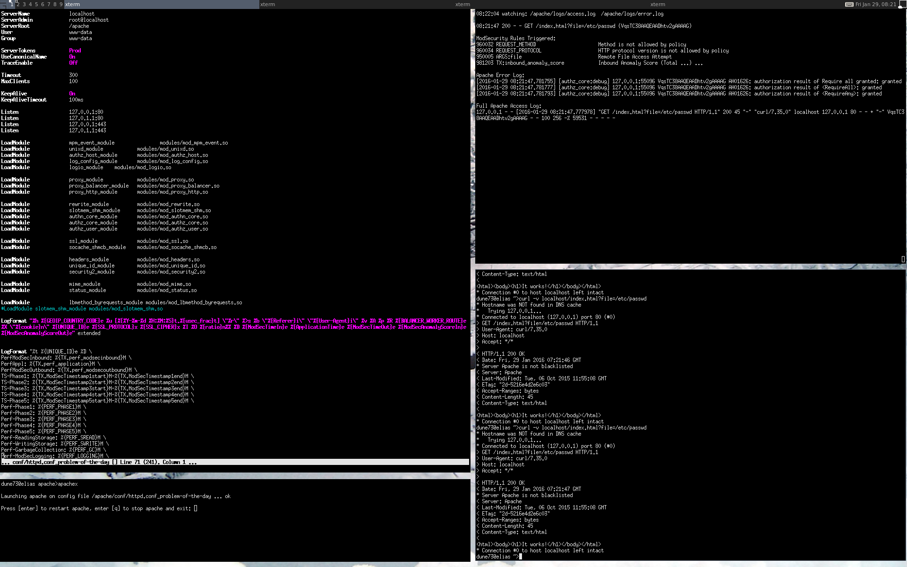

##Title: Apache und ModSec effizient in der Shell konfigurieren und debuggen

###Was machen wir?

Wir legen uns Shell-Werkzeuge und eine Arbeitsweise zurecht, welche es erlaubt, Apache-Konfigurationen effizient zu bearbeiten und in wenigen Sekunden zu testen, ohne den Browser zu benützen oder ständig Files von Hand durchsuchen zu müssen.

###Warum tun wir das?

Den Apache Webserver erfolgreich zu konfigurieren setzt viel Wissen und Erfahrung voraus. Wenn ModSecurity hinzukommt und in die Verarbeitung eingreifen soll, dann wird die Konfiguration noch komplizierter. Es ist deshalb nötig, sich die richtigen Werkzeuge zurechtzulegen und einen systematischen Arbeitsablauf einzurichten. Dies ist das Ziel dieses Tutorials.

Die Anleitung hat etwas pedantisches an sich, denn es geht darin mit vollem Ernst um die Optimierung von einzelnen Tastendrucken. Da verschiedene Aktionen bei der Entwicklung der Konfiguration eines Webservers dutzende, und bisweilen sogar über hundert Mal nacheinander ausgelöst werden müssen, hat eine Optimierung des Ablaufs, wie lächerlich sie auch scheinen mag, ein grosses Potential. Dazu kommt der Vorteil, dass wir damit unnötigen Ballast entfernen können, was den Blick auf das eigentliche Konfigurationsproblem freimacht. Zu diesem Zweck präsentiert diese Anleitung einige Tricks und Ideen, die einen ansprechenden Gewinn bringen.


###Voraussetzungen

* Ein Apache Webserver, idealerweise mit einem File-Layout wie bei [Anleitung 1 (Kompilieren eines Apache Servers)](https://www.netnea.com/cms/apache_tutorial_1_apache_compilieren/)
* Verständnis der minimalen Konfiguration in [Anleitung 2 (Apache minimal konfigurieren)](https://www.netnea.com/cms/apache_tutorial_2_apache_minimal_konfigurieren/)
* Ein Apache Webserver mit SSL-/TLS-Unterstützung wie in [Anleitung 4 (Konfigurieren eines SSL Servers)](https://www.netnea.com/cms/apache-tutorial-4-ssl-server-konfigurieren)
* Ein Apache Webserver mit erweitertem Zugriffslog wie in [Anleitung 5 (Das Zugriffslog Ausbauen und Auswerten)](https://www.netnea.com/cms/apache-tutorial-5-zugriffslog-ausbauen/)
* Ein Apache Webserver mit ModSecurity wie in [Anleitung 6 (ModSecurity einbinden)](https://www.netnea.com/cms/apache-tutorial-6-modsecurity-einbinden/)
* Ein Apache Webserver mit einer Core Rules Installation wie in [Anleitung 7 (Core Rules einbinden)](http://www.netnea.com/cms/modsecurity-core-rules-einbinden/)


###Schritt 1: Curl

Curl ist das richtige Werkzeug um HTTP Anfragen auszulösen. Natürlich muss HTTP primär im Browser oder der Applikation funktionieren. Aber bei der Fehlersuche oder der Konfiguration von neuen Features erweist sich der Browser in aller Regel als zu schwerfällig. Cookie-Handling, Grösse des Fensters, automatisches Folgen von Redirects etc. tragen alle dazu bei, dass man bei der Arbeit im Browser viel Zeit verbraucht. Besser von der Hand läuft es deshalb, wenn man ein Problem im Browser identifiziert, es dann mittels `curl` reproduziert, den Fehler sucht, ihn in der Konfiguration des Servers behebt und schliesslich die Lösung im Browser verifiziert.

Wir haben `curl` in den vorangegangenen Anleitungen verschiedentlich angewendet. Wir sind damit bereits sehr gut aufgestellt. Es lohnt sich aber, noch ein, zwei Features in den eigenen Werkzeugkasten mitaufzunehmen.

```bash
$> curl --cookie-jar /tmp/cookies.txt --cookie /tmp/cookies.txt --data "username=test" --data "password=xxxxxxxx" http://localhost/login.action
...
$> curl http://localhost/login.html --next --cookie-jar /tmp/cookies.txt --cookie /tmp/cookies.txt --data "username=test" --data "password=xxxxxxxx" http://localhost/login.action
...
```

Das erste Beispiel arbeitet mit einem Cookie-File, in das empfangene Cookies geschrieben und aus dem Cookies für neue Requests gelesen werden. Im zweiten Beispiel, das nur mit einem relativ neuen `curl` funktioniert, werden mehrere Anfragen auf einer einzigen Zeile zusammengeführt. Interessant ist nun die Option `--next`, welche die Kommandozeilenargumente unterteilt. Die Parameter nach dem `--next` gelten nur nach rechts. Das bedeutet, dass das obenstehende Beispiel zunächst einen GET Requst absetzt, und dann auf derselben TCP Verbindung einen POST Request anschliesst und das Session Cookie danach im Cookie-Jar abspeichert.


###Schritt 2: Single File Apache Konfiguration

Die in dieser Artikelserie verwendete Apache-Konfiguration ist für das Labor gedacht. Damit meine ich eine Test-Umgebung, in der Konfigurationen rasch ausprobiert oder Fehler ohne Rücksicht auf produktiven HTTP-Verkehr gesucht werden können. Ein wesentliches Merkmal der verwendeten Apache-Konfiguration war die Technik, die gesamte Konfiguration mit Ausnahme der OWASP ModSecurity Core Rules in einer einzigen Datei unterzubringen. Dies bringt den Vorteil, im File sehr rasch navigieren und einzelne Passagen mittels Standard-Suchbefehlen erreichen zu können. Dieses Prinzip ist aber nicht nur im Labor ein Gewinn, auch in einer Produktionsumgebung macht es Sinn so zu arbeiten und Widersprüche und Redundanzen weitgehend auszuschliessen. Die heute verbreitete Modularisierung der Webserver Konfiguration in verschiedene Dateien steht dem allerdings im Wege und provoziert Fehler. Tatsächlich wurde ich schon mehrfach mit Setups konfrontiert, die Virtualhosts mehrfach konfigurierten, widersprüchliche Zugriffsbeschränkungen einrichteten und deren Administratoren sich überrascht zeigten, dass die konfigurierten Direktiven andernorts übersteuert wurden. Aus diesem Grund versuche ich wenn immer möglich mit einer Konfiguration in einem einzigen File zu arbeiten.

Wichtig ist auf jeden Fall eine klare Struktur und ein stringentes Vorgehen. Bei jeder Direktive muss klar sein, an welcher Stelle in der Konfiguration sie zu liegen kommen muss. Ausreichend Kommentare müssen die markanten Teile dokumentieren (ohne die Direktiven in einem Dschungel von Dokumentation zu verstecken, wie in der Apache Default-Konfiguration). Die Beispiel-Konfigurationen der vorangegangenen Anleitungen versuchten genau dies umzusetzen.

Im Labor bietet es sich an, sich ein Template zurecht zu legen. Für meine eigenen Arbeiten habe ich ein Konfiguration namens `httpd.conf_template` zurechtgelegt. Dabei handelt es sich um eine lauffähige Konfiguration Reverse Proxy Konfiguration, den Core Rules, dem durch ModSecurity unterstützten Performance Log etc. Sie orientiert sich an den Konfigurationen der vorangegangenen Anleitungen. Zu Beginn der Arbeit an einem neuen Problem kopiere ich dieses Template-File und justiere dann diese Konfiguration noch leicht, um sie auf das richtige Szenario umzubiegen:

```bash
$> cp httpd.conf_template httpd.conf_problem-of-the-day
$> vim httpd.conf_problem-of-the-day
```

`Vim` eignet sich gut, um Apache Konfigurationen zu bearbeiten, aber letztlich spielt der Editor keine entscheidende Rolle solange er Syntax-Highlighting unterstützt, was aus meiner Sicht Editieren einen Mehrwert bringt.

###Schritt 3: Apachex

Mit `curl` und einem Single-File-Apache haben wir bereits gute Voraussetzungen, um rasch Konfigurationen anpassen und sie ebenso rasch testen zu können. Ein etwas nerviger Schritt steht meistens zwischen diesen beiden oft wiederholten Schritten: Der Neustart des Webservers. In den ersten beiden Anleitungen haben wir den Server jeweils mit dem Kommandozeilen Flag `-X` gestartet. Ich arbeite oft mit `-X`, da es ja den Server nicht in den Daemon-Moder versetzt und ihn stattdessen im Vordergrund als Single-Prozess laufen lässt. Ein Absturz des Servers ist damit unmittelbar in der Shell sichtbar. Wenn wir den Webserver standardgemäss starten und ihn als Daemon betreiben, müssen wir das Error-Log beobachten und sicherstellen, dass wir einen Absturz nicht verpassen, was allerlei merkwürdige Effekte nach sich ziehen kann. Diese Überwachung ist zwar machbar, in meiner Erfahrung aber ein überraschend gravierender Nachteil. Ich arbeite also mit `-X`. 

Der normale Arbeitsablauf mit einem Single-Prozess-Apache ist ein abwechselndes Starten des Binaries mit dem oben konfigurierten Konfigurationsfile und Stoppen mittels `CTRL-C`. Das bringt zwei weitere Nachteile mit sich: Zum einen müssen wir den Namen des Konfigurationsfiles eingeben, respektive ab der zweiten Runde aus der History der Shell abrufen. Unangenehmer noch ist der Verlust von Semaphoren durch den Abbruch des Webservers mittels `CTRL-C`. Bei den Semaphoren handelt es sich um eine durch den Webserver benutzte Kommunikationsstruktur des Linux-Betriebsystems. Die Anzahl der Semaphoren ist endlich und wenn wir den Webserver abbrechen gibt er eine reservierte Semaphor oftmals nicht mehr frei. Irgendwann ist der Vorrat an Semaphoren aufgebraucht und der Server kann nicht mehr länger gestartet werden. Stattdessen wird folgende Fehlermeldung ausgegeben, die nicht ohne weiteres auf das Semaphor-Problem schliessen lässt:

```bash
[emerg] (28)No space left on device: Couldn't create accept lock
```

Das Problem ist aber nicht die fehlende Reserve an Speicherplatz, sondern der Mangel an freien Semaphoren. Diese müssen vor einem Neustart zurückgewonnen werden. Dazu hat sich folgende Konstrukstion bewährt:

```bash
$> sudo ipcs -s | grep www-data | awk '{ print $2 }' | xargs -n 1 sudo ipcrm sem
```

Mittels `ipcs -s` lesen wir die Liste von Semaphoren aus, selektieren die richtige Zeile über den Usernamen des Webservers, und benützen dann `awk` um die zweite Spalte des Outputs zu selektieren. Dieser Spalte entnehmen wir die Identifikation der Semaphor, welche wir darauf mittels xargs und `ipcrm sem` löschen.

Damit ist dieses Problem in den Griff zu kriegen, aber die Fehlermeldung ist doch ein Ärgernis und das wiederholte Zurückgehen in der History, um den Namen der Konfigurationsdatei nicht neu tippen zu müssen, unnötig. Besser ist es da, beides durch ein Skript erledigen zu lassen: `apachex`. Dieses Skript ist online abrufbar ([apachex](https://github.com/Apache-Labor/labor/blob/master/bin/apachex)).

```bash
$> 
./bin/apachex -h

./bin/apachex

Skript to launch apache repeatedly via httpd -X.

The script guesses the desired apache config and handles
 - sudo
 - pidfile
 - semaphore cleanup
```

Das Skript versucht zunächst die zuletzt bearbeitete lokale Apache Konfigurationsdatei zu identifizieren. Mit sehr hoher Warscheinlichkeit handelt es sich dabei auch um diejenige Konfiguration, welche wir testen möchten. Ist die getroffene Annahme inkorrekt, so empfiehlt sich ein Abbruch des Skriptes und ein `touch` auf die gewünschte Date. Das Skript kennt verschiedene Standorte der Konfigurationsfiles und selektiert jeweils eine Datei. Von dieser Datei leitet es das httpd-Binary ab. Mit diesen Informationen startet es dann eine Schleife. In der Schleife wird dann ein gegebenenfalls laufender Webserver-Prozess gestoppt, dann werden die Semaphoren zurückgeholt und der Server neu gestartet; gegebenenfalls unterstützt ` sudo`. Als Konfigurationsfile benützt das Skript das zu Beginn eruierte Konfigurationsfile. Wir schicken den Single-Prozess Apache in den Hintergrund, halten ihn aber aktiv in der aktuellen Shell. Er läuft also noch nicht entkoppelt im Hintergrund als Daemon, sondern wird seine Ausgaben weiterhin in unser Shell-Fenster ausgeben. Wir werden also weiterhin über den Absturz des Prozesses informiert werden.

Bevor wir nun in eine neue Schleifenrunde starten, halten wir aber inne und geben dem Benutzer die Möglichkeit, das Skript entweder mittels der Taste `q` abzubrechen, oder aber eine neue Schleifenrunde mit Hilfe der Enter-Taste zu initiieren. 

Das Skript bringt also eine dreifache Funktionalität:
* Es identifiziert dasjenige Apache Konfigurationsfile, das wir testen möchten.
* Es stoppt und startet auf Tastendruck einen Webserverprozess
* Es sorgt dafür, dass die Semaphoren nicht ausgehen.

Zusammengefasst: Ein Druck auf die Entertaste und Apache wird mit der zuletzt bearbeiteten Konfiguration neu gestartet:

```bash
$> apachex

Launching apache on config file /apache/conf/httpd.conf_problem-of-the-day ... ok

Press [enter] to restart apache, enter [q] to stop apache and exit: 

Stopping active apache process ... ok
Launching apache on config file /apache/conf/httpd.conf_problem-of-the-day ... ok

Press [enter] to restart apache, enter [q] to stop apache and exit: q

Bailing out ... ok

``` 

###Schritt 4: lastrequestsummary

Nun fehlt uns noch ein gescheiter Zugang zu den Logfiles. Zwar gibt uns `curl -v` bereits Feedback, über die Resultate eines Requests. Aber gerade bei ModSecurity Regeln ist es wichtig, der Verarbeitung auch serverseitig folgen zu können. Und genau ModSecurity ist mit seinem gesprächigen und unübersichtlichen Logfile-Einträgen eine Herausforderungen, zumal ein einzelner Aufruf rasch mehr Protokoll generiert als in einem Fenster platz findet; zumal uns die meisten Informationen nicht interessieren. Was uns fehlt ist eine Zusammenfassung eines Requests über das `Access-Log` und das `Error-Log` hinweg. Das Skript `lastrequestsummary` bringt so eine Auswertung ([lastrequestsummary](https://github.com/Apache-Labor/labor/blob/master/bin/lastrequestsummary)):

```bash
$> cat lastrequestsummary

#!/bin/bash
#
# Script that extracts information from the latest request in the access
# log and enriches this with info from the error-log.
#
# Script is meant to be called regularly via watch.
#

ACCESSLOG="$1"
ERRORLOG="$2"

ACCESS_IGNORE_REGEX="(heartbeat)"

if [ -z "$ACCESSLOG" ]; then 
        echo "Accesslog not passed via commandline. Please pass path to accesslog as first parameter. This is fatal. Aborting."
        exit 1
fi
if [ ! -f "$ACCESSLOG" ]; then 
        echo "Accesslog $ACCESSLOG not found. This is fatal. Aborting."
        exit 1
fi
if [ -z "$ERRORLOG" ]; then 
        echo "Errorlog not passed via commandline. Please pass path to errorlog as first parameter. This is fatal. Aborting."
        exit 1
fi
if [ ! -f "$ERRORLOG" ]; then 
        echo "Errorlog $ERRORLOG not found. This is fatal. Aborting."
        exit 1
fi

ACCESSLINE=$(tail -200 $ACCESSLOG | grep -E -v "$ACCESS_IGNORE_REGEX" | tail -1)
ID=$(echo "$ACCESSLINE" | egrep -o " [a-zA-Z0-9@-]{24} " | tr -d " ")
METHOD_PATH=$(echo "$ACCESSLINE" | cut -d\  -f6,7 | cut -b2-)
STATUS=$(echo "$ACCESSLINE" | cut -d\  -f9)
SCORES=$(echo "$ACCESSLINE" | egrep -o "[0-9-]+ [0-9-]+$")
TIME=$(echo "$ACCESSLINE" | cut -d\  -f5 | cut -d. -f1)


echo "$(date +"%H:%M:%S") watching: $ACCESSLOG  $ERRORLOG"
echo
echo "$TIME $STATUS $SCORES $METHOD_PATH ($ID)"
echo

echo "ModSecurity Rules Triggered:"
MODSEC=$(tail -500 $ERRORLOG | grep $ID | grep -o -E " (at|against) .*\[file.*\[id \"[0-9]+.*\[msg \"[^\"]+" | tr -d \" | sed -e "s/ at the end of input at/ at/" -e "s/ required. /. /" -e "s/\[rev .*\[msg/[msg/" -e "s/\. / /" -e "s/(Total .*/(Total ...) .../" | tr -d \] | cut -d\  -f3,9,11- |
sed -e "s/^\([^ ]*\) \([^ ]*\)/\2 \1/" | awk "{ printf \"%+6s %-35s %s %s %s %s %s %s %s %s %s %s %s %s %s %s %s %s %s %s\n\", \$1, \$2, \$3, \$4, \$5, \$6, \$7, \$8, \$9, \$10, \$11, \$12, \$13, \$14, \$15, \$16, \$17, \$18, \$19, \$20 }" | sed -e "s/\ *$//")
# This is a crazy oneliner. A description starting with "grep -o -E":
# We grep for the various ModSec alert messages and take the content from the
# at/against via the parameter name, the id up and including the message. tr
# and sed and again tr are then used to strip this down. Now cut is used to
# extract (1) the parameter, (2) the id and (3) the message. Then we use sed
# to swap the position of the parameter and the id. Then we used awk to print
# the three fields in a clean table. This demands the used of a lot of %s
# fields, which results in a lot of empty spaces at the end of the line, which
# are finally removed.
if [ -z "$MODSEC" ]; then
        MODSEC="***NONE***"
fi
echo "$MODSEC"
echo

echo "Apache Error Log:"
ERRORLINES=$(tail -500 $ERRORLOG | grep $ID | grep -v -E "ModSecurity.*\b(at|against)\b")
if [ -z "$ERRORLINES" ]; then
        ERRORLOG="***NONE***"
fi
echo "$ERRORLINES"
echo

echo "Full Apache Access Log:"
echo "$ACCESSLINE"

```

Das Skript ist keine sehr elegante Umsetzung der Idee. Vielmehr hat es einen etwas brachialen Charakter, der aber den Vorteil hat, dass die Ausgabe leicht verändert werden kann. Das sie hier auch ausdrücklich empfohlen, denn das Skript dient lediglich als Beispiel, das sich für mich bewährt hat. Schauen wir uns das Skript kurz an. Es erwartet einen Aufruf mit beiden Logfiles als Parameter $1 und $2. Auf dieser Basis wird der letzte Request bestimmt, wobei Heartbeat-Anfragen (als Beispiel für uninteressante Requests eines Monitoring-Services) ignoriert werden. Aus dieser Anfrage wird die eindeutige Request-Identifikation extrahiert. Dann werden Kernwerte wie Methode, Pfad, Status, ModSecurity Anomaly Scores extrahiert. Diese Daten werden dann ausgegeben.

Als nächstes folgt eine Zusammenfassung der zum Request gehörigen ModSecurity Meldungen. Die sehr undurchsichtige Konstruktion orientiert sich am früher eingeführten Alias `melsummary` das hier in seiner ganzen Komplexität angewendet wird. Zu guter Letzt gibt das Skript noch diejenigen Meldungen des Error-Logs aus, welche nicht ModSecurity Alerts darstellen.

Eine typische Ausgabe des Skript sieht wie folgt aus:

```bash
$> lastrequestsummary /apache/logs/access.log /apache/logs/error.log 
07:53:20 watching: /apache/logs/access.log  /apache/logs/error.log

07:53:14 200 2 0 GET /index.html?a=..... (VqkfSH8AAQEAAHjqe40AAAAC)

ModSecurity Rules Triggered:
981172 ARGS:a                                           Restricted SQL Character Anomaly Detection Alert - Total # of special characters exceeded

Apache Error Log:
[2016-01-27 07:53:14.334862] [authz_core:debug] 127.0.0.1:36837 VqkfSH8AAQEAAHjqe40AAAAC AH01626: authorization result of Require all granted: granted
[2016-01-27 07:53:14.334899] [authz_core:debug] 127.0.0.1:36837 VqkfSH8AAQEAAHjqe40AAAAC AH01626: authorization result of <RequireAll>: granted
[2016-01-27 07:53:14.334914] [authz_core:debug] 127.0.0.1:36837 VqkfSH8AAQEAAHjqe40AAAAC AH01626: authorization result of <RequireAny>: granted

Full Apache Access Log:
127.0.0.1 - - [2016-01-27 07:53:14.333396] "GET /index.html?a=..... HTTP/1.1" 200 45 "-" "curl/7.35.0" localhost 127.0.0.1 80 - - + "-" VqkfSH8AAQEAAHjqe40AAAAC - - 125 256 -% 4294 560 130 250 2 0
```

Auf der dritten Zeile sehen wir das Timestamp des Requests, den HTTP Status, den ModSecurity Core Rules Incoming Anomaly Score, den Outgoing Anomaly Score, Method, Pfad und schliesslich in Klammern die eindeutige Request-Identifikation. Die übrigen Zeilen erklären sich von selbst und sind einfach ein illustrierendes Beispiel, wie sich so ein Skript umsetzen lässt.

Der Clou besteht nun darin, dieses Skript mittels `watch` in kurzen Abständen regelmässig aufzurufen. Dazu dient ein eigenes Shortcut-Skript namens `watch-lastrequestsummary` ([watch-lastrequestsummary](https://github.com/Apache-Labor/labor/blob/master/bin/watch-lastrequestsummary)):

```bash
$>cat watch-lastrequestsummary 
#!/bin/bash
#
# Watch lastrequestsummary every second
#
# Adopt filenames as see fit

watch --interval 1 --no-title "lastrequestsummary /apache/logs/access.log /apache/logs/error.log"
```  

Auch hier ist es namentlich für den produktiven Einsatz angezeigt, die Filenamen anzupassen, respektive sie über einen geschickten Suchprozess automatisch bestimmen zu lassen.

###Schritt 5: Aufteilen des Bildschirms in 4 Teile

In den vorangegangenen vier Schritten haben wir gesehen wie wir Apache konfigurieren, ihn einfach starten, ihn möglichst effizient ansprechen und schliesslich das Verhalten in den Logfiles überprüfen. Es bietet sich an, jeden dieser Schritte einem eigenen Shell-Fenster zuzuweisen. Damit kommen wir zu einem klassischen Vier-Fenster-Setup, der sich in der Praxis als sehr effizient erwiesen hat. Eine genügende Anzahl Bildschirme vorausgesetzt spricht nichts dagegen, es mit einem 6- oder 9-Bildschirm-Setup zu probieren, es sei denn man verliere darüber den Überblick.

Für mich hat sich der 4-Bildschirm-Setup bewährt und ich empfehle ihn zur Anwendung bei der Arbeit mit einem Apache Webserver. Ich verwende einen Tiling Windowmanager, aber dies ist natürliche keine Voraussetzung für die Umsetzung dieses Layouts. Wichtig ist allein die Anordnung der Fenster in der richtigen Reihenfolge des Arbeitsablaufes. Mein Auge folgt dabei einem Kreis im Gegenuhrzeigersinn:

* Apache Konfiguration (oben links, Fenster vertikal gestreckt)
* apachex (unten links, Fenster vertikal verkürzt)
* curl (unten rechts)
* watchmelsummary (oben rechts)

Der Ablauf ist damit wie folgt: Die Konfiguration wird oben links angepasst, mit einem Druck auf die Entertaste wird sie unten links neu gestartet. Unten rechts wird der Webserver mit dem gewünschten Curl-Request angesprochen und oben der Inhalt der Logfiles ohne weitere Interaktion über die Tastatur automatisch ausgegeben und von Auge überprüft. Dann der nächste Schritt in der Konfiguration, Neustart, curl, Blick in die Logfiles; und wieder Konfiguration, Neustart, curl, Blick in die Logfiles... 

Dieser zyklische Arbeitsablauf ist sehr schlank gehalten. Er erlaubt mir, in einer Minute, zwei, drei Anpassungszyklen durchzuspielen. So entsteht Schritt um Schritt eine neue Konfiguration. Der schlanke Prozess erlaubt es, auch sehr komplizierte ModSecurity Rezepte zu entwickeln, ohne auf dem Weg den Überblick zu verlieren, weil man sich beim Aufrufen von Curl mit verschiedensten Parametern, dem Editieren der Konfiguration oder dem Lesen der Logfiles verheddert.

Hier ein Bildschirmschnappschuss von meinem Desktop:



###Verweise

* [apachex](https://github.com/Apache-Labor/labor/blob/master/bin/apachex)
* [lastrequestsummary](https://github.com/Apache-Labor/labor/blob/master/bin/lastrequestsummary)
* [watch-lastrequestsummary](https://github.com/Apache-Labor/labor/blob/master/bin/watch-lastrequestsummary)
* [Semaphor](https://de.wikipedia.org/wiki/Semaphor_%28Informatik%29)

### Lizenz / Kopieren / Weiterverwenden

<a rel="license" href="http://creativecommons.org/licenses/by-nc-sa/4.0/"></a><br />Diese Arbeit ist wie folgt lizenziert / This work is licensed under a <a rel="license" href="http://creativecommons.org/licenses/by-nc-sa/4.0/">Creative Commons Attribution-NonCommercial-ShareAlike 4.0 International License</a>.

