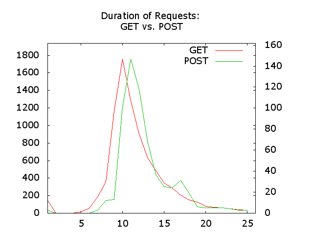

##Title: Apache und ModSecurity Logfiles visualisieren

###Was machen wir?

Wir werten Logfiles visuell aus.

###Warum tun wir das?

In den vorangegangenen Lektionen haben wir das Apache Logformat angepasst und verschiedene statistische Auswertungen durchgeführt. Wir haben es bis anhin aber unterlassen, die gewonnenen Zahlen grafisch darzustellen. Tatsächlich bietet aber die Visualisierung von Daten eine grosse Hilfe beim Erkennen von Problemen. Namentlich Zeitreihen sind sehr aufschlussreich und auch Performance-Probleme lassen sich visuell viel besser quantifizieren und isolieren. Daneben bietet aber auch die graphische Darstellung von False-Positives in der Menge der ModSecurity Alarme interessante Aufschlüsse.

Der Wert von Visualisierung liegt auf der Hand und tatsächlich sind Graphen mit gutem Grund je länger je mehr ein wichtiger Bestandteil von Dashboards und regelmässigen Reports. In dieser Lektion zielen wir aber nicht auf die formvollendeten Graphen ab, die auch dem Management zu gefallen wüssten, sondern kümmern uns darum, wie wir mit möglichst einfachen Mitteln zu aussagekräftigen Graphen kommen, welche den essentiellen Teil der Daten darstellen.

Zu diesem Zweck bedienen wir uns einem wenig bekannten Feature von `Gnuplot`. 

###Voraussetzungen

* Ein Apache Webserver, idealerweise mit einem File-Layout wie bei [Anleitung 1 (Kompilieren eines Apache Servers)](https://www.netnea.com/cms/apache_tutorial_1_apache_compilieren/)
* Verständnis der minimalen Konfiguration in [Anleitung 2 (Apache minimal konfigurieren)](https://www.netnea.com/cms/apache_tutorial_2_apache_minimal_konfigurieren/)
* Ein Apache Webserver mit SSL-/TLS-Unterstützung wie in [Anleitung 4 (Konfigurieren eines SSL Servers)](https://www.netnea.com/cms/apache-tutorial-4-ssl-server-konfigurieren)
* Ein Apache Webserver mit erweitertem Zugriffslog wie in [Anleitung 5 (Das Zugriffslog Ausbauen und Auswerten)](https://www.netnea.com/cms/apache-tutorial-5-zugriffslog-ausbauen/)
* Ein Apache Webserver mit ModSecurity wie in [Anleitung 6 (ModSecurity einbinden)](https://www.netnea.com/cms/apache-tutorial-6-modsecurity-einbinden/)
* Ein Apache Webserver mit einer Core Rules Installation wie in [Anleitung 7 (Core Rules einbinden)](http://www.netnea.com/cms/modsecurity-core-rules-einbinden/)
* Das `gnuplot` Paket; so wie in der `Ubuntu` Distribution vorhandenen.

###Schritt 1 : Graphische Darstellung von Zeitreihen in der Shell

Das Aufkommen von Einträgen in Logfiles folgt einem zeitlichen Verlauf. Tatsächlich ist es aber relativ schwierig diesem zeitlichen Verlauf im Textfile selbst zu folgen. Eine Visualisierung des Logfiles schafft Abhilfe. Dashboards wurden schon erwähnt und verschiedene kommerzielle Produkte und Open Source Projekte haben sich in den letzten Jahren etabliert. Diese Werkzeuge sind sehr sinnvoll. Oft sind sie aber nicht einfach zugänglich oder die Logdaten müssen erst importiert, und zum Teil auch konvertiert und indexiert werden. Eine grosse Lücke ist deshalb die Darstellung von Graphen in der Shell. Tatsächlich beherrscht das graphische Werkzeug `gnuplot` auch ASCII und kann komplett von der Kommandozeile aus gesteuert werden.


`Gnuplot` ist in der Bedienung und Steuerung anspruchsvoll und wer nur gelegentlich damit arbeitet hat eine wiederkehrende Lernkurve vor sich. Aus diesem Grund habe ich ein Wrapper-Skript namens `arbigraph` entwickelt, das einfache Graphen mit Hilfe von Gnuplot darstellen kann: [arbigraph](https://github.com/Apache-Labor/labor/blob/master/bin/arbigraph) Wir werden dieses Skript in dieser Lektion in verschiedenenen Situationen anwenden und dabei eine Vielzahl von Kommand-Line Optionen kennenlernen. Fangen wir also mit einem einfachen Fall an:

Erzeugen wir einen einfachen Graphen, welcher die Anzahl der Requests pro Stunde in einem zeitlichen Verlauf darstellt. Wir ziehen als Beispiel dazu dasjenige Access-Log heran, das wir beim Tunen von ModSecurity False Positives in einer vorangegangenen Anleitung bereits kennengelernt haben: [labor-07-example-access.log](https://raw.githubusercontent.com/Apache-Labor/labor/master/labor-07/labor-07-example-access.log).

Konzentrieren wir uns auf die Einträge vom 20. bis 29. Mai und extrahieren wir daraus die Timestamps:

```bash
$> grep 2015-05-2 labor-07-example-access.log | altimestamp | head
2015-05-20 12:53:11.139981
2015-05-20 12:53:12.232266
2015-05-20 12:54:57.772135
2015-05-20 12:54:58.842986
2015-05-20 12:54:59.009303
2015-05-20 12:54:59.003103
2015-05-20 12:54:59.006098
2015-05-20 12:54:58.992113
2015-05-20 12:54:58.994096
2015-05-20 12:55:00.270296
```

Hinter jeder dieser Zeilen steht ein Request. Die Anzahl der Requests pro Zeiteinheit lässt sich damit leicht durch auszählen erruieren. Die Aufsummierung pro Stunde geht einfach, indem wir den Zeitstempel beim Doppelpunkt schneiden und mittels `uniq -c` zusammenzählen. Sicherheitshalber bauen wir noch ein `sort` ein, denn Logfiles sind nicht in jedem Fall chronologisch (Der Eintrag folgt beim Abschluss des Requests, der Zeitstempel bezeichnet aber den Eingang der Request-Zeile der Anfrage. Das bedeutet, dass ein "langsamer" Request von 12:59 im Logfile nach einem "raschen" Request von 13:00 zu stehen kommen kann. Oben sehen wir dieses Problem bereits bei 12:54:58 und 12:54:59.).

Hier also die Summe pro Stunde:

```bash
$> grep 2015-05-2 labor-07-example-access.log | altimestamp | cut -d: -f1 | sort | uniq -c | head
     37 2015-05-20 12
      6 2015-05-20 13
      1 2015-05-20 14
    105 2015-05-20 15
     38 2015-05-20 16
     25 2015-05-20 17
     19 2015-05-20 18
     32 2015-05-20 19
     19 2015-05-20 22
      1 2015-05-21 06
```

Das scheint zu funktionieren, obschon sich im Logfile auch Lücken ausmachen lassen. Um diese werden wir uns später kümmern. In der ersten Spalte sehen wir nun die Requests pro Stunde, während die zweite und dritte Spalte den Zeitpunkt, die Stunde eben, beschreibt. Das Resultat füttern wir jetzt in das angesprochene Skript `arbigraph`, das von sich aus bei der Darstellung nur die erste Spalte berücksichtigt:

```bash
$> grep 2015-05-2 labor-07-example-access.log | altimestamp | cut -d: -f1 | sort | uniq -c | arbigraph

  250 ++-----------------+-------------------+-------------------+-------------------+-------------------+-------------------++
      |                  +                   +                   +                   +                   +       Col 1 ******+|
      |                                                            **                                                         |
      |                                                            **                                                         |
      |                                                            **                                                         |
  200 ++                                                           **                              **                        ++
      |                                                            **                              **    **                   |
      |                                                            **                              **    **                   |
      |                                                           ***                              **    **       ** **       |
      |                                                           ***                              **    **       ** **       |
  150 ++                        **                                ***            **                ** *****       ** ** **   ++
      |                 **      **                                ***            **                ** *******     ***** **    |
      |                 **      **                                ***            **   **           ** *******     ***** **    |
      |           **    **     ***                                ***            **   **           ** *******     ***** **    |
      |          ***    **     ***                                ***           ***   **  **       ** *******     ***** **    |
  100 ++ **      ***    **     ***                                ***           ***** **  **       ** *******     ***** ***  ++
      |  **      ***    **     ***        **                     ****           ***** **  **       ** *******     *********   |
      |  **     ****   ***     ***        **                     *****          ***** **  **       ** *******     *********   |
      |  **     *****  ***     ***  ***   ** **                  *****          ********  **       **********   ***********   |
      |  **     *****  ***     ***  ***   ** ****                *****          ******** ***       **********   ***********   |
   50 ++ **     **********   ****** ***   *******                *****          ************       **********   ***********  ++
      ** ***    **********   ****** ***   ******* **             *****  **   ** ************       **********   ***********   |
      ** *** ** **********   **********   ******* **        **   *****  ***  ** **************     ************ ************  |
      ** *****************   ********** ********* ****      ** ************* ** **************   **************************** |
      *********************  **************************    *** ********************************  ******************************
    0 *************************************************************************************************************************
                         20                  40                  60                  80                 100                 120
```

Wir sehen in dieser rudimentären graphischen Darstellung die Zahl der Anfragen auf der Y-Achse. Auf der X-Achse sehen wir den Zeitverlauf. 
Die Lastspitze liegt bei gegen 250 Requests pro Stunde. Generell sehen wir ein starkes Auf und Ab des Verkehrsaufkommense. Oben rechts sehen wir die Legende, welche die Sterne per Default als `Col 1` beschreibt.
Als gravierender Nachteil erweist sich die untaugliche Beschriftung auf der X-Achse, denn tatsächlich bezeichnen die Zahlen von 20-120
lediglich die Zeilennummer des Wertes auf der Y-Achse.

Da wir bei der Datenbasis ja Lücken im Datenset haben, können wir innerhalb des Graphen von der Zeilenzahl und mithin von der X-Achse nicht mehr
auf den Zeitpunkt eines Wertes zurückschliessen. Zunächst müssen wir diese Lücken schliessen, dann schauen wir uns das X-Achsen Problem genauer an.

###Schritt 2 : Füllen der Lücken in der Timeline

Das Problem mit den Lücken ist, dass wir im Logfile in machen Stunden keinen einzigen Request haben. Das Logfile stammt einfach von einem Server mit relativ wenig Verkehr. Aber auch auf einem Server mit deutlich mehr Verkehr führt das Filtern des Logfiles nach einem Fehler dazu, dass Lücken in der Timeline auftauchen. Wir müssen dieses also grundsätzlich schliessen. Bis dato haben wir das Datum und die Zeit aus dem Logfile gezogen. Dieser Ansatz erweist sich nun als unzulänglich: 
Anstatt dass wir die Datums- und Stundenfolge aus dem Logfile ableiten bauen wir sie neu selbst auf und suchen zu jeder Datums-Stunden-Kombination die Anzahl der Anfragen im Logfile. Das repetitive `grep` auf demselben Logfile ist dabei etwas ineffizient, aber für die vorliegende Grösse des Logfiles durchaus tauglich. Für grössere Files müsste man den Ansatz optimieren.

```bash
$> for DAY in {20..29}; do for HOUR in {00..23}; do echo "2015-05-$DAY $HOUR"; done; done 
2015-05-20 00
2015-05-20 01
2015-05-20 02
2015-05-20 03
2015-05-20 04
2015-05-20 05
2015-05-20 06
2015-05-20 07
2015-05-20 08
2015-05-20 09
2015-05-20 10
...
```

Das ist unser Zeitverlauf ohne Lücken. Nehmen wir diese Werte als Grundlage für eine Schleife und suchen zu jedem Wert die Zahl der Requests aus:

```bash
$> for DAY in {20..29}; do for HOUR in {00..23}; do echo "2015-05-$DAY $HOUR"; done; done | while read STRING; do COUNT=$(grep -c "$STRING" labor-07-example-access.log); echo  "$COUNT $STRING "; done
0 2015-05-20 00 
0 2015-05-20 01 
0 2015-05-20 02 
0 2015-05-20 03 
0 2015-05-20 04 
0 2015-05-20 05 
0 2015-05-20 06 
0 2015-05-20 07 
0 2015-05-20 08 
0 2015-05-20 09 
0 2015-05-20 10 
0 2015-05-20 11 
37 2015-05-20 12 
6 2015-05-20 13 
1 2015-05-20 14 
105 2015-05-20 15 
...
```

Wir lesen also den kombinierte Datum-Stunden-String in eine While-Schleife ein. Dann zählen wir zu jedem der Strings die Zahl der Requests (hier mittels `grep -c`) und geben das Resultat dann zusammen mit dem Datum-Stunden-String aus. Damit erhalten wir dasselbe Resultat wie im vorigen Beispiel, allerdings sind die Lücken nun gefüllt.

Füllen wir diese Ausgabe in unser Graphen-Skript:


```bash
$> for DAY in {20..29}; do for HOUR in {00..23}; do echo "2015-05-$DAY $HOUR"; done; done | while read STRING; do COUNT=$(grep -c "$STRING" labor-07-example-access.log); echo  "$COUNT $STRING "; done | arbigraph

  250 ++-----------------------+------------------------+------------------------+------------------------+------------------++
      |                        +                        +                        +                        +      Col 1 ****** |
      |                                                                            **                                         |
      |                                                                            **                                         |
      |                                                                            **                                         |
  200 ++                                                                           **                     *                  ++
      |                                                                            **                     *  *                |
      |                                                                            **                     *  *                |
      |                                                                            **                     *  *         ***    |
      |                                                                            **                     *  *         ***    |
  150 ++                           **                                              **         **          ****         ****  ++
      |                   *        **                                              **         **          *****        ****   |
      |                   *        **                                              **         ** *        *****        ****   |
      |                *  *        **                                              **         ** *        *****        ****   |
      |               **  *        **                                              **         ** * *      *****        ****   |
  100 ++      *       **  *        **                                              **         **** *      *****        ***** ++
      |       *       **  *        **         *                                   ***         **** *      *****        *****  |
      |       *       ** **        **         *                                   ***         **** *      *****        *****  |
      |       *       *****        ****       ***                                 ***         **** *      *****       ******  |
      |       *       *****        ****       ****                                ***         ******      *****       ******  |
   50 ++      *       *****       *****       ****                                ***         ******      *****       ****** ++
      |     ****      *****       *****       ******                              *** *  *    ******      *****       ******  |
      |     *****     *****       *****       ******                       *      *** ** *    *******     ******      ******  |
      |     *******   *****       ***** **    ****** *                     *     ******* *    *******  **********     ******* |
      |     *******   ******   +  ********    ****** ** +                 **     **********   ******** **********     ********|
    0 ++----*******--*********-+--********----******-**-+--**--*-----*********---***********--*******************-----********+
                               50                      100                      150                      200

```

Nun erscheint eine gewisse Regelmässigkeit, denn je 24 Werte machen einen ganzen Tag aus. Mit diesem Wissen sehen wir den Tagesrhythmus, können Samstag und Sonntag vermuten und sehen eventuell sogar eine gewisse Mittagspause angedeutet.


###Schritt 3 : X-Axis Label

Die Lücken sind geschlossen. Kommen wir zur korrekten Beschriftung der X-Achse. `Arbigraph` ist in der Lage Beschriftungen aus dem Input herauszulesen. Es identifiziert die Beschriftungen selbst; zu diesem Zweck müssen sie aber mittels einem Tabulator von den eigentlichen Daten abgetrennt werden. `Echo` übernimmt das für uns, wenn wir das `Escape-Flag` setzen.


```bash
$> for DAY in {20..29}; do for HOUR in {00..23}; do echo "2015-05-$DAY $HOUR"; done; done | while read STRING; do COUNT=$(grep -c "$STRING" labor-07-example-access.log); echo -e "$STRING\t$COUNT"; done | arbigraph

  250 +++++++++++++++++++++++++++++++++++++++++++++++++++++++++++++++++++++++++++++++++++++++++++++++++++++++++++++++++++++++++
      +++++++++++++++++++++++++++++++++++++++++++++++++++++++++++++++++++++++++++++++++++++++++++++++++++++++++++Col 1+******++
      |                                                                            **                                         |
      |                                                                            **                                         |
      |                                                                            **                     *                   |
  200 ++                                                                           **                     *                  ++
      |                                                                            **                     *                   |
      |                                                                            **                     *             **    |
      |                                                                            **                     *             **    |
  150 ++                           **                                              **         **          ****          ***  ++
      |                   *        **                                              **         **          *****        ****   |
      |                   *        **                                              **         ** *        *****        ****   |
      |                *  *        **                                              **         ** *        *****        ****   |
      |               **  *        **                                              **         ** *        *****        ****   |
  100 ++              **  *        **         *                                   ***         ****        *****        ***** ++
      |               ** **        **         *                                   ***         ****        *****        *****  |
      |               ** **        ****       *                                   ***         ****        *****        *****  |
      |               *****        ****       ***                                 ***         ****        *****       ******  |
   50 ++              *****        ****       ****                                ***         ******      *****       ****** ++
      |               *****       *****       ******                              ***         ******      *****       ******  |
      |     *****     *****       *****       ******                       *      *** *       *******     *****       ******  |
      |     *******   *****  *    ****** **   *********         *          ***    ****** *    ******************* *   ******* |
      +++++********++*******+*++++*********+++*********++++*+**+*++++++**+****+++**********+++*******************+*+++********+
    0 +++*+*********+*********+**+*********+*+*********+**+******++++*********+*+************+*******************+*+**********+
    20150151501515015150151501515015150151501515015150151501515015150151501515015150151501515015150151501515015150151501515015
      -  - -  - -  - -  - -  - -  - -  - -  - -  - -  - -  - -  - -  - -  - -  - -  - -  - -  - -  - -  - -  - -  - -  - -  -
    05-20-2020-2020-2121-2121-2122-2222-2222-2323-2323-2324-2424-2425-2525-2525-2626-2626-2627-2727-2727-2828-2828-2829-2929-29

```

Die Beschriftungen sind da, aber sie sind eindeutig zu dicht und überschreiben sich gegenseitig. Hier müssen wir Abhilfe schaffen. Eine Option mit dem schwerfälligen Namen `--xaxisticsmodulo` erlaubt es uns, nur mehr jeden n-ten X-Achsen-Wert zu schreiben. Jeder 24. Wert würde eine Beschriftung pro Tag bringen:

```bash
$> for DAY in {20..29}; do for HOUR in {00..23}; do echo "2015-05-$DAY $HOUR"; done; done | while read STRING; do COUNT=$(grep -c "$STRING" labor-07-example-access.log); echo -e "$STRING\t$COUNT"; done | arbigraph --xaxisticsmodulo 24


  250 +++++++++++++++++++++++++++++++++++++++++++++++++++++++++++++++++++++++++++++++++++++++++++++++++++++++++++++++++++++++++
      +++++++++++++++++++++++++++++++++++++++++++++++++++++++++++++++++++++++++++++++++++++++++++++++++++++++++++Col 1+******++
      |                                                                            **                                         |
      |                                                                            **                                         |
      |                                                                            **                     *                   |
  200 ++                                                                           **                     *  *               ++
      |                                                                            **                     *  *                |
      |                                                                            **                     *  *         ***    |
      |                                                                            **                     *  *         ***    |
  150 ++                           **                                              **         **          ****         ****  ++
      |                   *        **                                              **         **          *****        ****   |
      |                   *        **                                              **         ** *        *****        ****   |
      |                *  *        **                                              **         ** *        *****        ****   |
      |       *       **  *        **                                              **         ** * *      *****        ****   |
  100 ++      *       **  *        **         *                                   ***         **** *      *****        ***** ++
      |       *       ** **        **         *                                   ***         **** *      *****        *****  |
      |       *       ** **        ****       *                                   ***         **** *      *****        *****  |
      |       *       *****        ****       ***                                 ***         **** *      *****       ******  |
   50 ++      *       *****        ****       ****                                ***         ******      *****       ****** ++
      |       *       *****       *****       ******                              ***    *    ******      *****       ******  |
      |     *****     *****       *****       ******                       *      *** ** *    *******     *****       ******  |
      |     *******   *****  **   *****  **   ****** **          **        * **  ******* **   *********************   *********
      ++++++*******+++******+**+++*********+++******+**++++++++++**+++++++**+**++**********+++*********************+++*********
    0 ++++++*******++**********+++*********+++******+**++++**++*+**++**********++***********++*********************+++*********
               2015        2015        2015        2015        2015        2015        2015        2015        2015        2015
                 -           -           -           -           -           -           -           -           -           -
               05-20       05-21       05-22       05-23       05-24       05-25       05-26       05-27       05-28       05-29

```

Wir nähern uns dem Ziel. Problematisch ist noch der Umstand, dass die Datum-Stunden-Kombination beim Bindestrich umgebrochen wird und die Stunden komplett fehlen. Wenn wir den Bindestrich ersetzen, tritt dieser Umbruch nicht mehr auf. Nehmen wir dazu `sed` zu Hilfe.

```bash
$> for DAY in {20..29}; do for HOUR in {00..23}; do echo "2015-05-$DAY $HOUR"; done; done | while read STRING; do COUNT=$(grep -c "$STRING" labor-07-example-access.log); echo -e "$STRING\t$COUNT"; done | sed -e "s/-/./g" | arbigraph --xaxisticsmodulo 24


  250 +++++++++++++++++++++++++++++++++++++++++++++++++++++++++++++++++++++++++++++++++++++++++++++++++++++++++++++++++++++++++
      +++++++++++++++++++++++++++++++++++++++++++++++++++++++++++++++++++++++++++++++++++++++++++++++++++++++++++Col 1+******++
      |                                                                            **                                         |
      |                                                                            **                                         |
      |                                                                            **                     *                   |
  200 ++                                                                           **                     *  *               ++
      |                                                                            **                     *  *                |
      |                                                                            **                     *  *         ***    |
      |                                                                            **                     *  *         ***    |
  150 ++                           **                                              **         **          ****         ****  ++
      |                   *        **                                              **         **          *****        ****   |
      |                   *        **                                              **         ** *        *****        ****   |
      |                *  *        **                                              **         ** *        *****        ****   |
      |       *       **  *        **                                              **         ** * *      *****        ****   |
  100 ++      *       **  *        **         *                                   ***         **** *      *****        ***** ++
      |       *       ** **        **         *                                   ***         **** *      *****        *****  |
      |       *       ** **        ****       *                                   ***         **** *      *****        *****  |
      |       *       *****        ****       ***                                 ***         **** *      *****       ******  |
   50 ++      *       *****        ****       ****                                ***         ******      *****       ****** ++
      |       *       *****       *****       ******                              ***    *    ******      *****       ******  |
      |     *****     *****       *****       ******                       *      *** ** *    *******     *****       ******  |
      |     *******   *****  **   *****  **   ****** **          **        * **  ******* **   *********************   *********
      ++++++*******+++******+**+++*********+++******+**++++++++++**+++++++**+**++**********+++*********************+++*********
    0 ++++++*******++**********+++*********+++******+**++++**++*+**++**********++***********++*********************+++*********
            2015.05.20  2015.05.21  2015.05.22  2015.05.23  2015.05.24  2015.05.25  2015.05.26  2015.05.27  2015.05.28  2015.05.29

```

Nun sind noch die Stunden unsichtbar. Wie weiter oben sichtbar, sind sie vom Datum mit einem Leerschlag getrennt. Wenn wir diesen Leerschlag durch einen Binde-Strich ersetzen, dann erhalten wir zwischen dem Datum und den Stunden einen Zeilenumbruch.

```bash
$> for DAY in {20..29}; do for HOUR in {00..23}; do echo "2015-05-$DAY $HOUR"; done; done | while read STRING; do COUNT=$(grep -c "$STRING" labor-07-example-access.log); echo -e "$STRING\t$COUNT"; done | sed -e "s/-/./g" -e "s/ /-/" | arbigraph --xaxisticsmodulo 24
  250 +++++++++++++++++++++++++++++++++++++++++++++++++++++++++++++++++++++++++++++++++++++++++++++++++++++++++++++++++++++++++
      +++++++++++++++++++++++++++++++++++++++++++++++++++++++++++++++++++++++++++++++++++++++++++++++++++++++++++Col 1+******++
      |                                                                            **                                         |
      |                                                                            **                                         |
      |                                                                            **                     *                   |
  200 ++                                                                           **                     *  *               ++
      |                                                                            **                     *  *                |
      |                                                                            **                     *  *         ***    |
      |                                                                            **                     *  *         ***    |
  150 ++                           **                                              **         **          ****         ****  ++
      |                   *        **                                              **         **          *****        ****   |
      |                   *        **                                              **         ** *        *****        ****   |
      |                *  *        **                                              **         ** *        *****        ****   |
      |       *       **  *        **                                              **         ** * *      *****        ****   |
  100 ++      *       **  *        **         *                                   ***         **** *      *****        ***** ++
      |       *       ** **        **         *                                   ***         **** *      *****        *****  |
      |       *       ** **        ****       *                                   ***         **** *      *****        *****  |
      |       *       *****        ****       ***                                 ***         **** *      *****       ******  |
   50 ++      *       *****        ****       ****                                ***         ******      *****       ****** ++
      |       *       *****       *****       ******                              ***    *    ******      *****       ******  |
      |     *****     *****       *****       ******                       *      *** ** *    *******     *****       ******  |
      |     *******   *****       *****  *    ****** *                     *     ******* *    *******  **********     ******* |
      ++++++*******+++******++++++********++++******+**+++++++++++++++++++**+++++**********+++********+**********+++++********+
    0 ++++++*******++*********++++********++++******+**++++**++*+++++*********+++***********++*******************+++++********+
            2015.05.20  2015.05.21  2015.05.22  2015.05.23  2015.05.24  2015.05.25  2015.05.26  2015.05.27  2015.05.28  2015.05.29
                 -           -           -           -           -           -           -           -           -           -
                22          22          22          22          22          22          22          22          22          22
```

Wir beschriften nun also die X-Achse mit jedem 24. Wert und zufällig erhalten wir damit just die 22. Stunde. Wir sollten das schieben. Idealerweise wäre jeder Tag in seiner Mitte, als zur 12. Stunde beschriftet. Wir können so eine Verschiebung bei der Option `--xaxisticsmodulo` mit angeben. Das geschieht wie folgt:

```bash
$> for DAY in {20..29}; do for HOUR in {00..23}; do echo "2015-05-$DAY $HOUR"; done; done | while read STRING; do COUNT=$(grep -c "$STRING" labor-07-example-access.log); echo -e "$STRING\t$COUNT"; done | sed -e "s/-/./g" -e "s/ /-/" | arbigraph --xaxisticsmodulo 24/10 -w 130


  250 +++++++++++++++++++++++++++++++++++++++++++++++++++++++++++++++++++++++++++++++++++++++++++++++++++++++++++++++++++++++++
      +++++++++++++++++++++++++++++++++++++++++++++++++++++++++++++++++++++++++++++++++++++++++++++++++++++++++++Col 1+******++
      |                                                                            **                                         |
      |                                                                            **                                         |
      |                                                                            **                     *                   |
  200 ++                                                                           **                     *  *               ++
      |                                                                            **                     *  *                |
      |                                                                            **                     *  *         ***    |
      |                                                                            **                     *  *         ***    |
  150 ++                           **                                              **         **          ****         ****  ++
      |                   *        **                                              **         **          *****        ****   |
      |                   *        **                                              **         ** *        *****        ****   |
      |                *  *        **                                              **         ** *        *****        ****   |
      |       *       **  *        **                                              **         ** * *      *****        ****   |
  100 ++      *       **  *        **         *                                   ***         **** *      *****        ***** ++
      |       *       ** **        **         *                                   ***         **** *      *****        *****  |
      |       *       ** **        ****       *                                   ***         **** *      *****        *****  |
      |       *       *****        ****       ***                                 ***         **** *      *****       ******  |
   50 ++      *       *****        ****       ****                                ***         ******      *****       ****** ++
      |       *       *****       *****       ******                              ***    *    ******      *****       ******  |
      |     *****     *****       *****       ******                       *      *** ** *    *******     *****       ******  |
      |     *******   *****       *****  *    ****** *                     *     ******* *    *******  **********     ******* |
      ++++++*******+++******++++++********++++******+**+++++++++++++++++++**+++++**********+++********+**********+++++********+
    0 ++++++*******++*********++++********++++******+**++++**++*+++++*********+++***********++*******************+++++********+
       2015.05.20  2015.05.21  2015.05.22  2015.05.23  2015.05.24  2015.05.25  2015.05.26  2015.05.27  2015.05.28  2015.05.29
            -           -           -           -           -           -           -           -           -           -
           12          12          12          12          12          12          12          12          12          12

```

Mit einem Zahlenwert hinter einem Schrägstrich können wir die Wahl der zu beschrifteten Werte also nach links oder rechts schieben. Zu diesem Zweck sind ganzzahlige positive und negative Werte erlaubt.

Damit haben wir den gewünschten Graphen. Ein Detail sind die vielen Kreuze oben und am unteren Rand der Grafik. Sie hängen mit der grossen Zahl an (verborgenen) Beschriftungen zusammen und stören das Bild etwas. In einer nächsten Version werde ich versuchen, die zu unterdrücken.


###Schritt 4 : Weitere Label

`Arbigraph` bietet einige Einflussmöglichkeiten auf den Graphen. Schauen wir uns die Optionen mal an:

```bash
$> arbigraph -h

<STDIN> | arbigraph [OPTIONS] 

A script to plot a simple graph

 -c  --columnnames STR     Name for columns. Seperate by ';'.
 -C  --custom STR          Custom arbitrary gnuplot directives; will be placed right
                           before the plot directive. Separate commands with semicolon.
 -d  --dots                Graph with dots instead of blocks
 -e  --enablescript        Output the gnuplot script below the graph and keep data file
 -h  --help                This text
 -H  --height  STR         Graph height in characters
 -l  --lines               Graph with lines instead of blocks
     --label               Additional text inside the graph. Default positioned top left
 -L  --logscale            Logarithmic scale. Default is normale scale.
 -m  --minx STR            Starting value of x-axis. Default is 1
 -o  --output STR          Write graph into a file (png)
 -s  --sameaxis            Use the same y-axis. Default is seperate axis
 -t  --title STR           Title of graph
 -w  --width STR           Width of graph (terminal actually). Default is terminal width
 -x  --xaxisticsmodulo N   Suppress lables on certain tics on the x axis. xaxisticsmodulo 5
                           means every Nth tics gets a label. Default is 5. 1 means
                           every tics gets a label.
 -2                        Usa an additional, second data column

Example: 
 ls -l /tmp | head -15 | grep -v total | awk '{ print $5 " " $9 } ' | arbigraph

Arbigraph will graph the first column. Subsequent columns are ignored.
The X-axis is actually the line number of a value.
Command line option "minx" therefore defines the
starting point of the line numbering.

A label inside the graph can be added with the --label option. By default, this is
is put in the top left corner. You can align it to the right by adding "(right)"
inside the label text. This will not be printed. You can use \n to get a CR:
$> arbigraph --label '\n\n\n                  PEAK--->'

The caption (tics) on the x axis are always crowded. Use --xaxisticsmodulo to
suppress some of the labels. A value of 5 means, that only every 5th label is
printed. The other ones are hidden.
You can define an offset for the first label to be printed. So that no the 5th
starting from 0 will be printed, but the 5th starting from 2. Define this shift
behind a slash. Negative values are ok.
$> arbigraph --xaxisticsmodulo "24/-2"
You will have to try out various values for xaxisticsmodulo and a shift to the
right or to the left until you find something that suits the data and the graph.


```

Wir können also mit `--columnnames` eine Legende anbringen und zusätzlich vielleicht noch mit `--title` einen Titel. Um eine andere Darstellung auszuprobieren bietet es sich an, mit `--lines` zu arbeiten:


```bash
$> for DAY in {20..29}; do for HOUR in {00..23}; do echo "2015-05-$DAY $HOUR"; done; done | while read STRING; do COUNT=$(grep -c "$STRING" labor-07-example-access.log); echo -e "$STRING\t$COUNT"; done | sed -e "s/-/./g" -e "s/ /-/" | arbigraph -x 24/10 --columnnames "Num of Reqs/h" --title "Daily Rhythm of Requests in labor-07-example-access.log" --lines


                                       Daily Rhythm of Requests in labor-07-example-access.log

  250 +++++++++++++++++++++++++++++++++++++++++++++++++++++++++++++++++++++++++++++++++++++++++++++++++++++++++++++++++++++++++
      |++++++++++++++++++++++++++++++++++++++++++++++++++++++++++++++++++++++++++++++++++++++++++++++++++Num of Reqs/h+******++
      |                                                                             *                                         |
      |                                                                             *                                         |
      |                                                                             *                     *                   |
  200 ++                                                                           **                     *  *               ++
      |                                                                            **                     *  *                |
      |                                                                            **                     *  **        * *    |
      |                                                                            **                     *  **        ***    |
  150 ++                            *                                              **          *          * ***        ****  ++
      |                   *         *                                              **          * *        *****        ****   |
      |                   *        **                                              **         ** *        *** *        *****  |
      |                *  *        **                                              **         ** * *      *** *        * ***  |
  100 ++      *        *  *        **                                              **         **** *      *** *        * *** ++
      |       *       * * *        **         *                                    **         ******      *** *        * ***  |
      |       *       * * *        **         *                                    **         ******      **   *       * ***  |
      |       **      * * **       ** *       ***                                  **         ******      **   *      ** ***  |
      |       **      * * **       ** *       ****                                 **         *** ***     **   *      *   **  |
   50 ++      **      * ****      *** *       **** *                              *  *   *    *   ***     **   *      *   ** ++
      |      ****     *  * *      *  * *      **** *                       *      *  *** *    *   ***     **   *      *   **  |
      |      **** *   *  * *      *  * * *    *  *** *                     *      *  *** **   *   * **  * *    **     *   **  |
      |+++++***++**+++*++*+*++++++*++++****+++*++***+**++++++++++++++++++++**+++++*+++++***+++*+++*+**++*+*+++++**++++*+++++**+
    0 +******+*++******++++********+++++*******++**+***********************+******++++++*******++++++*****+++++++******+++++***
        2015.05.20  2015.05.21  2015.05.22  2015.05.23  2015.05.24  2015.05.25  2015.05.26  2015.05.27  2015.05.28  2015.05.29
             -           -           -           -           -           -           -           -           -           -
            12          12          12          12          12          12          12          12          12          12

```

Damit stossen wir langsam an die Grenzen der Fähigkeiten von `arbigraph`. Für das zu Grunde liegende `gnuplot` selbst ist damit noch lange nicht Ende der Fahnenstange. Mittels der Option `--custom` können wir zusätzliche `Gnuplot-Kommandos` übergeben. Oder aber wir benützen `--enablescript` und lassen uns das `Gnuplot-Skript` anzeigen:

```bash
for DAY in {20..29}; do for HOUR in {00..23}; do echo "2015-05-$DAY $HOUR"; done; done | while read STRING; do COUNT=$(grep -c "$STRING" labor-07-example-access.log); echo -e "$STRING\t$COUNT"; done | sed -e "s/-/./g" -e "s/ /-/" | arbigraph -x 24/10 --columnnames "Num of Reqs/h" --title "Daily Rhythm of Requests in labor-07-example-access.log" --lines --enablescript

...

THE GNUPLOT SCRIPT
------------------
set terminal dumb 130 30 ;  set boxwidth 1; set format x "\n\n"; set title "Daily Rhythm of Requests in labor-07-example-access.log"; ;; ; ;  plot [1:241][0:253] "/tmp/arbigXBwhcT.data" using 1:3:xtic(2) title "Num of Reqs/h" with lines

The transformed datafile /tmp/arbigXBwhcT.data is left for future use.

```

Wir können das Skript in ein Textfile kopieren und es als STDIN an gnuplot übergeben. Das funktioniert deshalb, weil auch das Datenfile, welches `arbigraph` für `gnuplot` im Gnuplot-Daten-Format geschrieben hat, zur weiteren Verwendung aufgehoben wurde (hier `/tmp/arbigXBwhcT.data`).

```bash
$> cat gnuplot-script.gp | gnuplot
                                       Daily Rhythm of Requests in labor-07-example-access.log

  250 +++++++++++++++++++++++++++++++++++++++++++++++++++++++++++++++++++++++++++++++++++++++++++++++++++++++++++++++++++++++++
      |++++++++++++++++++++++++++++++++++++++++++++++++++++++++++++++++++++++++++++++++++++++++++++++++++Num of Reqs/h+******++
      |                                                                             *                                         |
      |                                                                             *                                         |
      |                                                                             *                     *                   |
  200 ++                                                                           **                     *  *               ++
      |                                                                            **                     *  *                |
      |                                                                            **                     *  **        * *    |
      |                                                                            **                     *  **        ***    |
  150 ++                            *                                              **          *          * ***        ****  ++
      |                   *         *                                              **          * *        *****        ****   |
      |                   *        **                                              **         ** *        *** *        *****  |
      |                *  *        **                                              **         ** * *      *** *        * ***  |
  100 ++      *        *  *        **                                              **         **** *      *** *        * *** ++
      |       *       * * *        **         *                                    **         ******      *** *        * ***  |
      |       *       * * *        **         *                                    **         ******      **   *       * ***  |
      |       **      * * **       ** *       ***                                  **         ******      **   *      ** ***  |
      |       **      * * **       ** *       ****                                 **         *** ***     **   *      *   **  |
   50 ++      **      * ****      *** *       **** *                              *  *   *    *   ***     **   *      *   ** ++
      |      ****     *  * *      *  * *      **** *                       *      *  *** *    *   ***     **   *      *   **  |
      |      **** *   *  * *      *  * * *    *  *** *                     *      *  *** **   *   * **  * *    **     *   **  |
      |+++++***++**+++*++*+*++++++*++++****+++*++***+**++++++++++++++++++++**+++++*+++++***+++*+++*+**++*+*+++++**++++*+++++**+
    0 +******+*++******++++********+++++*******++**+***********************+******++++++*******++++++*****+++++++******+++++***
        2015.05.20  2015.05.21  2015.05.22  2015.05.23  2015.05.24  2015.05.25  2015.05.26  2015.05.27  2015.05.28  2015.05.29
             -           -           -           -           -           -           -           -           -           -
            12          12          12          12          12          12          12          12          12          12
```

Auf dieser Basis kann man nun - die entsprechenden Gnuplot-Kenntnisse vorausgesetzt - weiterarbeiten und eine "reportfähige" Grafik erzeugen.


###Schritt 5 : Graphische Darstellung einer Werte-Verteilung in der Shell

Neben Zeitreihen vermag unser Skript `arbigraph` im Verbund mit `gnuplot` aber auch Verteilungen von Werten gut visuell zu übersetzen. Schauen wir uns zum Beispiel die im Wert Duration dokumentierte Dauer der verschiedenen Requests an.

```bash
$> head -10 labor-07-example-access.log | alduration
935006
867783
991977
985790
981818
1001088
1000670
1048915
1057174
826016
825618
859946
1304401
931587
957446
1473020
1719549
857138
630606
1051057
``` 

Wir finden hier also in der Grössenordnung von 1 Million Mikrosekunden. Wie sieht das statistisch aus (die entsprechenden Routinen kennen wir noch von früheren Anleitungen)?


```bash
$> cat labor-07-example-access.log | alduration | basicstats.awk 
Num of values:        10000
      Average:      2531653
       Median:      1080252
          Min:          688
          Max:     72941899
        Range:     72941211
Std deviation:      5794915
``` 

Es handelt sich ganz offensichtlich um eine eher langsame Applikation und auch die Ausreisser gegen oben sind zahlreich. 

Uns liegen im Logfile 10'000 einzelne Datenpunkte vor. Bilden wir diese einfach einmal ab. Weil die Werte soweit auseinander liegen wählen wir eine logarithmische Skala für die Y-Achse. Die Darstellung soll auf Linien basieren. Weil wir mit 10'000 Datenpunkten arbeiten dauert das Zeichnen einen Moment:

```bash
$> cat labor-07-example-access.log  | alduration  | arbigraph --lines --logscale


         +----------------------+-----------*-----------+----------*-----------+-----------------------+----------------------+
         +                      +         *** ***** *  *+         ***          +   ***                 +         Col 1 ****** +
         +                                *** ***** *  *         ****              ***                                        +
   1e+07 ++               *            *  *** ***** *  *     *   ****            *****     *                                 ++
         +*   *    **   * *** ** **   **  *** ***** * **     *   *****          ******   * *   *  * *     *        **   * *   +
         **********************************************************************************************************************
   1e+06 **********************************************************************************************************************
         ************************************* **************** ************************** **** ******************************+
         *** *   *  ***    **** * ** *  * ***  **** **** * **   * ***  ****  * *** ******  ****   ***** ** * *  * ****     * *+
  100000 *** *   *  ***    **** * ** *  * ***  **** **** * **   * ***  ****  * *** ******  ****   ***** ** * *  * ****     * *+
         *** *   *  ***    **** * ** *  * ***  **** **** * **   * ***  ****  * *** ******  ****   ***** ** * *  * ****     * *+
         *** *   *  ***    **** * ** *  * ***  **** **** * **   * ***  ****  * *** ******  ****   ***** ** * *  * ****     * *+
   10000 *** *   *  ***    **** * ** *  * ***  **** **** * **   * ***  ****  * *** ******  ****   ***** ** * *  * ****     * *+
         +** *   *  ***    **** * ** *  * ***  **** **** * **   * ***  ****  * *** ******  ****   ***** ** * *  * ****     * *+
         |** *   *  **     * ** * ** *  * **   **** **** *  *   * ***  ****  * **  ** ***  ****   *** * **      *  ***     *  |
         +   *       *            *  *            *   **                *    *     *        *     ***   *                     +
    1000 ++  *                                        *                                                                      ++
         |                                                                                                                    |
         +                                                                                                                    +
     100 ++                                                                                                                  ++
         +                                                                                                                    +
         +                                                                                                                    +
      10 ++                                                                                                                  ++
         +                                                                                                                    +
         +                      +                       +                      +                       +                      +
       1 ++---------------------+-----------------------+----------------------+-----------------------+---------------------++
         0                     2000                    4000                   6000                    8000                  10000

```

Mit dem obenstehenden Befehl haben wir die Block-Darstellung durch Linien ersetzt und von Anfang auf eine logarhitmische Skala verwendet, da die Ausreisser optisch zu dominant wären. Allerdings ist die Darstellung nicht wirklich befriedigend. Der Grund ist die Überzahl an Datenpunkten. Unser Terminal weisst ja lediglich 80, 120 oder im Extremfall 200 Spalten auf. Das ist natürlich zu wenig für ein Set mit 10'000 Punkten, weshalb `gnuplot` hier selbst die Darstellung in relativ wenige Datenreihen überführt. Ausreisser werden da eingemittet und geglättet. Dazu kommt das bekannte Problem der schlecht beschrifteten X-Achse.

Was uns fehlt ist eine Technik, die in der Statistik `Binning` genannt wird. Der Begriff `Binning` meint die Zusammenfassung von Datenreihen in einer Gruppe. Ein typisches Beispiel ist eine Statistik die besagt, dass von den 20-29 jährigen 45% blabla und von den 30-39 jährigen lediglich 28% blabla. Bei den 40-49 jährigen ...  Die Bins sind hier die Alterskohorten à 10 Jahre. Die Breite des Bins ist frei zu wählen und der Inhalt des Bins ist dann eine Zusammenstellung der Werte.  In unserem Fall unterteilen wir die Zeitdauer des Requests in einzelne Bins und zählen bei jedem Bin, wie viele Requests in diese Gruppe oder eben in diesen Bin fallen.

Zur Durchführung dieses `Binning`-Prozesses steht wiederum ein Tool zur Verfügung: [do-binning.rb](https://github.com/Apache-Labor/labor/blob/master/bin/do-binning.rb).

```bash
$> cat labor-07-example-access.log | alduration | do-binning.rb --label
688.0-3647748.6 9221
3647748.6-7294809.1     180
7294809.1-10941869.6    106
10941869.6-14588930.2   57
14588930.2-18235990.8   65
18235990.8-21883051.3   51
21883051.3-25530111.8   47
25530111.8-29177172.4   32
29177172.4-32824233.0   175
32824233.0-36471293.5   20
36471293.5-40118354.1   22
40118354.1-43765414.6   10
43765414.6-47412475.2   5
47412475.2-51059535.7   2
51059535.7-54706596.3   1
54706596.3-58353656.8   1
58353656.8-62000717.4   2
62000717.4-65647777.9   2
65647777.9-69294838.5   0
69294838.5-72941899.0   0
72941899.0-infinity     1
```

In der ersten Spalte sehen wir die Breite des Bins, also das untere und das obere Ende und daneben in der zweiten Spalte die Anzahl Requests in diesem Bin. Die Bins wurden vom Skript selbst definiert und da liegt auch das Problem dieses Resultats. Das ist alles relativ zufällig. Versuchen wir es mit sauber definierten Bins und schneiden wir bei 2.5 Sekunden ab; alles andere sind ohnehin Ausreisser:


```bash
$> cat labor-07-example-access.log | alduration | do-binning.rb --label -n 25 --min 0 --max 2500000.0
0.0-100000.0    150
100000.0-200000.0       0
200000.0-300000.0       0
300000.0-400000.0       0
400000.0-500000.0       14
500000.0-600000.0       54
600000.0-700000.0       188
700000.0-800000.0       367
800000.0-900000.0       1182
900000.0-1000000.0      1862
1000000.0-1100000.0     1423
1100000.0-1200000.0     1024
1200000.0-1300000.0     706
1300000.0-1400000.0     525
1400000.0-1500000.0     371
1500000.0-1600000.0     306
1600000.0-1700000.0     238
1700000.0-1800000.0     168
1800000.0-1900000.0     136
1900000.0-2000000.0     82
2000000.0-2100000.0     72
2100000.0-2200000.0     68
2200000.0-2300000.0     54
2300000.0-2400000.0     40
2400000.0-2500000.0     39
```

Das sieht schon viel besser aus. Füttern wir dieses Resultat in das Graphen-Skript (und stellen gleich klar, dass wir nicht jeden Wert beschriftet haben wollen; wir haben oben gesehen, wie das geht.

```bash
$> cat labor-07-example-access.log | alduration | do-binning.rb --label -n 25 --min 0 --max 2500000.0  | arbigraph --xaxisticsmodulo 5/3


  2000 +++----+---+----+----+---+----+---+----+---+----+----+---+----+---+----+----+---+----+---+----+---+----+----+---+----+++
       | +    +   +    +    +   +    +   +    +   +    +    +   +    +   +    +    +   +    +   +    +   +    +  Col 1 ****** |
  1800 ++                                       ******                                                                       ++
       |                                        *    *                                                                        |
       |                                        *    *                                                                        |
  1600 ++                                       *    *                                                                       ++
       |                                        *    *                                                                        |
  1400 ++                                       *    *****                                                                   ++
       |                                        *    *   *                                                                    |
  1200 ++                                   *****    *   *                                                                   ++
       |                                    *   *    *   *                                                                    |
  1000 ++                                   *   *    *   ******                                                              ++
       |                                    *   *    *   *    *                                                               |
       |                                    *   *    *   *    *                                                               |
   800 ++                                   *   *    *   *    *                                                              ++
       |                                    *   *    *   *    ******                                                          |
   600 ++                                   *   *    *   *    *    *                                                         ++
       |                                    *   *    *   *    *    *****                                                      |
   400 ++                                   *   *    *   *    *    *   *                                                     ++
       |                               ******   *    *   *    *    *   **********                                             |
       |                               *    *   *    *   *    *    *   *    *   ******                                        |
   200 ******                     ******    *   *    *   *    *    *   *    *   *    **********                              ++
       * +  * +   +    +    + *****  + * +  * + * +  * + *  + * +  * + * +  * + *  + * + *  + *******************  +   +    + |
     0 ******-+---+----+-*************************************************************************************************--+++
        0.0                 500000.0               1000000.0              1500000.0              2000000.0              2500000.0
         -                      -                      -                      -                      -                      -
     100000.0               600000.0               1100000.0              1600000.0              2100000.0              2500000.0

```


Das passt und gibt uns eine gute Sicht auf die Verteilung der Duration der verschiedenen Requests. Offensichtlich haben wir einen Peak bei ungefähr einer Sekunde und dann ein Abflachen gegen hinten. Interessant vielleicht auch der kleine Cluster an sehr schnellen Requests links aussen. Machen wir etwas neues: Können wir GET und POST Requests nebeneinander darstellen und sehen wir einen Unterschied?

```bash
$> cat labor-07-example-access.log | grep GET | alduration | do-binning.rb --label -n 25 --min 0 --max 2500000.0 > /tmp/tmp.get
$> cat labor-07-example-access.log | grep POST | alduration | do-binning.rb --label -n 25 --min 0 --max 2500000.0 > /tmp/tmp.post
$> paste  /tmp/tmp.get /tmp/tmp.post | awk '{ print $1 "\t"  $2 " " $4 }'  | arbigraph -l -2 -c "GET;POST" -x 5/3 -w 130


       +---+----+---+---+----+---+---+----+---+---+----+---+---+----+---+----+---+---+----+---+---+----+---+---+----+--++ 160
       |   +    +   +   +    +   +   +    +   +   +    +   +   +    +   +    +   +   +    +   +   +    +   + GET ****** +
  1800 ++                                         *    #                                                    POST ######++
       |                                         * *  # #                                                              ++ 140
  1600 ++                                        *  * #  #                                                             ++
       |                                        *    *    #                                                             |
  1400 ++                                       *   #*     #                                                           ++ 120
       |                                       *   #  *     #                                                           |
       |                                       *   #   *    #                                                           |
  1200 ++                                     *   #     *    #                                                         ++ 100
       |                                      *   #      *   #                                                          |
  1000 ++                                    *   #        *   #                                                        ++
       |                                     *   #         ** #                                                        ++ 80
       |                                    *    #           **#                                                        |
   800 ++                                   *   #               #                                                      ++ 60
       |                                    *   #              ****                                                     |
   600 ++                                  *    #                 #*                                                   ++
       |                                   *   #                   #***                                                ++ 40
   400 ++                                 *    #                    ###*                                               ++
       |                                 **    #                        *****  ######                                   |
       |                               **     #                              ****    ####                              ++ 20
   200 ++  ****                    ****  ######                                  *************                         ++
       |   +   *+   +   +    + ****  + ## +   +   +    +   +   +    +   +    +   +   +    ####*****************+    +   +
     0 ++--#####***************########---+---+---+----+---+---+----+---+----+---+---+----+---+---+----+---+---********** 0
          0.0                500000.0              1000000.0             1500000.0            2000000.0             2500000.0
           -                     -                     -                     -                    -                     -
       100000.0              600000.0              1100000.0             1600000.0            2100000.0             2500000.0

```

Wir arbeiten nun also mit zwei separaten Datenfiles, welche wir mittels dem Unix-Commando `paste` separieren. Danach benützen wir `awk` und den Tabulator für die Beschriftungen in die Daten hineinzukriegen und die in der 3. Spalte der Daten wiederholte Beschriftung zu entfernen. Die Darstellung von zwei Werten funktioniert nicht mehr im Block-Modus, weshalb wir erneut zu Linien greifen.  Die beiden Linien sind auf unterschiedlichen Skalen
übereinander gezeichnet. Damit lassen sie sich sehr gut vergleichen. Wenig überraschend dauern POST Anfragen etwas länger. Überraschend ist vielmehr, dass sie so wenig länger dauern als die GET Requests. 

###Bonus : Ausgabe in verschiedenen Breiten und als PNG

`Arbigraph` passt sich bei der Ausgabe der Breite des Terminals an. Wenn es schmaler sein soll, dann lässt sich dies mittels der Option `--width` kontrollieren. Auch die Höhe lässt sich mittels `--height` einstellen. Auch eine Ausgabe in ein PNG Bild ist im Skript bereits enthalten. Die Ausgabe ist dabei noch recht rudimentär, lässt sich aber vielleicht bereits in einem Bericht einsetzen. 

```bash
$> paste  /tmp/tmp.get /tmp/tmp.post | awk '{ print  $2 " " $4 }'  | arbigraph -l -2 -c "GET;POST" -t "Duration of Requests:\n GET vs. POST" --output /tmp/duration-get-vs-post.png
...
Plot written to file /tmp/duration-get-vs-post.png.
```




###Verweise

* [gnuplot](http://www.gnuplot.info)
* [arbigraph](https://github.com/Apache-Labor/labor/blob/master/bin/arbigraph)
* [do-binning.rb](https://github.com/Apache-Labor/labor/blob/master/bin/do-binning.rb)

### Lizenz / Kopieren / Weiterverwenden

<a rel="license" href="http://creativecommons.org/licenses/by-nc-sa/4.0/"></a><br />Diese Arbeit ist wie folgt lizenziert / This work is licensed under a <a rel="license" href="http://creativecommons.org/licenses/by-nc-sa/4.0/">Creative Commons Attribution-NonCommercial-ShareAlike 4.0 International License</a>.

